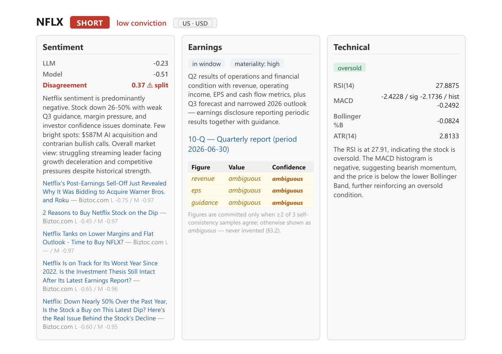

# AI Investment Team

[](https://github.com/gilbarel1/algotrade-project/actions/workflows/ci.yml)

An **n8n multi-agent system that turns a stock watchlist into a justified, written investment
recommendation** — delivered as a PDF report. Four specialist agents — **Sentiment, Earnings,
Technical, and Risk Manager** — each analyze a ticker independently; a coordinating workflow
gathers their conclusions, runs a deliberate three-stage critique, and renders a **long / short /
hold / avoid** call with the full reasoning behind it. The watchlist can mix **TA-35 (Tel Aviv)**
and **S&P 500 (US)** names in one list.

Two things set it apart from a single-prompt LLM pipeline:

1. **Dual sentiment** — every headline is scored twice: by an LLM *and* by a fine-tuned
   transformer (FinBERT for English, DictaBERT for Hebrew). When they disagree, the report shows the
   split instead of hiding it.
2. **A self-critiquing Risk Manager** — a *draft → devil's-advocate critique → final* loop that
   stress-tests its own recommendation. All three passes are printed in the report.

A third guardrail runs through the whole system: **it never invents financial numbers.** Earnings
figures are committed only when repeated self-consistency samples agree on a value that appears
verbatim in the source; otherwise they are marked `ambiguous`.

**The four recommendations.** Each ticker gets exactly one call plus a `conviction`
(`low` / `medium` / `high`) — how strongly the evidence supports it. The first three are directional
views on the stock; the fourth says the picture isn't clear enough to take one:

| Call                | What it means for the stock                                                                                                                                                  |
| ------------------- | ---------------------------------------------------------------------------------------------------------------------------------------------------------------------------- |
| **`long`**  | Bullish. The outlook points up — a candidate to**buy / hold a long position**, expecting the price to rise.                                                           |
| **`short`** | Bearish. The outlook points down — a candidate to**sell / avoid / short**, expecting the price to fall.                                                               |
| **`hold`**  | Neutral. No clear edge in either direction right now —**stay put and wait** rather than open or change a position.                                                    |
| **`avoid`** | Sit it out. The available information is too thin or unreliable to judge the stock —**not a view that it will fall**, just that there isn't enough to justify a call. |

Conviction reflects how well the evidence lines up: `high` when everything agrees, stepping down to
`medium` around near-term earnings risk, conflicting signals, or gaps in the data. The exact
thresholds live in `config/rubric.yaml` (design §3.4).

> Everything is **local and educational**. The system produces analysis and rationale — it does
> **not** trade, place orders, or measure returns.



---

### Start here

| If you want to… | Go to |
| --- | --- |
| **Read the written analysis** — problem, architecture, results, ablations, caveats | **[`docs/project_summary.pdf`](docs/project_summary.pdf)** (8 pages) |
| **See the output without running anything** | [`docs/samples/`](docs/samples/) — two real reports, committed |
| **Run it yourself** | [Setup & quick start](#setup--quick-start) |
| **Judge whether the AI techniques do anything** | [Design highlights](#design-highlights) · [`docs/ablations.md`](docs/ablations.md) |
| **See the measured accuracy** | [Evaluation results](#evaluation-results) |
| **Know what it can't do** | [Limitations](#limitations) |

**Contents** — [How it works](#how-it-works) · [Prerequisites](#prerequisites) ·
[Setup & quick start](#setup--quick-start) · [Everyday commands](#everyday-commands) ·
[Configuration](#configuration) · [Design highlights](#design-highlights) ·
[Evaluation results](#evaluation-results) · [Limitations](#limitations) ·
[Further reading](#further-reading)

---

## How it works

Two layers joined by one HTTP boundary:

- **n8n orchestration** runs the workflows and makes every LLM call (via **OpenRouter**). It holds
  **no machine-learning code**.
- **A local FastAPI "quant service"** does everything that needs a real library — technical
  indicators (`pandas-ta`), transformer sentiment (FinBERT/DictaBERT), PDF rendering (WeasyPrint) —
  and owns the DuckDB cache. n8n's embedded Python can't import those libraries, so all heavy data
  and computation stay server-side; only short text and scores ever cross the LLM boundary.



The pipeline, per ticker: the orchestrator fans out the three analysis agents in parallel, the
Risk Manager consumes all three through its critique loop, and the result is persisted to DuckDB
and rendered into `reports/YYYY-MM-DD/HHMM/report.pdf`.

### The four agents

Three specialists gather independent evidence; the Risk Manager weighs it into the final call.

| Agent                  | What it does                                                                                                                                                                            |
| ---------------------- | --------------------------------------------------------------------------------------------------------------------------------------------------------------------------------------- |
| **Sentiment**    | Reads recent news on the ticker and scores the mood — twice, with an LLM and a fine-tuned transformer — surfacing where the two disagree.                                             |
| **Earnings**     | Finds the latest disclosure (Maya for Tel Aviv, SEC EDGAR for US), classifies it, and extracts the reported figures**only when they appear verbatim** — otherwise `ambiguous`. |
| **Technical**    | Computes price indicators (RSI, MACD, Bollinger Bands, ATR) from history and reads a momentum signal (bullish, bearish, overbought, oversold…).                                        |
| **Risk Manager** | Synthesizes the three signals and runs the*draft → critique → final* loop to issue the **call + conviction** with a written rationale.                                        |

Each specialist returns a compact, schema-validated result — or degrades honestly (`status: "degraded"`)
if its data source fails, rather than guessing.

### Three ways to run it

All three reuse the identical *fan-out → Risk Manager → persist → PDF* path:

| Entry point                | What it's for                                                                                                                                                                                                                                                                                                                 |
| -------------------------- | ----------------------------------------------------------------------------------------------------------------------------------------------------------------------------------------------------------------------------------------------------------------------------------------------------------------------------- |
| **Manual trigger**   | Run the whole watchlist on demand from the n8n editor. Never gated by market hours.                                                                                                                                                                                                                                           |
| **Schedule trigger** | Hourly across both markets' trading windows. A**per-market gate** analyzes only the tickers whose market (`tase` \| `us`) is currently open, so a fire at 11:00 Israel time runs the TA-35 names and one at 20:00 runs the US names.                                                                                |
| **Chat assistant**   | Ask*"what do you think about Teva?"* at a small web UI. It resolves the name to a ticker, runs the pipeline for that one name (~40–80 s), and reports the Risk Manager's call. It is a **router, not an analyst** — it relays what the pipeline returns and declines to invent a price target or figure of its own. |

Because every ticker resolves to a market from its Yahoo suffix (`*.TA` → Tel Aviv, bare symbol →
US), a **mixed watchlist** like `["TEVA.TA", "AAPL"]` is one list, not two code paths — each name
uses its market's trading calendar, news feeds, earnings source (Maya for TA-35, SEC EDGAR for US),
and currency.

---

## Prerequisites

| Tool                         | Version    | Notes                                                                               |
| ---------------------------- | ---------- | ----------------------------------------------------------------------------------- |
| **Python**             | 3.11–3.13 | Runs the quant service.                                                             |
| **Node.js**            | ≥ 20      | Runs the dev scripts and n8n itself (via`npx` — nothing to install by hand).     |
| **Git**                | any recent | —                                                                                  |
| **OpenRouter account** | —         | Every LLM call. Pay-as-you-go; a five-ticker run costs ~$0.04–$0.08.               |
| **NewsAPI account**    | free tier  | Optional — English news for the Sentiment Agent; it falls back to RSS without one. |

> **Windows only:** WeasyPrint (PDF rendering) needs the **GTK3 runtime** once — install the
> [tschoonj GTK-for-Windows installer](https://github.com/tschoonj/GTK-for-Windows-Runtime-Environment-Installer/releases)
> (`gtk3-runtime-*-win64.exe`, keep "add to PATH"), then restart your shell. Without it, `/report`
> degrades to `pdf_path: null` rather than crashing.

The quant service and its endpoints work **without n8n and without any API keys** — keys are only
needed once you run the agents.

---

## Setup & quick start

### 1. Clone and bootstrap once

```bash
git clone <repo-url>
cd algotrade-project
npm run setup
```

`npm run setup` is idempotent and needs **no API keys** to run: it creates `quant_service/.venv`,
installs `requirements.txt`, downloads the Playwright Chromium the Earnings agent needs, copies
`.env.example` → `.env` (**never** overwriting an existing one), and creates the DuckDB tables.

> First run downloads PyTorch and a headless Chromium — budget a few minutes and ~2 GB.

Every `npm run …` script uses that venv. If you keep your own virtualenv at the repo root (`.venv`),
the scripts pick it up instead — and if one venv exists but its install never finished, they say so
rather than failing later on a missing import. `VENV_PYTHON=/path/to/python` overrides the search.

### 2. Add your keys to `.env`

Run step 1 **first** — it generates `.env` from the template. Then put your keys in that
generated **`.env`** file (not in `.env.example`, which stays keyless and committed).

| Key                    | Needed for                                                                                                                                                                                                    |
| ---------------------- | ------------------------------------------------------------------------------------------------------------------------------------------------------------------------------------------------------------- |
| `OPENROUTER_API_KEY` | Every LLM call.**Also paste it into the n8n OpenRouter credential** — n8n reads credentials from its own store, not from `.env`.                                                                     |
| `NEWSAPI_API_KEY`    | English news for the Sentiment Agent. Optional: without it,`/news/fetch` returns RSS-only and the agent reports `status: "degraded"`.                                                                     |
| `N8N_API_KEY`        | LLM cost logging. n8n →*Settings → n8n API* → create key. Without it the cost harvest degrades cleanly; it never fails a run.                                                                            |
| `EDGAR_USER_AGENT`   | US earnings disclosures. SEC requires a declared contact (`your-name your-email@example.com`); without it `/earnings/fetch` degrades for US tickers rather than fabricating. TASE tickers are unaffected. |

Everything else in `.env` can keep its default — see [Configuration](#configuration).

### 3. Run everything

```bash
npm run dev
```

One command starts all three processes — the quant service, the chat front end, and n8n — loading
`.env` into each and setting the n8n variables the workflows require. Output is prefixed
`[svc]` / `[web]` / `[n8n]` in a single terminal, and **Ctrl-C stops all of them**.

|                |                                                                                    |
| -------------- | ---------------------------------------------------------------------------------- |
| quant service  | [http://localhost:8000](http://localhost:8000) — interactive API docs at `/docs` |
| chat front end | [http://localhost:8001](http://localhost:8001)                                      |
| n8n editor     | [http://localhost:5678](http://localhost:5678)                                      |

### 4. Verify

In a second terminal, with `npm run dev` running:

```bash
npm run smoke      # Expect: OK for every endpoint, then "All endpoints OK."
```

> **First `/sentiment` call is slow** — it downloads FinBERT + DictaBERT into `HF_HOME` and
> loads them into memory. Later calls reuse the in-process pipeline.

### 5. Import the n8n workflows (one-time, in the UI)

This is the one part the scripts can't do — importing mints new workflow ids and credentials must
be selected in the editor. Full walkthrough: **[`n8n/README_credentials.md`](n8n/README_credentials.md)**.
The short version:

1. In n8n, create the **OpenRouter** credential once (paste `OPENROUTER_API_KEY`).
2. *Workflows → Import from File* for each of `n8n/agents/*.json`, then
   `n8n/orchestrator.workflow.json`, then `n8n/chat_assistant.workflow.json`.
3. Open each **Chat Model** node and re-select your OpenRouter credential — imported JSONs carry a
   `REPLACE_AFTER_IMPORT` placeholder. (The Earnings Agent has **two** such nodes.)
4. Open the orchestrator's four **Execute Sub-workflow** nodes and re-pick each agent — the
   imported JSON carries the ids of whichever instance it was exported from, and an import mints
   new ones. Nothing to copy into config: `/costs/harvest` finds each agent by **workflow name**
   (§4.4), so cost attribution works straight after an import. Set `N8N_WF_<AGENT>` in `.env` only
   if you rename a workflow in n8n.

### 6. Run the team

Hit **Execute workflow** on the orchestrator. It opens a run, fans the three analysis agents out
over the watchlist (concurrency 3), calls the Risk Manager per ticker, persists each result,
harvests the run's LLM costs, and writes the PDF.

> **Trim the watchlist for a first run.** The full TA-35 list is 35 × 4 sub-workflows and burns the
> NewsAPI free tier (100 req/day) in one go. Set `watchlist: ["TEVA.TA", "AAPL"]` in
> `config/universe.yaml` — the orchestrator reads it from the service, so no workflow edit is needed.

Then inspect what the run wrote:

```bash
npm run costs      # every LLM call of the run, priced per the model table below
```

Expect one `runs` row, one `recommendations` row per ticker (with `draft`, `critique`, `final` and
`agent_status` populated), and `costs` rows per `(run_id, agent, model)`.

### 7. Ask the team in chat

Open [http://localhost:8001](http://localhost:8001) and ask *"what do you think about Teva?"*. The assistant resolves the
name to `TEVA.TA`, runs the same pipeline for that ticker, and reports the Risk Manager's call,
conviction, rationale, and the PDF path. Follow-ups resolve from memory — *"and Nvidia?"* analyzes
`NVDA` (US names take the bare symbol; TA-35 names take `.TA`). Ask for a price target and it
declines rather than inventing one.

Two one-time wiring steps after importing `chat_assistant.workflow.json` (details in
[`n8n/README_credentials.md`](n8n/README_credentials.md)): point its `run_investment_analysis` tool
node at your imported orchestrator, and copy the **Chat Trigger** node's Production URL into
`N8N_CHAT_WEBHOOK_URL`. Its id needs no config entry — the harvest resolves it by name (§4.4).
The orchestrator **and its four sub-workflows** must all be **Published/Active**: n8n refuses to
publish a workflow whose referenced sub-workflows are not themselves published.

---

## Everyday commands

| Command                                                  | What it does                                                                                                                                             |
| -------------------------------------------------------- | -------------------------------------------------------------------------------------------------------------------------------------------------------- |
| `npm run dev`                                          | Quant service + chat front end + n8n, wired. Ctrl-C stops all.                                                                                           |
| `npm run doctor`                                       | Preflight — Node, venv,`.env`, keys, DuckDB, ports. Starts nothing.                                                                                   |
| `npm run test`                                         | The offline test suite (`tests/`) — no network, no API keys, no LLM calls. Runs in seconds.                                                          |
| `npm run lint`                                         | `ruff` over the whole repo, using the ruleset in `pyproject.toml`.                                                                                |
| `npm run smoke`                                        | Endpoint check against the running service.                                                                                                              |
| `npm run ingest`                                       | Pull the watchlist's OHLC into the`prices` cache (keyless — Yahoo Finance).                                                                           |
| `npm run costs`                                        | Per-run LLM cost summary.                                                                                                                                |
| `npm run eval`                                         | Evaluation harness ([below](#evaluation-results)) against `eval/*_labeled.jsonl`. `npm run eval -- --no-llm` runs the FinBERT/DictaBERT arm only (free). |
| `npm run ablations`                                    | Ablation harness ([`docs/ablations.md`](docs/ablations.md)) — switches each AI technique off and re-scores. `-- --critique-only` mines the critique arm from DuckDB (free, no key). |
| `npm run db:init`                                      | Create/repair the DuckDB schema.                                                                                                                         |
| `npm run summary`                                      | Rebuild [`docs/project_summary.pdf`](docs/project_summary.pdf) from its HTML source (WeasyPrint).                                                        |
| `npm run dev:service` / `dev:n8n` / `dev:frontend` | Just one process, for debugging.                                                                                                                         |

`npm run ingest` accepts `-- --symbols TEVA.TA` and `-- --lookback-days 90`. Ingestion is also
**lazy** — `/ohlc` and `/indicators` fetch any symbol they don't have cached — so it's a pre-warm,
not a prerequisite.

### Tests

```bash
npm run test
```

**148 tests, offline, a few seconds** — no network, no API keys, no LLM spend, so they are safe to
run on every change. They pin the parts where a silent regression would be expensive rather than
obvious:

| Area | What is pinned |
| --- | --- |
| **Session calendar** (`test_ohlc_calendar.py`) | Two invariants that make a whole bug class impossible: cleaning never drops a bar the source sent, and never creates one on a weekday the source doesn't send. Pinned after the configured Sun–Thu grid was found discarding real Fridays and forward-filling synthetic Sundays into ~19% of every TASE series. |
| **Cache retraction** (`test_price_cache.py`) | That a re-ingest can *remove* a bar, not just add or correct one — insert-or-replace alone let the phantom Sundays above outlive the fix that stopped producing them. Also that a narrow re-ingest keeps history outside its window, and a degraded (empty) fetch never empties the cache. |
| **Market gate** (`test_markets.py`) | Symbol → market, and the per-market session gate in each market's own timezone — including the two-to-three-week windows where Israel and the US have swapped DST on different dates, which a fixed UTC offset gets wrong. |
| **Rubric clamp** (`test_rubric_clamp.py`) | The §3.4 decision rules, executed **as the workflow's own JavaScript** — the test extracts `jsCode` from `n8n/agents/risk_manager.json` and runs it under Node, so it cannot drift from what n8n ships. |
| **LLM boundary** (`test_schemas.py`) | Every Pydantic schema accepts the canonical enums and rejects invented ones, out-of-range scores, and extra fields a model might smuggle through. |
| **`/validate` contract** (`test_validate_endpoint.py`) | The endpoint every agent's retry branch reads, driven over the real ASGI stack: the `{valid, errors}` shape for each of the seven boundaries, and that an unknown key degrades instead of raising. It also parses `n8n/agents/*.json` and asserts every `agent` key the workflows **post** is registered — an unregistered key never raises, it just fails validation forever, so each run degrades in a way that reads like a flaky model rather than a typo. |
| **Never invent numbers** (`test_schemas.py`, `test_earnings_degradation.py`) | Figure confidence must be 1–3; a lazy `{}` sample fails validation; an excerpt-layer fallback does *not* degrade, while a candidate with no verbatim text still does. |
| **Cost accounting** (`test_cost_log.py`) | §7 prices, and that calls collapse onto the `(agent, model)` key with an unknown model priced at a visible 0.0 rather than crashing a run. |
| **Workflow ids** (`test_workflow_ids.py`) | The §4.4 resolution ladder — env, then name lookup, then config — plus the ambiguity guard that refuses to guess between two same-named workflows. |
| **Degraded wording** (`test_degraded_messages.py`) | Degraded reasons are printed verbatim in the PDF, so no layer may re-label what the layer below already labelled. |

CI ([`.github/workflows/ci.yml`](.github/workflows/ci.yml)) runs `ruff` and this suite on every
push. It installs only what the suite imports — no torch, no Playwright, no GTK — so it finishes in
under a minute.

---

## Configuration

**Defaults live in config, never in code or workflows.** Watchlist, news/earnings windows,
lookback, cron, report directory, per-market calendars, and the n8n workflow ids are in
`config/universe.yaml`; Risk Manager decision thresholds are in `config/rubric.yaml`. Edit those.

**Secrets live in `.env`** (gitignored; only `.env.example` is committed). `npm run dev` loads it
into both processes.

| Variable                      | Default                        | Notes                                                                                                                                    |
| ----------------------------- | ------------------------------ | ---------------------------------------------------------------------------------------------------------------------------------------- |
| `OPENROUTER_API_KEY`        | —                             | [https://openrouter.ai](https://openrouter.ai) → **Keys**.                                                                         |
| `NEWSAPI_API_KEY`           | —                             | [https://newsapi.org/register](https://newsapi.org/register) → free tier. Optional.                                                      |
| `N8N_API_KEY`               | —                             | n8n →*Settings → n8n API*. The only place n8n exposes LLM token usage.                                                               |
| `EDGAR_USER_AGENT`          | —                             | Name + contact email, per SEC fair-access policy. Needed only for US tickers.                                                            |
| `QUANT_SERVICE_URL`         | `http://127.0.0.1:8000`      | Where n8n reaches the service; the runner derives uvicorn's port from it. Use`http://host.docker.internal:8000` if n8n runs in Docker. |
| `N8N_CHAT_WEBHOOK_URL`      | —                             | Chat front end → n8n. The Chat Trigger node's Production URL (ends in`/chat`).                                                        |
| `DUCKDB_PATH`               | `quant_service/store.duckdb` | Repo-root-relative; the runner absolutizes it.                                                                                           |
| `HF_HOME`                   | `.hf_cache`                  | Hugging Face cache (FinBERT/DictaBERT weights).                                                                                             |
| `REPORT_DIR`                | `reports`                    | Generated PDFs.                                                                                                                          |
| `TZ` / `GENERIC_TIMEZONE` | `Asia/Jerusalem`             | Store UTC, render local. n8n evaluates cron in`GENERIC_TIMEZONE` — leave it set or the schedule fires at the wrong hours.             |

---

## Design highlights

Four AI techniques go beyond baseline LLM calls. This is where the interesting engineering lives —
each is deliberate, visible in the report, and **measured**: the last column is what happens when the
technique is switched off, not what it is supposed to do.

### One idea, applied at three scales

The techniques below aren't a grab-bag. They are the same principle three times over: **an LLM cannot
be trusted to report its own uncertainty, so uncertainty is derived from disagreement between
independent attempts** — never from the model's own confidence, which it will happily state at 0.998
while being wrong.

| Scale | What disagrees | What the disagreement produces |
| --- | --- | --- |
| **Within one model** | 3 samples of the same extraction prompt (temp 0.3) | Figures that don't survive a majority → **`ambiguous`**, never a number |
| **Between two models** | an LLM vs. a fine-tuned transformer on the same headline | Split above 0.3 → **conviction capped** at medium, and both scores printed |
| **Between two passes** | a draft vs. a devil's advocate attacking it | Objections that hold → **call downgraded**, all three passes printed |

At no point does the system ask a model "how sure are you?" — the question that produced HeBERT's
0.998-confidence wrong answer, and the reason it was replaced. Confidence is *earned* by surviving an
independent challenge, and the [ablations](docs/ablations.md) show all three challenges have teeth.

| Technique                                                               | Where                                    | What it adds                                                                                                                           | Measured effect of removing it |
| ----------------------------------------------------------------------- | ---------------------------------------- | -------------------------------------------------------------------------------------------------------------------------------------- | --- |
| **Fine-tuned domain transformers** (FinBERT EN, DictaBERT HE)        | `/sentiment` endpoint, Sentiment Agent | An independent sentiment signal alongside the LLM; their disagreement becomes a first-class, reported feature.                         | No second opinion at all — the dual-sentiment cap can never fire, and per-article splits like `L 0.15 / M −0.96` go unseen. |
| **Few-shot prompting from labeled JSONL**                         | Sentiment + Earnings agents              | Prompt engineering that is version-controlled (`prompts/`) and evaluable, not buried in a node.                                      | Sentiment accuracy **90% → 77%**, MAE **0.12 → 0.20** — i.e. down to exactly what the *free* local transformer scores. |
| **Self-consistency sampling** (n=3, temperature 0.3)              | Earnings number extraction               | Enforces "do not invent numbers"*by construction*: a figure commits only when ≥2 of 3 samples agree; otherwise it is `ambiguous`. | Invented figures **0 → 2**; invented rate **0% → 3%**; precision **1.00 → 0.92**. |
| **Multi-pass critique loop** (draft → devil's advocate → final) | Risk Manager                             | The recommendation visibly audits its own reasoning, which curbs overconfident calls.                                                  | The draft *is* the ablation: **31%** of calls and **35%** of convictions changed, **9 downgrades / 0 upgrades**. |

**The techniques are load-bearing, and that is measured, not asserted** — by a second harness,
[`npm run ablations`](docs/ablations.md), that removes each one and re-scores:

- **Self-consistency earns its 3× token cost.** Two of three individual samples each committed a
  figure its source does not state; the vote caught both **because the samples disagreed with each
  other**. Disagreement between draws *is* the signal that a number isn't really in the document — a
  single-sample extractor has no access to it, and no way to know it was wrong.
- **Few-shot is the LLM arm's entire margin.** Without the nine examples, the paid model lands at
  77% — the same accuracy as the free FinBERT/DictaBERT arm it exists to disagree with.
- **The critique loop has never once made the system more bullish.** Across every run on record it
  moved 8 calls, all of them `long → hold`, and changed conviction 9 times, all downgrades. It is
  also not a rubber stamp: in 19 of 26 cases the devil's advocate argued for a different call.

Full method, the paired experimental design, and an honest account of what these numbers *don't*
show (small samples; "changed" ≠ "improved") are in **[`docs/ablations.md`](docs/ablations.md)**.

**Model assignments** (all via OpenRouter — a one-field swap to change any of them):

| Agent                     | Model                            | Price / 1M tokens    | Why                                                                      |
| ------------------------- | -------------------------------- | -------------------- | ------------------------------------------------------------------------ |
| Sentiment                 | `anthropic/claude-haiku-4.5`   | $1 in / $5 out       | Multi-headline reading, translation, few-shot scoring.                   |
| Earnings                  | `x-ai/grok-4.3`                | $1.25 in / $2.50 out | Careful extraction with self-consistency (chosen on quality, not price). |
| Technical                 | `google/gemini-2.5-flash-lite` | $0.10 in / $0.40 out | Narrates a pre-computed JSON — no reasoning required.                   |
| Risk Manager (×3 passes) | `anthropic/claude-haiku-4.5`   | $1 in / $5 out       | Cross-agent synthesis, critique, and final justification.                |

Every LLM call is logged to the `costs` table (`run_id, agent, model, tokens, usd_cost, latency`).
A five-ticker run costs roughly **$0.04–$0.08** — the critique loop triples the Risk Manager's call
count. Every LLM-to-agent boundary is validated by a **Pydantic schema**; a malformed response
triggers one stricter-instruction retry, then a `degraded` result — never a silent bad value.

See the [reasoning trace in `docs/results.md`](docs/results.md) for a worked example of the critique
loop downgrading a call's conviction, and [`docs/design.md`](docs/design.md) for the full design.

---

## Evaluation results

The harness scores each agent against hand-labeled fixtures (`eval/*_labeled.jsonl`) and prints a
one-page summary. Reproduce with `npm run eval` (needs the service running and an OpenRouter key;
`-- --no-llm` runs the free transformer arm only).

**These numbers reproduce.** The block below is a fresh run, eleven days after the one it replaced,
and **every metric came back identical** — accuracy, MAE, Pearson r, macro-F1, precision/recall, and
the router's 4/4 and 3/3. Only the run id and the cost moved ($0.1155 vs $0.1138, from a 676-token
difference in the earnings arm). That is the point of pinning the fixtures and setting
`temperature=0` outside the self-consistency sampler: the one number that *should* wander is the
extractor's, and it is reported honestly below rather than averaged into the rest.

```
Evaluation summary  (eval-20260817-060223)
Sentiment: 30 items (20 EN, 10 HE)   Earnings: 10 disclosures   Chat: 7 router cases

Agent                         Dataset             Metrics
------------------------------------------------------------------------------
Sentiment (LLM)               sentiment_labeled   accuracy 0.90 (27/30) | MAE 0.12  [haiku]
Sentiment (FinBERT/DictaBERT) sentiment_labeled   accuracy 0.77 (23/30) | MAE 0.39
  └ en                        finbert             accuracy 0.80 (16/20) | MAE 0.43
  └ he                        dictabert           accuracy 0.70 (7/10) | MAE 0.32
Sentiment (agreement)         sentiment_labeled   Pearson r 0.82 (n=30)
Earnings (classifier)         earnings_labeled    macro-F1(kind) 1.00 | materiality acc 0.90 (n=10)  [grok]
Earnings (extractor)          earnings_labeled    precision 1.00 | recall 1.00 | ambiguous-when-absent 22/22  [grok]
Chat router (§6.5)            chat_refusal        refusal 4/4 | routing 3/3 | no fabrication  [haiku]
------------------------------------------------------------------------------
LLM cost (this run): $0.1155   (chat 11,872 tok, earnings 47,859 tok, sentiment 5,337 tok)
```

**The transformer arm is reported per language**, because it is two different models and the mean
of the two describes neither. FinBERT carries English at 0.80. Hebrew sits at 0.70 — and getting
there meant replacing the model. The original choice, `avichr/heBERT_sentiment_analysis`, scored
0.30, and inspecting *why* showed it was not weakly discriminating but **not discriminating at
all**: `neutral` for 10 of 10 Hebrew items, at 0.833–0.998 confidence, including a *"record
quarterly orders, guidance raised"* headline at 0.998. Two rescue attempts failed — re-normalising
polarity over the polar classes made it *worse* (0.53 overall), and a threshold sweep from ±0.1 to
±0.6 moved nothing — so it was swapped for `dicta-il/dictabert-sentiment`, which reads every
negative and every neutral correctly and misses only positives. Agreement between the two arms rose
from 0.70 to **0.82** as a result: a model returning ~0 for everything cannot correlate with
anything, so the old figure was largely measuring noise.

**On the earnings extractor, and what "never invent numbers" actually buys you.** That row scores
whether a figure is committed *only* when the source states it verbatim. The mechanism is
self-consistency: three samples at temperature 0.3, committed on a majority. Because it samples, it
is **not deterministic**. Measured across four runs it scored **22/22, 21/22, 22/22, 22/22** —
so in one of the four, a single field was committed that its source does not state. The honest
claim is that self-consistency *sharply reduces* invented figures and makes the remainder visible
and measurable — not that it eliminates them. A single-sample extractor has no such guard at all,
and no way to know how often it is wrong.

---

## Limitations

Stated up front rather than discovered later. Each of these is a real constraint on what the output
means; the system is built to **degrade visibly** into `degraded` / `ambiguous` rather than paper over
any of them. Design [§13](docs/design.md) has the full detail and the reasoning behind each.

**News and sentiment**

- **Coverage of TA-35 mid-caps is patchy** outside the largest names. Sentiment for a thinly-covered
  ticker is legitimately thin — the report prints the article count and never pads it.
- **The Hebrew arm is weaker than the English one, and no Hebrew model here is finance-tuned.**
  DictaBERT scores 0.70 against FinBERT's 0.80, and its misses are one-sided: it reads positive
  financial news as neutral while getting every negative right — so Hebrew coverage understates good
  news rather than inventing bad news. Conservative, but a real skew. It replaced HeBERT, which
  scored 0.30 by never committing to a direction at all; the [evaluation
  results](#evaluation-results) report the arms per language rather than hiding the gap in a mean.
- **Self-consistency reduces invented figures; it does not eliminate them.** Extraction samples three
  times at temperature 0.3 and commits on a majority, so it is stochastic: measured runs have scored
  `ambiguous`-when-absent at 22/22, 21/22, 22/22 and 22/22 across four runs. The one miss is a figure
  committed that its source does not state. The guard is a large improvement over a single sample — and, unlike a single
  sample, it is measurable — but it is not a proof.
- **A derived search term is weaker than a hand-tuned one.** So that any S&P 500 name works without
  500 config entries, an unlisted US ticker's news query is derived from its SEC *registrant* name.
  Where that differs from the name the press uses — "Alphabet" vs. "Google" — the query is simply
  wrong and returns nothing, so divergent names are curated by hand in `search_terms`. The
  `newsapi_domains` publisher allowlist keeps precision high but is itself fixed: an outlet not on it
  is invisible. The endpoint says when a term was derived, so thin coverage is explainable.
- **NewsAPI's free tier (100 requests/day) binds harder on a bigger universe.** A mixed TA-35 + S&P 500
  watchlist multiplies per-ticker calls; trim the watchlist or pay for a tier. A quota-exhausted fetch
  degrades rather than fabricating coverage.

**Price data**

- **Yahoo's TASE calendar does not match the real Tel Aviv trading week, and the discrepancy is
  unexplained.** TASE trades Sunday–Thursday, but Yahoo returns `.TA` daily bars on a **Mon–Fri**
  index with no Sunday sessions (verified on TEVA.TA, ICL.TA and POLI.TA). Ingestion therefore takes
  its session grid from the data rather than from the configured week, and reports the disagreement
  per symbol instead of absorbing it. Whether those Friday bars are genuine sessions, sessions
  labelled a day late, or a feed artifact is **not resolved** — their volume runs consistently below
  the Mon–Thu bars. The guarantee the code makes is narrower and checkable: it never invents a bar
  and never discards one. Before this was found, the Sun–Thu grid dropped every real Friday and
  forward-filled a synthetic Sunday, making ~19% of a TASE series duplicate rows — which deflated
  ATR and flattened RSI on the primary market. Any TA-35 report generated before that fix understates
  its indicators accordingly; the committed
  [mixed-watchlist sample](docs/samples/sample-report-mixed-watchlist.pdf) was regenerated afterwards
  and is clean.

**Earnings extraction**

- **Maya scraping is best-effort.** The site is a JavaScript SPA behind bot protection, rendered
  server-side in headless Chromium. A layout change or a bot-block can still break the harvest; the
  agent then marks fields `ambiguous` — or degrades to "no recent disclosure" — rather than guess.
- **Figures live in a PDF attachment two layers below the disclosure page.** The page itself carries
  none, so a scanned PDF with no text layer or an unreachable attachment yields `ambiguous` figures
  despite a correctly classified disclosure.
- **EDGAR excerpts come from 8-K press-release exhibits, whose formatting varies wildly** between
  issuers. Extraction is a bounded text excerpt, not a structured parse. The primary-document fallback
  is thinner still: a 10-Q's figures sit in iXBRL statement *tables* that flatten into label/number
  runs as text, making a periodic report a materially worse source than the press release an 8-K attaches.

**Reasoning and scope**

- **The three-pass critique loop reduces overconfidence but does not guarantee correctness.** It is a
  structured reasoning aid, not a financial-validity guarantee. The PDF's methodology footer says so
  in as many words, alongside its educational / not-investment-advice disclaimer.
- **No live execution and no return measurement.** The system produces recommendations and rationales;
  it never checks whether they would have made money. A backtest is the natural next step and is
  listed as future work in [`docs/results.md`](docs/results.md).
- **A one-field model swap is not a no-op below the prompt.** Models differ in how often they clear a
  Pydantic boundary first time, and the retry path is a *different branch* of the workflow graph.
  Swapping the Earnings model surfaced a latent fan-in bug that the previous model had masked, so any
  node reasoning over a whole *set* — selection, voting, aggregation — needs auditing when a model changes.
- **OpenRouter pricing and model availability can change.** Every agent's model is a one-field swap,
  and the `costs` table is the arbiter of what a run actually costs.

---

## Further reading

- **[`docs/project_summary.pdf`](docs/project_summary.pdf)** — the written summary: the financial
  problem, the architecture, the results and ablations, the data-integrity bug and what finding it
  changed, and the risks. Built from [`project_summary.html`](docs/project_summary.html) with
  `npm run summary`, so the PDF cannot drift from its source.
- **[`docs/design.md`](docs/design.md)** — the full technical design: architecture, endpoint
  contracts, agent schemas, DuckDB tables, and parameters. The source of truth.
- **[`docs/results.md`](docs/results.md)** — a walk-through of real runs end-to-end, with the
  reasoning trace and persisted data, plus the evaluation results.
- **[`docs/ablations.md`](docs/ablations.md)** — each AI technique switched off and re-scored, so
  their contribution is measured rather than claimed. Includes what the numbers don't show.
- **[`docs/samples/`](docs/samples/)** — two reports the system actually produced, committed so you
  can read the output **without running the pipeline** (which needs API keys): one showing dual
  sentiment splitting a call, one showing a mixed TA-35 + S&P 500 watchlist in a single PDF.
- **[`docs/demo_script.md`](docs/demo_script.md)** — a 5-minute demo outline.
- **[`docs/defense_deck.pptx`](docs/defense_deck.pptx)** — a 10-slide presentation built from the
  summary document, with speaker notes on every slide.
- **[`docs/sp500_integration_plan.md`](docs/sp500_integration_plan.md)** — how the mixed
  TA-35 + S&P 500 market abstraction was added.
- **[`n8n/README_credentials.md`](n8n/README_credentials.md)** — the detailed n8n import and
  credential-wiring walkthrough.
