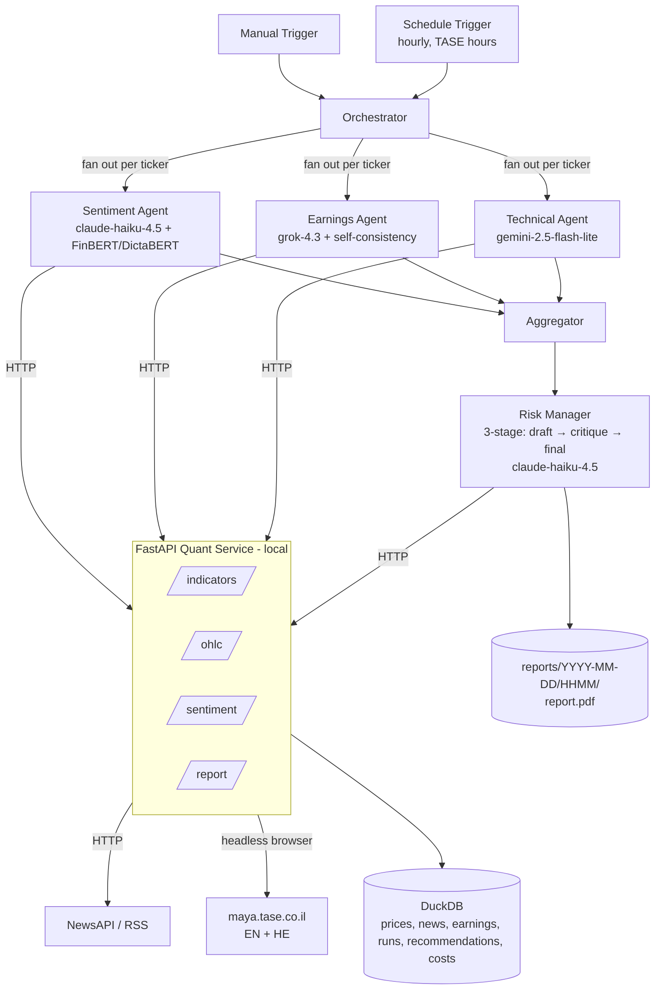

# Technical Design Plan

## n8n-Based Multi-Agent System for Investment Decisions (TA-35)

An automated workflow simulating a virtual investment team. Four specialist agents — Sentiment, Earnings, Technical, and Risk Manager — independently analyze a watchlist of TA-35 names; a coordinating workflow synthesizes their conclusions, runs a deliberate critique pass, and produces a justified buy / hold / sell recommendation as a detailed PDF report saved to disk.

Two design choices distinguish the system from a baseline LLM-only pipeline. First, sentiment is scored twice — once by a language model and once by a fine-tuned transformer (FinBERT for English, DictaBERT for Hebrew) — and disagreements between the two are surfaced in the report rather than hidden. Second, the Risk Manager runs a three-stage critique loop (draft → devil's-advocate critique → final decision) so the rationale visibly stress-tests itself instead of being a single LLM emission. Number extraction from earnings disclosures uses self-consistency sampling to enforce a strict "do not invent numbers" guarantee.

The system runs on self-hosted n8n with language-model access via OpenRouter; computation that does not fit n8n is delegated to a small local Python service. The workflow runs in two modes: manually triggered for the demo, and on a schedule during TASE trading hours.

---

## 1. Scope and assumptions

- **Watchlist.** TA-35 **and S&P 500 constituents, mixed** — one watchlist can hold `TEVA.TA` and `AAPL` together. Starter set: `TEVA.TA`, `NICE.TA`, `LUMI.TA`, `POLI.TA`, `ESLT.TA`; the full list lives in config. Every ticker carries a **market** (`tase` | `us`) derived from the Yahoo suffix (`*.TA` → `tase`, bare symbol → `us`), with an optional explicit override in config (§4.4). The market is a bundle of properties — trading calendar, trading hours, earnings source, news feeds, currency — replacing what used to be global TASE assumptions.
- **Markets data.** Daily and intraday OHLC via Yahoo Finance (`*.TA` symbols for TASE, bare symbols for US); Alpha Vantage as a backup for indicators and intraday history.
- **News.** NewsAPI for English coverage and Israeli English-language outlets (Globes, Reuters, Bloomberg, Calcalist English) via targeted RSS. Hebrew headlines from Ynet/Calcalist RSS are used as a fallback and translated by the language model. US names draw on NewsAPI plus a US finance RSS group (`en_us`, §4.4).
- **Earnings disclosures.** For TASE names, the English MAYA page at `maya.tase.co.il/en/reports/companies` is primary; the Hebrew page is fallback for names that report only in Hebrew. The paid TASE MAYA API is out of scope. For US names the source is **SEC EDGAR** (§4.1); the fetch source routes by market, and everything downstream of the fetch is identical (§3.2).
- **Decision scope.** An analytical recommendation report (long / short / hold / avoid with conviction and rationale) per ticker and an overall watchlist summary. No real or simulated execution.
- **Run modes.** Manual trigger for demonstrations; scheduled trigger hourly across both markets' trading windows, where a scheduled run analyzes **only the tickers whose market is currently in session** (the per-market gate, §6.1); and a **chat trigger** (§6.5) that runs the same pipeline conversationally for an ad-hoc ticker. Manual and chat runs are never gated by market hours.
- **Delivery.** A PDF report saved to `reports/YYYY-MM-DD/HHMM/report.pdf`. Email and Telegram delivery are out of scope but the report step is structured so either can be added with a single extra n8n node.
- **Deployment.** Local only.

---

## 2. System architecture

Two layers joined by one HTTP boundary:

1. **Orchestration (n8n + OpenRouter).** A trigger fans out the four agent sub-workflows over the watchlist, the Risk Manager consumes their outputs through a three-stage critique loop, and the report is rendered.
2. **Quant service (Python + FastAPI).** Computes technical indicators on cached OHLC, serves a sentiment endpoint backed by a fine-tuned transformer (FinBERT/DictaBERT), and generates the PDF. Everything that needs a real library (`pandas-ta`, Hugging Face Transformers, WeasyPrint) lives here.



n8n's embedded Python runtime cannot import `pandas-ta`, Transformers, or PDF libraries, so all such work lives in the FastAPI service.

---

## 3. Agents

Each agent is an n8n sub-workflow. Sentiment, Earnings, and Technical run in parallel per ticker; the Risk Manager runs once afterward, consuming all three.

### 3.1 Sentiment Agent (dual-model)

- **Role.** Read news headlines and summaries from the last two hours about a given ticker; score sentiment two ways and surface disagreements.
- **Two independent scorers:**
  - **`llm_sentiment`** — Haiku 4.5 reads each article (translating Hebrew inline when needed) and returns a `-1..+1` score plus per-article reasoning. Prompt is **few-shot**, loaded from `prompts/sentiment_examples.jsonl` (labeled examples covering positive/negative/neutral and an English/Hebrew mix).
  - **`model_sentiment`** — the quant service's `/sentiment` endpoint. English text is scored by `ProsusAI/finbert`; Hebrew text by `dicta-il/dictabert-sentiment` (CC-BY-4.0). Outputs `-1..+1` per article and an aggregated score.
  - **Why DictaBERT rather than HeBERT for Hebrew.** The original choice, `avichr/heBERT_sentiment_analysis` (2020), was measured against the §9.1 labeled set and found to be **unusable on financial Hebrew**: it returned `neutral` for **10 of 10** items, with neutral probability between 0.833 and 0.998 — including *"record quarterly orders, raises annual guidance"* (0.998 neutral) and *"heavy quarterly loss, the stock plunged"* (0.957). Its 0.30 accuracy was simply the base rate of genuinely-neutral items, not discrimination. Two rescue attempts failed before the model was replaced: re-normalising polarity over the polar classes only, which *degraded* the overall score to 0.53 by turning that residual mass into confident wrong calls, and a threshold sweep from ±0.1 to ±0.6, which moved nothing. `dicta-il/dictabert-sentiment` scores **0.70** on the same items (MAE 0.32 vs 0.39) — every negative and every neutral correct, missing only positives, which it reads as neutral. Measured on 10 Hebrew items, so the size of the gap is better evidence than its precise value.
- **Agreement metric.** `|llm − model|` per article; aggregate disagreement is the mean. High disagreement is **not** a failure — it is a feature reported to the Risk Manager and shown in the PDF.
- **Sources.** NewsAPI (English); Globes/Reuters/Bloomberg/Calcalist-English RSS; Ynet/Calcalist Hebrew RSS as fallback. Fetching, §4.3 cleaning, and `news`-table persistence run server-side in the quant service (`/news/fetch`, `/news/store`) so n8n moves only compact, pre-cleaned items.
- **Search terms, and the derived fallback.** A ticker is not a searchable string (§4.4), so news is queried by the company's name from `search_terms`. Hand-tuned entries always win. When a ticker has none *and* its market sets `search_terms_fallback: sec_registry` (§4.4 — `us` does; `tase` cannot, since Israeli issuers are not SEC registrants and their Hebrew terms are underivable), the term is derived from the SEC registrant name already cached by the EDGAR path — `"NVIDIA CORP"` → `"NVIDIA"`. This exists because the chat assistant (§6.5) accepts any S&P 500 name ad-hoc, and without it every name the config has never seen returns no coverage, degrading Sentiment and capping conviction at `medium` (§3.4) for companies that are in fact heavily covered. A derived term is **weaker than a hand-tuned one and treated as such**: NewsAPI searches the whole web, so a bare brand name pulls in software releases sharing it (measured: `"NVIDIA"` → 48 items led by PyPI package listings; `"MICROSOFT"` → 42 led by Azure SDK releases). Precision is restored by restricting the **publisher**, not the wording: a market may declare `newsapi_domains` (§4.4), an allowlist of finance outlets, and `us` does. Narrowing the *query* instead was tried and reverted — NewsAPI's `searchIn` then demands both the company and a finance keyword in the title/description, and `"Apple Inc"` fell to 0 items while `"Alphabet" OR "Google"` fell to 1. With the allowlist those same queries return 33 and 28 items, all equity coverage. The allowlist applies to hand-tuned and derived terms alike; `tase` declares none, so Israeli coverage keeps its unrestricted behavior. The response summary states when a term was derived.
- **Brand vs. registrant name.** The derived fallback is correct where a company is reported under the name it registers under (`NVDA` → "NVIDIA CORP" → "NVIDIA"). It is *wrong*, not merely thin, where the two diverge: `GOOGL` registers as "Alphabet Inc." while the press writes "Google", and the derived term returned zero articles. Those tickers are hand-tuned in `search_terms` listing both forms (`GOOGL: ["Alphabet", "Google"]`), and hand-tuned always wins over derived.
- **Output (JSON).**
  The aggregate `llm_sentiment` and `model_sentiment` are the **mean** of the per-article LLM and model scores; `disagreement` is the **mean of the per-article `|llm − model|`**. The per-article model scores come from `/sentiment`; the endpoint returns per-item scores only, so the aggregation and disagreement are computed in the sub-workflow.
  ```jsonc
  { "ticker":"TEVA.TA", "window":"2h",
    "llm_sentiment": -0.32, "model_sentiment": -0.18, "disagreement": 0.14,
    "n_articles": 7,
    "top_items":[{"headline":"…","source":"…","url":"…","language":"en",
                   "llm_score":-0.6, "model_score":-0.4}],
    "summary":"Negative tone driven by an FDA delay story; LLM more bearish than the fine-tuned model." }
  ```

### 3.2 Earnings Agent (self-consistent number extraction)

- **Role.** Detect recent MAYA disclosures for the ticker, classify them (earnings / guidance / material event / other), and extract headline financial numbers **only when present verbatim** in the source.
- **Which disclosure gets analyzed (top-3, most material wins).** A ticker's *newest* filing is usually administrative — a Form 4 insider statement, an "Opening of Trading" notice, a registrar update — while the disclosure that moves the thesis sits further down the list (verified: TEVA's newest is a Form 4 with its Q1 8-K 30 rows below; Elbit's newest is a *"to report Q2 results on Aug 5"* scheduling notice with the actual Q1 results 6 rows below). Analyzing the newest therefore reports "other / low" for almost every ticker, and §3.4's earnings-event conviction cap — which keys off `materiality: high` — never fires.

  So the agent **classifies the top 3 candidates and returns the most material one**:
  1. **Rank (deterministic, server-side).** `/earnings/fetch` scores in-window disclosures by title and returns them ranked, so only the top `earnings_candidates` (default 3, `config/universe.yaml`) carry an `excerpt`. Administrative filings are demoted (Forms 3/4/5, 13D/G, trading/registrar/meeting notices); results/guidance wording is promoted. This is **retrieval, not classification** — it only decides which documents are worth an LLM call.
  2. **Classify each candidate (LLM).** The §7 classify pass runs once per candidate, so `kind` and `materiality` remain the model's judgement, never the keyword score's.
  3. **Select — over all candidates at once.** Highest `materiality` wins (`high` > `medium` > `low`), tie broken by `kind` (`earnings` > `guidance` > `material_event` > `other`), then by **excerpt layer** (`press_release` > `primary_document` > `cover_sheet`, from `excerpt_source` in §5), and only then by recency. The layer tie-break exists because recency alone is actively wrong for US issuers: a results 8-K and the 10-Q covering the same quarter are filed hours apart and both classify `earnings`/`high`, so the 10-Q — filed later — would win every company, every quarter. It is the worse source. A press release states headline revenue/EPS/guidance in prose; a periodic report's excerpt is windowed statement tables that may surface segment or note lines instead (verified: an Apple 10-Q window offered `$14.7 billion` and `$13.7 billion`, neither being total revenue, against the press release's `$111.2 billion`). The exposure is therefore not just an `ambiguous` field but a plausible **wrong** one, which is exactly what §3.2 exists to prevent. A mis-ranked candidate is therefore recoverable: the model simply classifies it `other/low` and a better-classified sibling is selected.
     Selection is **a single decision over the whole candidate set**, so the three classification outcomes — first-pass valid, valid-after-retry, and `degraded` — must be **merged back into one branch before it runs**. Candidates need not clear the Pydantic boundary on the same attempt: one may validate first time while a sibling needs the stricter retry. If selection instead runs per-branch, it silently picks the most material of a *subset*, the sub-workflow returns one result per branch, and the caller consuming the first gets the loser. Verified live: this fired the moment a model that fails validation more often than Haiku was configured (§7), and it returned the wrong disclosure with all figures `ambiguous` ahead of the right one — under a green `status: "ok"`.
  4. **Extract from the winner only.** Self-consistency (n=3) runs on the selected disclosure alone, so the cost is 3 classify + 3 extract calls per ticker rather than 3 × the whole chain.
- **Self-consistency for numbers.** The language model is sampled **three times at `temperature=0.3`** for every number it extracts (revenue, EPS, guidance figures). A figure is committed only when at least two of the three samples agree (string-exact match after units normalization). Otherwise the field is marked `"ambiguous"` and shown that way in the report — never silently filled.
- **Sources — routed by market (§4.4).** For `tase` tickers: `maya.tase.co.il/en/reports/companies` primary; the Hebrew page as fallback with LLM translation. The Maya site is a JavaScript SPA behind bot protection, so scraping happens **server-side in the quant service** (`/earnings/fetch`, Playwright headless Chromium) — n8n moves only compact disclosure items, mirroring the news pattern (§3.1). For `us` tickers the source is **SEC EDGAR** (§4.1): recent 8-K/10-Q/10-K filings, with the EX-99.\* press-release exhibit text as the bounded excerpt — falling back to the filing's primary document when it has no such exhibit. That ladder is the EDGAR analogue of Maya's (PDF attachment → cover sheet → title) and exists for the same reason: an 8-K's *own* document is a one-paragraph cover note pointing at the attached press release, while a 10-Q's figures are in the primary document and it has no exhibit at all. Reading the wrong layer yields an excerpt with no figure in it, so every field votes `ambiguous` and the self-consistency mechanism is intact but never exercised. Only the *fetch source* routes by market — the classify → self-consistency (n=3 @ 0.3) → majority-vote-or-`ambiguous` pipeline below is identical for both, and `/earnings/fetch`'s response shape is unchanged, so the Earnings Agent sub-workflow is market-agnostic.
- **Where the figures actually live (verified against the live site).** A disclosure is published across three layers, and only the third contains financial figures:
  1. `maya.tase.co.il/en/reports/details/<id>` — the SPA shell. Its `document.body.innerText` is navigation, the report-list sidebar, and a live stock quote. **No disclosure text, but it does contain decoy numbers** (`Last Rate 9,736`, `Change -0.4%`, the security id).
  2. `mayafiles.tase.co.il/rhtm/<bucket>/H<id>.htm` — an iframe holding the MAGNA cover sheet (~1.2 KB): issuer, regulation cited, and the attachment's filename. Still no figures.
  3. `mayafiles.tase.co.il/rpdf/<bucket>/P<id>-00.pdf` — **the attached press release / financial statement: the verbatim source of revenue, EPS and guidance.** Text-based (not scanned), so it extracts without OCR.

  The excerpt returned by `/earnings/fetch` is therefore taken from **layer 3**: resolve the report id's PDF attachment, extract its text, and bound it to `_EXCERPT_MAX`. Reading only layer 1 (the naive `body.innerText`) yields an excerpt in which no figure is ever present, so every field votes `"ambiguous"` and §3.2's self-consistency never commits — the mechanism is intact but never exercised. `<bucket>` is the report id rounded to its enclosing 1000 (id `1737984` → `1737001-1738000`). When the PDF is unreachable or carries no extractable text, the agent falls back to the layer-2 cover sheet and then the title alone; figures then come out `"ambiguous"`, never invented (§9.4).
- **A layer fallback is a resolution, not a degrade.** Only a candidate left with **no excerpt at all** contributes a degrade reason to the fetch. A candidate whose ladder fell through to a lower layer still produced verbatim text, and *which* layer it reached is already reported per item as `excerpt_source` (§5) — where §3.2's selection tie-break consumes it. The distinction matters because the errors of the layer walk are pooled across candidates and any one of them prefixes the whole summary `degraded:` (§5), which the sub-workflow reads as agent `status: "degraded"` — and two degraded agents force `avoid` (§3.4). So a fallback on a candidate that **loses selection and is never extracted from** would otherwise decide the run's recommendation. Verified live (TEVA.TA, 2026-07-30): report `1760113`'s attachment 404'd on both URL patterns and resolved to its cover sheet, while the two press-release candidates carried full excerpts (`$4.1 billion`, `$696 million`) — and the cover-sheet candidate could not have won selection anyway, since the layer tie-break ranks `press_release` above it. The run nevertheless returned `avoid`/`low` on two degraded agents. This mirrors the rule already applied *inside* the PDF ladder, where a 404 on the preferred URL followed by a hit on the fallback is likewise not surfaced; the amendment applies the same principle *across* layers. The consequence of a thin excerpt is still surfaced honestly, at the level where it actually bites: the summary says how many candidates fell back, and figures absent from the text come out `"ambiguous"` (§13).
- **Output (JSON).**
  `selected_disclosure` is the disclosure the agent classified *and* extracted from — the most material of the ranked candidates, not necessarily the newest. `considered` lists the other classified candidates so a reviewer can see what was rejected and why the winner won; it is the audit trail for the selection and carries no figures (only the winner is extracted from).
  ```jsonc
  { "ticker":"TEVA.TA",
    "selected_disclosure":{"date":"2026-06-19","type":"earnings","language":"en",
                          "title":"Q1 2026 results","url":"https://maya.tase.co.il/…",
                          "title_en":null,  // English translation of a Hebrew title; null for EN disclosures (§8.1 translation flag)
                          "summary":"Q1 beat on revenue; guidance reaffirmed.",
                          "extracted":{"revenue":{"value":"$4.1B","confidence":3},
                                       "eps":{"value":"$0.62","confidence":3},
                                       "guidance":{"value":"ambiguous","confidence":1}}},
    "considered":[{"date":"2026-06-22","title":"FORM 4 — Shields Matthew","url":"https://maya.tase.co.il/…",
                    "kind":"other","materiality":"low"}],  // classified but not selected
    "is_earnings_window": true, "materiality":"high",
    "summary":"Q1 beat on revenue; guidance reaffirmed." }
  ```
  `selected_disclosure` is `null` (and `considered` empty) when the scrape is healthy but nothing matched the window — a valid "no recent disclosure", never padded (§13, §14).

### 3.3 Technical Agent

- **Role.** Compute and interpret RSI, MACD, Bollinger, and ATR over recent OHLC. HTTP calls are made by n8n; the language model writes a plain-English reading.
- **Sources.** Yahoo Finance via the quant service; Alpha Vantage as backup. Indicators via `pandas-ta`.
- **Output (JSON).**
  ```jsonc
  { "ticker":"TEVA.TA", "as_of":"2026-06-22",
    "indicators":{ "rsi_14":62.1,
                   "macd":{"macd":1.2,"signal":0.9,"hist":0.3},
                   "bbands":{"upper":34.1,"mid":31.0,"lower":27.9,"pct_b":0.71},
                   "atr_14":0.85 },
    "signal":"bullish_momentum",
    "summary":"Momentum building; near upper Bollinger but not yet overbought." }
  ```

### 3.4 Risk Manager — three-stage critique loop

The Risk Manager is the most consequential reasoning step in the system, so it runs as **three sequential LLM passes** with explicit role separation rather than a single emission:

1. **Draft pass.** Given the three agents' outputs, produce an initial `{recommendation, conviction, rationale, earnings_direction}` per the agreement rubric. Sentiment and technical directions are computed deterministically server-side (`/riskmanager/context`); `earnings_direction ∈ {bullish, bearish, neutral}` is the one directional mapping §3.4 leaves to the model ("LLM-classified"), so it is emitted here to keep it auditable and to let the sub-workflow recompute the agreement count mechanically for the final clamp.
2. **Devil's-advocate critique pass.** Given the draft, deliberately argue the **opposite** case: cite specific signals the draft underweighted, name plausible failure scenarios for the recommendation, and challenge the conviction. Output is structured: `{counter_recommendation, key_objections[], conviction_challenge}`.
3. **Final-decision pass.** Given the draft and the critique, produce the final `{recommendation, conviction, rationale}`. The rationale must explicitly state how each critique objection was either incorporated or dismissed.

**The rubric clamp, and where its note goes.** The final pass is authored by the model but enforced mechanically afterwards, so a rubric violation cannot reach the report (a `short` without a strong bearish signal, `avoid` without two degraded agents, conviction above what the agreement count allows). Every clamp is recorded in the rationale — never a silent rewrite — and the model's own prose is preserved verbatim, because it is the auditable artifact §3.4 exists to produce. Placement therefore depends on what the clamp changed. A **conviction** cap leaves the argument intact, so its note is appended. A changed **recommendation** does not: the rationale still argues the call the model made, so a reader meets a `hold` badge above a paragraph opening *"Final call: AVOID…"* (verified live, NFLX 2026-07-30). When the recommendation is clamped, the note therefore **leads** the rationale, names both values, and says explicitly that the text below is the model's pre-clamp argument. The contradiction is then labelled rather than discovered — which is also the honest rendering, since the disagreement between the model and the rubric is real and worth seeing.

This visibly demonstrates non-trivial prompt engineering, makes the model's reasoning auditable in the PDF (all three passes are shown), and reduces the rate of overconfident calls.

**Decision rubric (defaults in `config/rubric.yaml`):**

**Canonical enums (used by all agents, schemas, and the rubric):**

- `recommendation ∈ {long, short, hold, avoid}`
- `conviction ∈ {low, medium, high}`
- Technical `signal ∈ {bullish_momentum, bearish_momentum, overbought, oversold, neutral}`
- Earnings `kind ∈ {earnings, guidance, material_event, other}`
- Earnings `materiality ∈ {low, medium, high}`
- Agent `status ∈ {ok, degraded}` (returned by every sub-workflow)

**Directional mapping** (used by the agreement rule below):

| Agent     | Bullish                                              | Bearish                                         | Neutral              |
| --------- | ---------------------------------------------------- | ----------------------------------------------- | -------------------- |
| Sentiment | `max(llm_sentiment, model_sentiment) ≥ 0.2`       | `min(llm_sentiment, model_sentiment) ≤ -0.2` | otherwise            |
| Technical | `signal ∈ {bullish_momentum, oversold}`           | `signal ∈ {bearish_momentum, overbought}`    | `signal = neutral` |
| Earnings  | positive surprise / raised guidance (LLM-classified) | miss / cut guidance (LLM-classified)            | otherwise            |

**Strong signal flags** (used by the draft pass to pick a side at all):
`|llm_sentiment| ≥ 0.4` or `|model_sentiment| ≥ 0.4`; technical `signal ∈ {overbought, oversold}`; earnings `materiality = high` within the last `earnings_window_days`.

**Agreement rule.** Count agents whose directional mapping equals the candidate side (bullish for `long`, bearish for `short`).

| Agents agreeing | Conviction                                |
| --------------- | ----------------------------------------- |
| 3 of 3          | `high`                                  |
| 2 of 3          | `medium`                                |
| ≤ 1 of 3       | `hold` (no non-`hold` call permitted) |

`short` requires at least one **strong** bearish signal in addition to the count. `avoid` is reserved for cases where `status = "degraded"` on two or more agents (insufficient evidence) — never confused with a directional call.

**A degraded agent carries no information.** `status: "degraded"` means the agent could not
measure, so it is neutral by definition and contributes nothing to the agreement count in
either direction. Its emptiness is never itself a signal: zero news items because a key was
rejected says something about the system, not about the company, and a pass that reads
absence as evidence has fabricated a signal exactly as surely as inventing a number would
(§3.2's guarantee, applied to reasoning rather than figures). The reason text is diagnostic
— it explains the gap to a reader, it is not input to the call. All three passes are told
this, and each panel carries its `status` (§6.3) so the rule is checkable rather than
inferred from prose.

**Conviction caps (applied after the count):**

- **Earnings event cap.** `materiality = high` within `earnings_window_days` caps conviction at `medium` (event risk), regardless of agreement count.
- **Dual-sentiment cap.** `disagreement > 0.3` caps conviction at `medium` and the report explicitly notes the LLM/model split.
- **Degraded-agent cap.** Any single agent returning `status = "degraded"` caps conviction at `medium`; two or more degraded agents force `avoid` per the rule above.

---

## 4. Data layer

### 4.1 Sources

| Need                    | Primary                                                                          | Notes / limits                             | Backup                                                  |
| ----------------------- | -------------------------------------------------------------------------------- | ------------------------------------------ | ------------------------------------------------------- |
| OHLC (daily + intraday) | Yahoo Finance via`yfinance`                                                    | Free; ~60d of 1–5m bars, ~730d of 1h bars | Alpha Vantage (25 req/day — cache hard)                |
| News (English)          | NewsAPI                                                                          | Free tier 100 req/day                      | Targeted RSS (Globes, Reuters, Bloomberg, Calcalist EN) |
| News (Hebrew, fallback) | Ynet / Calcalist RSS                                                             | Free RSS; LLM translates                   | —                                                      |
| Earnings disclosures (TASE) | `maya.tase.co.il/en/reports/companies` (JS SPA, rendered via Playwright headless Chromium server-side); figures come from the disclosure's **PDF attachment** on `mayafiles.tase.co.il` (§3.2), text-extracted with `pypdf` | Free, English where available; best-effort (§13) | Hebrew Maya + LLM translation                           |
| Earnings disclosures (US)   | SEC EDGAR — `data.sec.gov/submissions/CIK##########.json` for recent filings; ticker→CIK via `company_tickers.json`; excerpt from the filing's EX-99.\* press-release exhibit, falling back to its **primary document** when there is none (a 10-Q/10-K carries its figures there, not in an exhibit) | Free JSON API; requires a declared `User-Agent` (contact email); ~10 req/s limit; plain `httpx`, no Playwright | — (degrades to `ambiguous`, §13)                        |
| Market context          | Yahoo Finance for`^TA125.TA`, `^GSPC`, `^VIX`                              | Free                                       | —                                                      |
| Fine-tuned sentiment    | Hugging Face`ProsusAI/finbert` (EN), `dicta-il/dictabert-sentiment` (HE, CC-BY-4.0) | Local inference via`transformers`        | —                                                      |

### 4.2 Caching and persistence

DuckDB (`quant_service/store.duckdb`):

```sql
prices       (symbol TEXT, ts TIMESTAMP, open DOUBLE, high DOUBLE, low DOUBLE,
              close DOUBLE, volume BIGINT, source TEXT,
              PRIMARY KEY(symbol, ts))

news         (id TEXT PRIMARY KEY, symbol TEXT, published_at TIMESTAMP,
              headline TEXT, url TEXT, source TEXT, language TEXT,
              llm_sentiment DOUBLE, model_sentiment DOUBLE, disagreement DOUBLE,
              raw JSON)

earnings     (id TEXT PRIMARY KEY, symbol TEXT, published_at TIMESTAMP,
              language TEXT, title TEXT, url TEXT, kind TEXT,
              materiality TEXT, summary TEXT, extracted JSON)

runs         (run_id TEXT PRIMARY KEY, started_at TIMESTAMP, finished_at TIMESTAMP,
              mode TEXT, tickers JSON, status TEXT, report_path TEXT)

recommendations (run_id TEXT, ticker TEXT,
                 draft JSON, critique JSON, final JSON,
                 sentiment JSON, earnings JSON, technical JSON,
                 agent_status JSON,                              -- {sentiment:"ok|degraded", earnings:..., technical:...}
                 PRIMARY KEY(run_id, ticker))

costs        (run_id TEXT, agent TEXT, model TEXT, input_tokens INT,
              output_tokens INT, usd_cost DOUBLE, latency_ms INT,
              PRIMARY KEY(run_id, agent, model))
```

The `costs` table is written on every LLM call, including the evaluation harness's own calls (§9).

### 4.3 Cleaning and outlier handling

- OHLC: adjusted close; reindex onto the **session grid the source actually delivers** (the set of weekdays present in the fetched data); one-day-gap forward-fill; flag returns beyond 8× MAD. Multi-day-gap dropping already absorbs exchange holidays for both markets, so no holiday calendar is maintained.

  **The grid is derived, not configured — this is a correction.** It previously came from `markets[<market>].closed_weekdays` (§4.4), i.e. Sun–Thu for `tase`. Measured against live data, Yahoo returns `.TA` daily bars on a **Mon–Fri** index with no Sunday sessions — verified on TEVA.TA, ICL.TA and POLI.TA, all tz-aware `Asia/Jerusalem`. Reindexing onto Sun–Thu therefore discarded every real Friday bar and forward-filled a synthetic Sunday from the preceding Thursday: **~19% of a TASE series became duplicate rows** carrying a zero return and a near-zero true range, which deflates ATR, flattens RSI, and distorts the MAD outlier test. Since the point of the grid is only to *locate missing sessions*, taking it from the data removes the assumption instead of correcting it, and makes the same failure impossible for any future market or source.

  Two invariants hold regardless of market (pinned in `tests/test_ohlc_calendar.py`): **no fetched row is ever reindexed away**, and **no bar is ever created on a weekday the source does not deliver**. `closed_weekdays` remains in config — it still documents the real trading week and feeds the cache-coverage slack — and ingestion now *compares* it against what arrived, reporting a `calendar_mismatch` rather than silently absorbing the difference.

  > **Open question, deliberately not resolved in code.** Whether Yahoo's Friday `.TA` bars are genuine TASE sessions, sessions labelled a day late, or a feed artifact is unresolved — their volume is consistently well below the Mon–Thu bars. What is certain is that fabricating Sundays and discarding Fridays was wrong under this system's own never-fabricate rule. The current behaviour is correct under every reading of that question: it invents nothing and drops nothing. See §13.
- News: deduplicate by `url`; drop items where the ticker only appears in tag metadata.
- Earnings: deduplicate by `(symbol, url)`; **the LLM never invents numbers** (§3.2 self-consistency enforces this).

### 4.4 Runtime universe

`config/universe.yaml`:

```yaml
# A mixed watchlist is supported: *.TA symbols are TASE, bare symbols are US (see
# `markets:` below). The live file ships a trimmed watchlist with the full TA-35
# list commented out — expanding it is the intended scaling point (§1).
watchlist: ["TEVA.TA", "AAPL"]   # one from each market, so a run exercises both
news_window_minutes: 4320
# 21, not 5. At 5 days both reference tickers returned ZERO disclosures despite each
# having filed ~18 days earlier, so the Earnings Agent contributed nothing and the
# self-consistency path never ran — a quarterly filing is material for longer than a
# working week. Trade-off to know: a wider window makes `is_earnings_window` true more
# often, which fires the §3.4 earnings-event cap and ceilings conviction at `medium`.
earnings_window_days: 21
earnings_candidates: 3   # disclosures classified per ticker; most material wins (§3.2)
ohlc_lookback_days: 180

# --- Market abstraction ---------------------------------------------------
# Every ticker resolves to exactly one market. Derivation: a `*.TA` suffix ⇒
# `tase`, any bare symbol ⇒ `us`; `market_overrides` wins over the suffix rule
# when a symbol needs pinning explicitly. Each market bundles the properties
# that used to be global TASE assumptions.
#
# TWO WEEKDAY CONVENTIONS, deliberately kept distinct:
#   * `closed_weekdays` uses **pandas** numbering (Mon=0 … Sun=6) — it documents
#     the market's real trading week, sets the cache-coverage slack, and is the
#     baseline ingestion compares the source's own calendar against (§4.3). It is
#     NOT the reindex grid: that comes from the data (§4.3, "derived, not
#     configured"), so a feed that disagrees cannot silently reshape the series.
#   * `trading_hours.days` uses the **n8n cron** convention (0=Sun) — it is
#     consumed by the schedule gate (§6.1) and matches `schedule_cron` below.
# The conversion happens in exactly one place (`quant_service/data/markets.py`).
markets:
  tase:
    closed_weekdays: [4, 5]          # Fri, Sat
    trading_hours: { tz: "Asia/Jerusalem", days: [0, 1, 2, 3, 4],   # Sun–Thu
                     open: "09:30", close: "17:25" }
    earnings_source: maya
    rss_feed_groups: [en_il, he_il]  # keys into rss_feeds
    currency: ILS
  us:
    closed_weekdays: [5, 6]          # Sat, Sun
    trading_hours: { tz: "America/New_York", days: [1, 2, 3, 4, 5], # Mon–Fri
                     open: "09:30", close: "16:00" }
    earnings_source: edgar
    rss_feed_groups: [en_us]
    currency: USD
    search_terms_fallback: sec_registry   # derive news terms from the SEC registrant name (§3.1)
    newsapi_domains: [reuters.com, bloomberg.com, cnbc.com, …]  # publisher allowlist (§3.1); tase declares none
market_overrides: {}   # e.g. {SOMESYM: us} — explicit pin; suffix rule otherwise

# Ticker -> query terms used to fetch news (§3.1). *.TA symbols are not searchable
# on NewsAPI/RSS, so each ticker maps to the company's common name(s) (EN + HE).
# US tickers get EN-only terms, with the same collision care.
search_terms:
  TEVA.TA: ["Teva Pharmaceutical", "טבע תעשיות"]
  LUMI.TA: ["Bank Leumi", "Leumi", "לאומי"]
  AAPL: ["Apple Inc"]   # bare "Apple" floods NewsAPI with non-equity noise — see the file's note
  # ... full TA-35 + US mappings live in the file
  # A US ticker absent from this map is NOT an error: its market's
  # `search_terms_fallback` derives a term from the SEC registrant name (§3.1),
  # which is what lets the chat assistant (§6.5) analyze any S&P 500 name
  # ad-hoc. Adding a hand-tuned entry always overrides the derived one.
# RSS feeds fetched server-side by /news/fetch, keyed by **feed group**. A ticker's
# groups come from its market's `rss_feed_groups`. The group name's prefix before
# the underscore is the feed language (`en_il`/`en_us` ⇒ en, `he_il` ⇒ he); the
# suffix is the region. NewsAPI covers EN separately for both markets.
rss_feeds:
  en_il:
    - "https://www.globes.co.il/webservice/rss/rssfeeder.asmx/FeederNode?iID=1725"
  he_il:
    - "https://www.ynet.co.il/Integration/StoryRss6.xml"
    - "https://www.globes.co.il/webservice/rss/rssfeeder.asmx/FeederNode?iID=585"
  en_us:
    - "https://finance.yahoo.com/news/rssindex"
    - "https://www.cnbc.com/id/10000664/device/rss/rss.html"
# n8n's Schedule Trigger cron is 6-field, SECONDS-FIRST: [sec] [min] [hour] [dom] [month] [dow].
# The standard 5-field intent is "0 10-23 * * 0-5"; the n8n-correct equivalent is below.
# Cron is evaluated in n8n's GENERIC_TIMEZONE (§11.1) — set it to Asia/Jerusalem, so the
# hours read as local Israeli time. Hours 10–23 IL cover BOTH windows: TASE continuous
# trading ~09:30–17:25 IL, and NYSE 09:30–16:00 ET = 16:30–23:00 IL (15:30–22:00 during
# the 2–3 week IL/US DST-skew, still inside the range). Day-of-week 0–5 (Sun–Fri IL)
# covers TASE Sun–Thu plus NYSE Mon–Fri — a US Friday session ends Friday 23:00 IL and
# never crosses into Saturday. DST is handled by the timezone, not the expression.
# The cron is deliberately wider than either market: the per-market gate in
# /runs/start (§6.1) decides which tickers are actually in session, so a fire
# outside all market hours costs one cheap HTTP call and writes nothing.
schedule_cron: "0 0 10-23 * * 0-5"
report_dir: "reports"
# n8n sub-workflow ids (§6.2). Used by /costs/harvest to attribute each agent
# sub-execution's LLM calls to an agent name in `costs` (§9.4).
#
# A workflow id is MINTED BY THE IMPORT, so it differs on every machine — which
# makes it the wrong thing to track in a shared file. Committing one developer's
# ids silently breaks attribution for everyone else (their ids 404, the harvest
# degrades, and `costs` stays empty with the run otherwise green). Ids are
# therefore resolved at harvest time, first hit wins:
#
#   1. `N8N_WF_<AGENT>` in the environment (§11.1) — gitignored via .env, so a
#      machine can pin its own ids without touching a tracked file.
#   2. **Lookup by workflow name** through the n8n API. The names in this repo's
#      `n8n/*.json` are the lookup keys ("Technical Agent (§3.2)" and friends),
#      so a fresh import needs no configuration at all: import, and the harvest
#      finds it. Matching is exact first, then on the name before " (" so the
#      section-number suffix can drift. An ambiguous name (two workflows match)
#      resolves to neither and falls through.
#   3. The block below, as a last-resort default.
#
# Because (2) covers the normal case, the block is optional and ships EMPTY —
# entries here are only needed when a workflow was renamed in n8n and the env
# var is not set. `/costs/harvest` reports which agents resolved and how.
n8n_workflow_ids: {}
```

`config/rubric.yaml` holds the Risk Manager rubric thresholds. The rubric, the Risk
Manager, the dual-sentiment mechanism, the schemas, `costs` and the evals are all
**market-agnostic** — the market abstraction stops at the data layer.

---

## 5. Quant service (FastAPI)

Local FastAPI app (`uvicorn app:app --port 8000`). All responses small and pre-summarized.

| Endpoint             | Purpose                                                                      |
| -------------------- | ---------------------------------------------------------------------------- |
| `POST /ohlc`       | Cached daily/intraday OHLC for a symbol                                      |
| `POST /indicators` | RSI, MACD, Bollinger, ATR from cached OHLC                                   |
| `POST /sentiment`  | FinBERT/DictaBERT score for a batch of texts (auto-routes by detected language) |
| `POST /news/fetch` | Fetch + clean recent news for a ticker (NewsAPI EN + the RSS groups of the ticker's market — `markets[<market>].rss_feed_groups`, §4.4) and return compact items plus the few-shot examples; keeps NewsAPI/RSS access and §4.3 cleaning server-side so n8n never fetches or parses raw feeds. Search terms come from `search_terms`, falling back to the SEC registrant name for markets with `search_terms_fallback: sec_registry` (§3.1, §4.4) |
| `POST /news/store` | Upsert per-article dual-sentiment scores into the `news` table (§4.2); n8n cannot write DuckDB directly |
| `POST /earnings/fetch` | Fetch + clean recent disclosures for a ticker, **routed by the ticker's market (§4.4)** and echoing that routing back as `market`, `source` and a human-readable `source_label` (`TASE (Maya)` \| `SEC EDGAR`) so the Earnings Agent can name its source in prompts and summaries without re-deriving the market: Maya for `tase` (EN primary, HE fallback; Playwright headless Chromium), SEC EDGAR for `us` (`httpx`; `url` points at the EDGAR filing index). The response shape is identical for both sources, so the Earnings Agent sub-workflow is market-agnostic. Returns compact items **ranked by relevance (§3.2), the top `earnings_candidates` each with a bounded text excerpt extracted from that disclosure's PDF attachment — the only layer carrying financial figures** — plus the few-shot examples; keeps SPA rendering, bot-protection handling, PDF text extraction, ranking, and §4.3 cleaning server-side so n8n never touches raw pages or PDFs |
| `POST /earnings/store` | Upsert the classified disclosure + self-consistency extraction into the `earnings` table (§4.2); n8n cannot write DuckDB directly |
| `POST /report`     | Render PDF from Risk Manager output + run id                                 |
| `POST /validate`   | Validate an agent's raw LLM JSON against its Pydantic schema in `schemas/` (the §9.4 LLM-boundary guardrail; n8n's embedded Python cannot import the repo's schemas, so validation is served over HTTP) |
| `POST /runs/start`   | Open a run: mint the `run_id`, write the `runs` row (§4.2), and return the run's config (watchlist + windows from `config/universe.yaml`) so the orchestrator never hardcodes them (§4.4). **In `scheduled` mode this is also the per-market gate (§6.1)**: the watchlist is filtered to tickers whose market is currently in session, and when none is, the call returns `skipped: true` with `run_id: null` **without minting a run id or writing a `runs` row**. `manual` and `chat` runs are never filtered. n8n cannot write DuckDB directly, so every orchestration write is served over HTTP — same precedent as `/news/store` and `/earnings/store` |
| `POST /runs/finish`  | Close a run: set `finished_at`, `status`, `report_path` on the `runs` row |
| `POST /recommendations/store` | Upsert one per-ticker `recommendations` row (draft/critique/final + the three agent outputs + `agent_status`), keyed `(run_id, ticker)` (§4.2) |
| `POST /costs/harvest` | Log the run's LLM costs into `costs` (§4.2, §9.4). Token usage is **not reachable inside an n8n workflow** — the LLM chain node emits only its text and a Code node cannot read the Chat Model sub-node's run data — so the quant service reads the agents' sub-executions from n8n's REST API (`N8N_API_URL`/`N8N_API_KEY`, §11.1) and pulls the real `tokenUsage` (prompt/completion), the model, and each call's `executionTime` (→ `latency_ms`) per LLM call. Which workflow belongs to which agent is resolved per the §4.4 ladder — `N8N_WF_<AGENT>`, then lookup by workflow name against the same API, then `n8n_workflow_ids` — and the summary names the agents that resolved and how. `usd_cost` is computed server-side from the §7 price table. The orchestrator calls this once after the fan-out, when every sub-execution has finished and been persisted. Idempotent: re-harvesting a `run_id` rewrites the same totals. Degrades (never 500s) if the n8n API is unreachable |
| `POST /riskmanager/context` | Serve the Risk Manager sub-workflow its three pass prompts (from `prompts/risk_manager_*.md`), the rubric thresholds (from `config/rubric.yaml`), and the **deterministic** §3.4 rubric facts (directional mapping, strong-signal flags, agreement counts, applicable conviction caps) computed from the agent outputs. Keeps prompts and rubric server-side (never hardcoded in the workflow) and makes the rubric a mechanism, not just an instruction — mirrors the server-side few-shot loading in `/news/fetch` and `/earnings/fetch`. Read-only; degrades (never 500s) on partial agent input |

```jsonc
// POST /ohlc
{ "symbol":"TEVA.TA", "lookback_days":180, "interval":"1d" }
{ "symbol":"TEVA.TA","interval":"1d","as_of":"2026-06-22",
  "candles":[{"ts":"2026-06-20","o":31.1,"h":31.6,"l":30.9,"c":31.4,"v":1234567}, …],
  "summary":"180 daily bars cached." }

// POST /indicators
{ "symbol":"TEVA.TA","lookback_days":120,"indicators":["rsi","macd","bbands","atr"] }
{ "symbol":"TEVA.TA","as_of":"2026-06-22",
  "indicators":{ "rsi_14":62.1, "macd":{"macd":1.2,"signal":0.9,"hist":0.3},
                  "bbands":{"upper":34.1,"mid":31.0,"lower":27.9,"pct_b":0.71},
                  "atr_14":0.85 },
  "summary":"Momentum building; near upper Bollinger." }

// POST /sentiment
{ "items":[{"id":"a1","text":"Teva beats Q1 estimates …","language":"en"},
           {"id":"a2","text":"דיווח רבעוני: …","language":"he"}] }
{ "scores":[{"id":"a1","score":0.62,"model":"finbert"},
             {"id":"a2","score":-0.18,"model":"dictabert"}],
  "summary":"2 items scored: 1 EN (finbert), 1 HE (dictabert)." }

// POST /news/fetch
{ "ticker":"TEVA.TA", "window_minutes":120 }
{ "ticker":"TEVA.TA",
  "items":[{"id":"<sha1(url)>","headline":"Teva beats Q1 estimates","summary":"…",
            "source":"Globes","url":"https://…","published_at":"2026-06-22T09:14:00Z",
            "language":"en"}, …],
  "few_shot":[{"text":"…","language":"en","score":0.6,"reasoning":"…"}, …],
  "summary":"7 items after cleaning: 5 EN (NewsAPI/RSS), 2 HE (RSS)." }
// Partial-source failure degrades, never 500s: summary prefixed "degraded: <reason>".

// POST /news/store
{ "ticker":"TEVA.TA",
  "items":[{"id":"<sha1(url)>","headline":"…","url":"https://…","source":"Globes",
            "language":"en","published_at":"2026-06-22T09:14:00Z",
            "llm_score":-0.6,"model_score":-0.4,"disagreement":0.2,
            "raw":{ /* original fetched item */ }}, …] }
{ "stored":7 }

// POST /earnings/fetch
{ "ticker":"TEVA.TA", "window_days":5 }
{ "ticker":"TEVA.TA",
  "items":[{"id":"<sha1(symbol|url)>","symbol":"TEVA.TA",
            "published_at":"2026-06-19T06:05:00+00:00",
            "title":"Q1 2026 results","url":"https://maya.tase.co.il/…",
            "language":"en", "rank_score":6,
            "excerpt_source":"press_release",   // press_release | primary_document | cover_sheet | ""
            "excerpt":"Teva … revenues were $4.1 billion …"}, …],
  "few_shot":[{"title":"…","excerpt":"…","language":"en","kind":"earnings",
               "materiality":"high","reasoning":"…"}, …],
  "summary":"2 disclosure(s) in window: 2 EN, 0 HE (window 5d)." }
// Items are ordered by `rank_score` desc, then recency (§3.2 ranking). Only the
// top `earnings_candidates` carry an `excerpt` — the verbatim source the §3.2
// classify + self-consistency passes read; the rest are context only.
// `language` on an excerpted item is re-derived from the PDF text, since Maya's
// English site serves AI-translated titles for Hebrew filings (§3.2).
// `excerpt_source` names the LAYER the text came from — Maya's PDF attachment and
// EDGAR's EX-99 exhibit are both `press_release`; a 10-Q/10-K primary document is
// `primary_document`; Maya's rendered page is `cover_sheet`. §3.2 selection
// prefers the earlier layers, so the market rule stays server-side.
// Scrape failure degrades, never 500s: summary prefixed "degraded: <reason>".
// A candidate that resolved to a LOWER layer is not a failure and does not
// degrade (§3.2): the summary appends "N candidate(s) fell back to a lower
// excerpt layer" and `excerpt_source` names it per item. Only a candidate left
// with no excerpt at all contributes a "degraded:" reason.

// POST /earnings/store
{ "ticker":"TEVA.TA",
  "items":[{"id":"<sha1(symbol|url)>","published_at":"2026-06-19T06:05:00+00:00",
            "language":"en","title":"Q1 2026 results","url":"https://…",
            "kind":"earnings","materiality":"high",
            "summary":"Q1 beat on revenue; guidance reaffirmed.",
            "extracted":{"revenue":{"value":"$4.1B","confidence":3},
                         "eps":{"value":"$0.62","confidence":3},
                         "guidance":{"value":"ambiguous","confidence":1}}}] }
{ "stored":1 }

// POST /runs/start
{ "mode":"manual",                        // mode ∈ {manual, scheduled, chat}  (chat = §6.5)
  "tickers":null }                        // optional (§6.5): non-empty ⇒ overrides the
                                          // config watchlist for this run; null/omitted ⇒ full watchlist
{ "run_id":"r_2026-06-22T13:00", "started_at":"2026-06-22T10:00:00+00:00",
  "mode":"manual", "skipped":false,
  "watchlist":["TEVA.TA","NICE.TA", …],   // config/universe.yaml (§4.4), or the `tickers` override
                                          // in `scheduled` mode: filtered to in-session markets (§6.1)
  "window_minutes":4320, "window_days":5, "lookback_days":180,
  "summary":"run r_2026-06-22T13:00 started (manual): 5 ticker(s)." }

// POST /runs/start — scheduled mode, no market in session (§6.1 gate).
// No run id is minted and NO `runs` row is written; the orchestrator exits on this.
{ "mode":"scheduled", "tickers":null }
{ "run_id":null, "started_at":null, "mode":"scheduled", "skipped":true,
  "watchlist":[],
  "window_minutes":4320, "window_days":5, "lookback_days":180,
  "summary":"skipped: no market in session at 2026-06-27T05:00:00+00:00 (tase, us); no runs row written." }

// POST /runs/finish
{ "run_id":"r_2026-06-22T13:00", "status":"ok",      // status ∈ {ok, degraded, error}
  "report_path":"reports/2026-06-22/1300/report.pdf" }
{ "run_id":"r_2026-06-22T13:00", "finished_at":"2026-06-22T10:04:12+00:00",
  "status":"ok", "summary":"run r_2026-06-22T13:00 finished (ok)." }

// POST /recommendations/store
{ "run_id":"r_2026-06-22T13:00", "ticker":"TEVA.TA",
  "draft":{ /* §6.3 */ }, "critique":{ /* §6.3 */ }, "final":{ /* §6.3 */ },
  "sentiment":{ /* §3.1 */ }, "earnings":{ /* §3.2 */ }, "technical":{ /* §3.3 */ },
  "agent_status":{"sentiment":"ok","earnings":"degraded","technical":"ok"} }
{ "stored":1 }

// POST /costs/harvest
{ "run_id":"r_2026-06-22T13:00" }
{ "run_id":"r_2026-06-22T13:00", "rows":4, "calls":9, "usd_cost":0.0421,
  "by_agent":[{"agent":"technical","model":"google/gemini-2.5-flash-lite",
               "input_tokens":812,"output_tokens":96,"usd_cost":0.0001,
               "latency_ms":1814,"calls":1}, …],
  "summary":"harvested 9 LLM call(s) across 4 agent(s): $0.0421." }
// Unreachable n8n API degrades, never 500s: summary prefixed "degraded: <reason>".

// POST /report
{ "run_id":"r_2026-06-22T13:00", "recommendations":[ /* per-ticker, see §6.3 */ ],
  "summary":"3 long, 1 hold, 1 avoid." }
{ "run_id":"r_2026-06-22T13:00", "pdf_path":"reports/2026-06-22/1300/report.pdf" }
// The §8.1 rich blocks (news citations, Maya disclosure + figures, indicator
// snapshot, price chart) are enriched server-side from the `news`/`earnings`
// tables and the `prices` cache — the §6.3 payload carries only the condensed
// panels (§2 heavy-data-stays-server-side). Rendering degrades, never 500s:
// { "run_id":…, "pdf_path": null, "summary":"degraded: <reason>" } (the
// orchestrator maps a null pdf_path to run status "error"). Needs the GTK
// runtime for WeasyPrint (§11.1).

// POST /validate
{ "agent":"technical", "payload":{"signal":"bullish_momentum","summary":"Momentum building."} }
{ "agent":"technical", "valid":true, "errors":[] }
// invalid example: {"valid":false, "errors":["signal: Input should be 'bullish_momentum', … or 'neutral'"]}
// agents: technical, sentiment, earnings, earnings_extraction, risk_draft, risk_critique, risk_final

// POST /riskmanager/context
{ "ticker":"TEVA.TA", "sentiment":{ /* §3.1 */ }, "earnings":{ /* §3.2 */ }, "technical":{ /* §3.3 */ } }
{ "ticker":"TEVA.TA",
  "prompts":{ "draft":"…", "critique":"…", "final":"…" },          // prompts/risk_manager_*.md
  "rubric":{ /* config/rubric.yaml */ },
  "facts":{ "sentiment_direction":"bullish", "technical_direction":"bearish",
            "strong_signals":{"sentiment":true,"technical":false,"earnings":false,"any":true},
            "has_strong_bearish":false, "short_requires_strong_bearish":true,
            "agreement_counts":{"fixed_bullish":1,"fixed_bearish":1,
              "by_earnings_direction":{"bullish":{"bullish":2,"bearish":1},
                "bearish":{"bullish":1,"bearish":2},"neutral":{"bullish":1,"bearish":1}}},
            "caps":{"earnings_event":false,"dual_sentiment":false,"degraded_agents":[],
              "degraded_count":0,"force_avoid":false,"any_cap_medium":false} },
  "summary":"context ready for TEVA.TA." }
// Read-only; partial/degraded agent input degrades the summary ("degraded: …"), never 500s.
```

PDF rendering uses **WeasyPrint** over a **Jinja2** template (`templates/report.html.j2`).

---

## 6. Orchestration (n8n)

### 6.1 Triggers and high-level flow

- **Manual Trigger** for the demo.
- **Schedule Trigger** with `schedule_cron` (§4.4), which is deliberately wider than either market — it covers the union of the TASE and NYSE windows in Asia/Jerusalem local time.
- **Per-market gate, inside the service.** The gate lives in `POST /runs/start` (§5) rather than the workflow, because it needs the `markets:` config and each market's own timezone (`zoneinfo`) to be correct across the ~2–3 week Israel/US DST-skew windows — a fixed offset is wrong for part of the year. In `scheduled` mode the service computes "now" in each market's own timezone and filters the watchlist to the tickers whose market is currently in session. If at least one is, the run proceeds with **only those tickers**; if none is, the service returns `skipped: true` with no `run_id` and **no `runs` row written**, and the workflow exits cleanly on that branch. Manual and chat runs bypass the filter entirely.

Top-level flow:

1. Call `POST /runs/start` — the service mints the `run_id`, writes the `runs` row, and returns the watchlist and window parameters from `config/universe.yaml`. In `scheduled` mode it may instead return `skipped: true` (no market in session, §5), on which the workflow ends without writing anything.
2. For each ticker (n8n loop, concurrency 3): call the three analysis sub-workflows in parallel.
3. Call the Risk Manager sub-workflow once per ticker; it runs the three-stage critique loop internally. Persist each result with `POST /recommendations/store`.
4. Call `POST /costs/harvest` to log every LLM call of the run into `costs` (§9.4 — token usage is only available from n8n's execution API, so it is harvested once the sub-executions have finished).
5. Call `POST /report` to render the PDF.
6. Call `POST /runs/finish` to set `finished_at`, `status`, `report_path` on the `runs` row.

### 6.2 Sub-workflow input / output

| Sub-workflow | Input                                                  | Calls                       | Output |
| ------------ | ------------------------------------------------------ | --------------------------- | ------ |
| Sentiment    | `{ ticker, window_minutes, run_id }`                 | `/news/fetch`, `/sentiment`, `/news/store` (NewsAPI + RSS reached server-side) | §3.1  |
| Earnings     | `{ ticker, window_days, run_id }`                    | `/earnings/fetch`, `/validate`, `/earnings/store` (Maya EN/HE reached server-side via headless browser) | §3.2  |
| Technical    | `{ ticker, lookback_days, run_id }`                  | `/ohlc`, `/indicators`  | §3.3  |
| Risk Manager | `{ ticker, sentiment, earnings, technical, run_id }` | `/riskmanager/context` (prompts + rubric + deterministic facts), `/validate` (×3 passes); three LLM passes otherwise | §6.3  |

### 6.3 Per-ticker Risk Manager output (consumed by `/report`)

```jsonc
{
  "ticker":"TEVA.TA",
  "draft":   { "recommendation":"long",  "conviction":"high",
                "rationale":"…initial pass…" },
  "critique":{ "counter_recommendation":"hold",
                "key_objections":["LLM sentiment more bearish than FinBERT",
                                   "earnings window opens in 4 days"],
                "conviction_challenge":"high → medium" },
  "final":   { "recommendation":"long", "conviction":"medium",
                "rationale":"Two of three signals constructive; dual-sentiment disagreement (0.14) is below threshold but earnings window in 4 days warrants conviction cap. Critique objection on event risk incorporated." },
  "sentiment":{ "status":"ok", "llm_sentiment":-0.12, "model_sentiment":-0.05, "disagreement":0.07,
                 "summary":"Mixed; mild negative bias." },
  "earnings":{ "status":"ok", "is_window":false, "materiality":"low",
                "summary":"No recent disclosures." },
  "technical":{ "status":"ok", "signal":"bullish_momentum",
                 "summary":"Momentum building; RSI 62, MACD positive." }
}
```

Each panel carries the agent's `status` (§3.4 enum). It is not decoration: without it the
only trace of a failed agent in the prompt is prose inside `summary`, and a model reading
`"llm_sentiment": null` beside *"0 items after cleaning"* treats the failure as a measured
zero rather than an absent measurement. Verified live (NFLX, 2026-07-30): the sentiment
agent degraded on a NewsAPI 401, and the critique pass argued that *"complete absence of
news signal … is itself a material anomaly"* — either lost investor interest or masked bad
news, both bearish — which the final pass then incorporated. That is an inference about the
**company** drawn from a fact about the **API key**. `status` makes the distinction
machine-readable, and §3.4 states what it means.

### 6.4 OpenRouter wiring

Each sub-workflow holds its own OpenRouter Chat Model node, so model selection is per-agent. The OpenRouter credential is created once at the n8n level. On n8n < 1.78, use the OpenAI node with base URL `https://openrouter.ai/api/v1`.

### 6.5 Chat assistant front end (`mode: "chat"`)

A third entry point alongside the manual and scheduled triggers: an n8n **Chat Trigger** → **AI Agent** (`n8n/chat_assistant.workflow.json`) that turns the pipeline into a conversational "investment team" — *"what do you think about Teva?"* runs the real fan-out for that ticker and answers with the Risk Manager's call.

- **The chat agent is a router, not an analyst.** This is the load-bearing constraint. It holds **no analytical authority**: it may only invoke tools and relay what they return. It must never emit a recommendation, conviction, sentiment score, indicator, or financial figure of its own — those come from the Risk Manager and the quant service, or they do not appear. Letting the chat model *discuss* the stocks would bypass both the §3.4 critique loop and the §3.2 "never invent numbers" guarantee, which are the system's differentiators. Its system prompt states this explicitly, and the §9.1 eval set gains a small "refusal" case: asked for a figure the tools did not return, it declines instead of inventing one.
- **Tool.** One **Call n8n Workflow Tool** bound to the orchestrator. The orchestrator therefore gains an **Execute Workflow Trigger** with an optional `tickers` input (comma-separated); when supplied it overrides the `config/universe.yaml` watchlist for that run, so an ad-hoc single-ticker request reuses the identical fan-out → Risk Manager → persistence path rather than duplicating it. Omitted ⇒ the full watchlist, exactly as the manual/scheduled runs behave.
- **Ticker resolution, and why it is the router's job.** The assistant maps the company name to its Yahoo symbol — and **the suffix selects the market** (§4.4), so the mapping decides the trading calendar, news feeds, earnings source and currency downstream. Its system prompt states both conventions explicitly with worked examples: US/S&P 500 names take the bare symbol (`"Nvidia"` → `NVDA`), TA-35 names take `.TA` (`"Teva"` → `TEVA.TA`). A wrong symbol never fabricates — Yahoo and EDGAR simply return nothing and every agent degrades — so the prompt instructs it to ask rather than guess when it is unsure of a ticker. Because the assistant accepts any S&P 500 name rather than only the configured watchlist, most US tickers reaching the pipeline have no `search_terms` entry; that is what the §3.1 derived-term fallback exists for.
- **Memory.** A buffer-window memory holds the conversation so follow-ups ("and NICE?") resolve to a ticker.
- **Model.** `anthropic/claude-haiku-4.5` at `temperature=0` (routing, not reasoning).
- **Persistence and cost.** A chat-initiated run is a first-class run: it calls `/runs/start` with `mode: "chat"` and writes `runs`, `recommendations`, and `costs` like any other. The chat workflow's own id is added to `n8n_workflow_ids` as the `chat` agent so `/costs/harvest` attributes its tokens too (§9.4).
- **Latency and expectation-setting.** A single ticker takes ~40–80 s (Maya's headless scrape plus the three Risk Manager passes), so the assistant announces the wait before calling the tool. Reports still land on disk per §8.3; the chat reply is a summary, not a replacement for the PDF.
- **Front-end service (`frontend/`).** The user-facing chat UI is a **separate small FastAPI service** (`uvicorn app:app --port 8001`), not the n8n editor panel: `GET /` serves a single static chat page, and `POST /api/chat` proxies `{sessionId, chatInput}` to the n8n Chat Trigger webhook (`N8N_CHAT_WEBHOOK_URL`, §11.1) and returns the agent's reply. The proxy keeps the webhook URL out of the browser and sidesteps CORS. The browser mints a per-tab `sessionId` so the buffer-window memory above resolves follow-ups. **The front end holds no intelligence of its own**: no LLM call, no ML, no analytics — it is a dumb pipe to the chat workflow, which is what keeps the router-not-analyst guarantee intact. On a webhook failure it surfaces a degraded message; it never fabricates a reply.

Canonical enum update: run `mode ∈ {manual, scheduled, chat}` (§5 `/runs/start`), and `/runs/start` accepts an optional `tickers` override (§5).

---

## 7. AI techniques and model assignments

The system intentionally combines four AI techniques beyond baseline LLM calls. Each is listed below with its location and what it contributes.

| Technique                                                               | Where                                                        | What it adds                                                                               |
| ----------------------------------------------------------------------- | ------------------------------------------------------------ | ------------------------------------------------------------------------------------------ |
| **Fine-tuned domain transformers** (FinBERT EN, DictaBERT HE)        | `/sentiment` endpoint, used by the Sentiment Agent (§3.1) | Independent sentiment signal alongside the LLM; disagreement becomes a first-class feature |
| **Few-shot prompting from a labeled JSONL**                       | Sentiment + Earnings agents                                  | Visible, version-controlled, evaluable prompt engineering                                  |
| **Self-consistency sampling** (n=3, temperature=0.3)              | Earnings number extraction (§3.2)                           | Enforces "do not invent numbers" by construction, not by instruction                       |
| **Multi-pass critique loop** (draft → devil's advocate → final) | Risk Manager (§3.4)                                         | Visibly audits its own reasoning; reduces overconfident calls                              |

**Model assignments and cost:**

| Agent                     | OpenRouter model                 | Price (per 1M tokens) | Why                                                      |
| ------------------------- | -------------------------------- | --------------------- | -------------------------------------------------------- |
| Sentiment                 | `anthropic/claude-haiku-4.5`   | $1 in / $5 out        | Multi-headline reading, translation, few-shot scoring    |
| Earnings                  | `x-ai/grok-4.3`                | $1.25 in / $2.50 out  | Translation, careful extraction with self-consistency    |
| Technical                 | `google/gemini-2.5-flash-lite` | $0.10 in / $0.40 out  | Narrates a pre-computed JSON; no reasoning required      |
| Risk Manager (×3 passes) | `anthropic/claude-haiku-4.5`   | $1 in / $5 out        | Cross-agent synthesis, critique, and final justification |

Per-run cost for a five-ticker watchlist is roughly $0.04–$0.08 (the critique loop triples the Risk Manager's call count). All token usage is logged to `costs` per run/agent. Any agent's model is a one-field change to upgrade — Risk Manager promotion to `anthropic/claude-sonnet-4-6` is the natural fallback if rationale quality is insufficient.

The Earnings agent runs `x-ai/grok-4.3` rather than Haiku 4.5. Note that this is **not** a saving for this agent. Grok's output is half Haiku's price but its input is 25% dearer, so it only wins when a call's input is under ~10× its output. The Earnings agent sits on the wrong side of that line: each of the three ranked candidates carries a PDF excerpt of up to 6,000 characters (and the winning excerpt is re-sent once per self-consistency sample), while every response is short JSON. A representative 10k-in/500-out classify call costs $0.01375 on Grok against $0.01250 on Haiku — about 10% more. The swap is therefore justified on extraction quality, not price; `costs` per run/agent is the arbiter.

---

## 8. PDF report

### 8.1 Structure

1. **Header.** Run id, timestamp (Asia/Jerusalem), watchlist, mode.
2. **Executive summary.** Watchlist counts (long / short / hold / avoid), **grouped by market** when the watchlist spans more than one, and the top three highest-conviction calls with one-line rationales.
3. **Per-ticker section** (one page per ticker):
   - Recommendation badge and conviction, plus the ticker's **market and currency** (§4.4) so figures are never read in the wrong unit.
   - Three agent panels:
     - **Sentiment** — both scores side-by-side, the disagreement value, top articles with citations.
     - **Earnings** — disclosure title, link to the source (Maya for `tase`, the EDGAR filing index for `us`), extracted figures with `confidence` markers (figures marked `ambiguous` are visually distinct).
     - **Technical** — indicator snapshot + signal.
   - **Reasoning trace** — draft, critique objections, final decision. This is the headline differentiator of the report.
   - **Price chart thumbnail** — 90-day close + 20/50-day moving averages, generated as PNG by the quant service.
4. **Methodology footer.** Decision rubric, dual-sentiment threshold, the critique-loop description, and a disclaimer that the report is educational and not investment advice **and that the critique loop audits the reasoning without guaranteeing the call is correct** (the §13 limitation, named in the report rather than only in the docs).

### 8.2 Rendering

The Jinja2 template `templates/report.html.j2` receives the Risk Manager output and renders to HTML; WeasyPrint converts to PDF. The same template renders a single-ticker preview during development.

### 8.3 Delivery

Reports are written to `reports/YYYY-MM-DD/HHMM/report.pdf` and the path is stored in `runs.report_path`. Email/Telegram are not built but the seam is in place.

---

## 9. Evaluation and observability

A small evaluation harness ships with the system; it prints a one-page summary of the metrics below, which is reproduced in the README.

### 9.1 Labeled datasets (in `eval/`)

- **`eval/sentiment_labeled.jsonl`** — 30 news items (~20 EN, ~10 HE) labeled `{positive, neutral, negative}` and a numeric score, hand-curated from real TA-35 coverage.
- **`eval/earnings_labeled.jsonl`** — 10 Maya disclosures with ground-truth `{kind, materiality, key figures}`.

### 9.2 Metrics

| Agent                      | Dataset           | Metrics                                                                           |
| -------------------------- | ----------------- | --------------------------------------------------------------------------------- |
| Sentiment (LLM)            | sentiment_labeled | Accuracy on label, MAE on numeric score                                           |
| Sentiment (FinBERT/DictaBERT) | sentiment_labeled | Accuracy on label **reported per language**, MAE on numeric score                                           |
| Sentiment (agreement)      | sentiment_labeled | Correlation between LLM and model scores                                          |
| Earnings (classifier)      | earnings_labeled  | F1 on`kind`, accuracy on `materiality`                                        |
| Earnings (extractor)       | earnings_labeled  | Field-level precision/recall (numbers correct when present, "ambiguous" when not) |

### 9.3 Harness

`python -m eval.run` executes all of the above end-to-end against the labeled fixtures and prints a one-page summary. Its own LLM calls are cost-logged to `costs` (under an `eval-*` run id). The README reproduces the printed summary so a grader sees concrete numbers, not just claims.

### 9.4 Observability

- **Cost logging.** Every LLM call is logged as `{run_id, agent, model, input_tokens, output_tokens, usd_cost, latency_ms}` in `costs`, aggregated per `(run_id, agent, model)` as the §4.2 primary key requires. n8n exposes token usage only through its execution API (not to the workflow itself), so the orchestrator calls `POST /costs/harvest` after the fan-out and the quant service reads each agent sub-execution's real `tokenUsage` and `executionTime`. A simple `python -m ops.cost_report` summarizes the last N runs.
- **Structured outputs.** Every LLM-to-agent boundary uses a **Pydantic schema**; a malformed response triggers one automatic retry with a stricter instruction before the agent returns a `degraded` result.
- **Degraded mode.** On any external-source failure or rate-limit, the agent returns its partial result with `status: "degraded"` and a reason; the Risk Manager downgrades conviction accordingly. No silent fallbacks, no fabrication.

---

## 10. Repository structure

```
algotrade-project/
├── n8n/
│   ├── orchestrator.workflow.json
│   ├── chat_assistant.workflow.json   # §6.5 Chat Trigger -> AI Agent (router only); Step 12
│   ├── agents/ {sentiment,earnings,technical,risk_manager}.json
│   └── README_credentials.md
├── quant_service/
│   ├── app.py
│   ├── smoke_test.py                   # endpoint check against a running service (npm run smoke)
│   ├── store_init.py                   # creates/repairs the §4.2 DuckDB schema (npm run db:init)
│   ├── routers/ {ohlc,indicators,sentiment,news,earnings,report,validate,riskmanager,runs,costs}.py  # news = /news/fetch + /news/store; earnings = /earnings/fetch + /earnings/store; riskmanager = /riskmanager/context (§3.4 prompts + rubric + deterministic facts); runs = /runs/start + /runs/finish + /recommendations/store (§6.1 orchestration writes); costs = /costs/harvest (§9.4)
│   ├── data/ {markets.py, yahoo.py, newsapi.py, maya.py, edgar.py, rss.py, news_store.py, earnings_store.py, run_store.py, textclean.py, tls.py, cache.py, ingest.py}  # markets = symbol→market, market properties, session gate + the single config/universe.yaml reader (§4.4, §6.1); ingest = OHLC pull/clean CLI (python -m data.ingest); news_store/earnings_store/run_store = table upserts (run_store = runs + recommendations); textclean = shared §4.3 text cleaning + term matching; maya = Playwright scraper + PDF-attachment text extraction (§3.2, pypdf); edgar = SEC EDGAR US earnings source (§3.2, §4.1 — httpx, no Playwright); tls = OS-trust SSL context for httpx
│   ├── indicators/ {calc.py}  # pandas-ta computation behind /indicators (§3.3, §5)
│   ├── nlp/  {finbert.py, hebert.py, language_detect.py}  # hebert.py = the Hebrew scorer (DictaBERT since §3.1)
│   ├── pdf/  {render.py, charts.py}
│   ├── schemas/ {sentiment.py, earnings.py, technical.py, risk_manager.py}  # Pydantic
│   ├── ops/  {cost_log.py, cost_report.py, n8n_api.py}  # cost_log = §7 pricing + costs upsert; n8n_api = read-only client for n8n's execution API (token usage, §9.4)
│   ├── templates/ {report.html.j2, report.css}
│   ├── store.duckdb
│   └── requirements.txt
├── frontend/                           # §6.5 chat UI service (separate process, port 8001); Step 12
│   ├── app.py                          # GET / (chat page) + POST /api/chat (proxy to the n8n chat webhook)
│   ├── static/ {index.html, app.js, style.css}
│   └── requirements.txt
├── prompts/  {sentiment_examples.jsonl, earnings_examples.jsonl,
│              risk_manager_draft.md, risk_manager_critique.md, risk_manager_final.md,
│              chat_assistant_system.md}   # §6.5 router-only system prompt
├── eval/     {sentiment_labeled.jsonl, earnings_labeled.jsonl, chat_refusal_labeled.jsonl,
│              run.py, ablations.py}
│          # run.py = §9 agent scoring; ablations.py = removes each §7 technique and
│          # re-scores it, so self-consistency / few-shot / the critique loop are
│          # measured contributions rather than claims (docs/ablations.md)
├── config/   {universe.yaml, rubric.yaml}
├── tests/    {conftest.py, test_markets.py, test_ohlc_calendar.py, test_rubric_clamp.py,
│              test_schemas.py, test_validate_endpoint.py, test_cost_log.py,
│              test_workflow_ids.py, test_earnings_degradation.py,
│              test_degraded_messages.py, test_report_paths.py}
│          # offline suite — no network, no keys, no LLM spend. Two tests read the
│          # shipped workflow JSON so service and workflows cannot drift apart:
│          # test_rubric_clamp.py runs the §3.4 rubric's own `jsCode` under Node, and
│          # test_validate_endpoint.py asserts every `agent` key the workflows POST
│          # is registered in the §5 /validate schema registry.
├── scripts/  {setup,dev,doctor,eval,ablations,py,pyroot}.mjs, lib/env.mjs,
│              sync_chat_prompt.py, build_summary.py
│          # build_summary.py renders docs/project_summary.html -> .pdf via WeasyPrint
│          # (npm run summary), so the graded PDF cannot drift from its HTML source
│          # the `npm run …` entry points; lib/env.mjs resolves the venv and loads .env
├── .github/workflows/ci.yml            # ruff + tests on every push (no torch/Playwright/GTK)
├── reports/  # generated PDFs, gitignored
├── docs/     {design.md, results.md, ablations.md, demo_script.md, architecture.svg,
│              acceptance_checklist.md, sp500_integration_plan.md,
│              project_summary.{html,pdf}, defense_deck.pptx, screenshots/, samples/}
│          # samples/ = two committed PDFs the system produced; project_summary.* = the
│          # graded written summary, PDF built from the HTML by scripts/build_summary.py
├── README.md
├── pyproject.toml                       # pytest + ruff config (§10 tooling)
├── package.json                         # npm run scripts
├── requirements-dev.txt                 # test/lint deps only (what CI installs)
├── .env.example
└── .gitignore
```

---

## 11. Configuration, secrets, operations

### 11.1 Environment variables

```
OPENROUTER_API_KEY        # all LLM access
NEWSAPI_API_KEY           # English news
ALPHAVANTAGE_API_KEY      # OHLC backup
QUANT_SERVICE_URL         # http://localhost:8000 (or host.docker.internal:8000 if n8n is in Docker)
N8N_API_URL               # http://localhost:5678 — n8n REST API, read by /costs/harvest (§9.4)
N8N_API_KEY               # n8n API key (Settings → n8n API); token usage is only exposed there
N8N_CHAT_WEBHOOK_URL      # http://localhost:5678/webhook/<chat-id>/chat — target of the frontend proxy (§6.5)
N8N_WF_TECHNICAL          # optional per-machine override of an agent's n8n workflow id (§4.4).
N8N_WF_SENTIMENT          # One per agent: TECHNICAL, SENTIMENT, EARNINGS, RISK_MANAGER, CHAT.
N8N_WF_EARNINGS           # Unset is the normal case — /costs/harvest resolves the id by
N8N_WF_RISK_MANAGER       # workflow NAME through the n8n API. Set one only when a workflow
N8N_WF_CHAT               # was renamed in n8n, since the name lookup then cannot find it.
EDGAR_USER_AGENT          # SEC-required declared User-Agent with contact email (§4.1), read by
                          # data/edgar.py — e.g. "algotrade-project you@example.com". Unset ⇒
                          # /earnings/fetch degrades for `us` tickers (never fabricates, §9.4)
DUCKDB_PATH               # quant_service/store.duckdb
REPORT_DIR                # reports
TZ                        # Asia/Jerusalem
HF_HOME                   # local Hugging Face cache (avoids re-downloads)
```

Only `.env.example` is committed. `reports/`, `store.duckdb`, and the HF cache are gitignored.

n8n itself must be started with `QUANT_SERVICE_URL` in its environment **and** `N8N_BLOCK_ENV_ACCESS_IN_NODE=false`, otherwise the `{{ $env.QUANT_SERVICE_URL }}` expressions in the workflows resolve to `access to env vars denied` (n8n blocks `$env` by default).

### 11.2 Operations notes

- Scheduled runs exit cleanly outside TASE hours (no `runs` row written).
- Each external call is cached and rate-limit-aware; on failure the workflow logs the issue, marks the agent as `degraded`, and the Risk Manager downgrades conviction.
- All times stored as UTC; rendered in Asia/Jerusalem.
- Determinism: a `run_id` plus cached inputs reproduces the same report on rerun. Note that LLM calls are non-deterministic by default; the system pins `temperature=0` for single-shot calls and `temperature=0.3` only for self-consistency sampling (which then commits a stable result via majority vote).

---

## 12. Delivery plan

**Skeleton.** n8n running, OpenRouter credential working, FastAPI service reachable, DuckDB schemas created, `config/` populated, Jinja2 template skeleton in place. Validates the integration before any logic.

**Milestone A — Data and indicators.** Yahoo Finance ingestion into `prices`; `/ohlc` and `/indicators` working; cleaning per §4.3.

**Milestone B — Three analysis agents.**

- **B1 Technical Agent** (HTTP-only).
- **B2 Sentiment Agent** with dual scoring (LLM + FinBERT/DictaBERT), few-shot prompts, Pydantic validation.
- **B3 Earnings Agent** with Maya EN/HE scraping, self-consistency sampling for numbers, Pydantic validation.

**Milestone C — Risk Manager and orchestration.** The three-stage critique loop (§3.4); orchestrator fan-out across the watchlist; `recommendations` table populated with all three passes.

**Milestone D — PDF and schedule.** `/report` endpoint, full Jinja2 template with reasoning trace and dual-sentiment panel, chart thumbnails, scheduled trigger gated by TASE hours, manual trigger for the demo.

**Milestone E — Evaluation and docs.** Labeled datasets, evaluation harness, cost report; README with quick-start, screenshots, eval results, and a limitations section; `docs/results.md` with a walk-through of one or two real runs; `docs/demo_script.md` for the 5-minute defense; `docs/architecture.svg` exported from the design diagram.

---

## 13. Limitations (acknowledged up front)

The grader's rubric explicitly rewards "understanding of solution limitations." Stating them here so the implementation does not paper over them:

- **News coverage of TA-35 mid-caps is patchy** outside the largest names. Sentiment for a sparsely-covered ticker will legitimately be thin; the report shows article counts and never pads.
- **The Hebrew arm is still weaker than the English one, and no Hebrew model here is finance-tuned.** DictaBERT scores 0.70 on the labeled Hebrew items against FinBERT's 0.80 on English, and its misses are one-sided: it reads positive financial news as neutral (3 of 4), while getting every negative and every neutral right. So Hebrew coverage is more likely to *understate* good news than to invent bad news — a conservative failure, but a real skew. The harness measures this per language rather than hiding it inside one aggregate number, and the §3.1 note records what the previous model (HeBERT) did and why it was replaced. A genuinely finance-tuned Hebrew model would be the fix; none is published that we could find.
- **Maya scraping is best-effort.** The site is a JavaScript SPA behind bot protection, so it is rendered server-side in a headless browser (Playwright Chromium); layout changes or a bot-block can still break the harvest. The fallback is widening to the Hebrew page, which loses some structural fields. The earnings agent will mark fields `ambiguous` — or degrade to "no recent disclosure" — rather than guess.
- **Financial figures depend on a PDF attachment, two layers below the report page** (§3.2). The disclosure page itself carries no figures, so the excerpt is extracted from the attached PDF. That adds two failure modes the report surfaces honestly rather than hiding: a PDF that is a scan (no text layer) or an unreachable attachment yields `ambiguous` figures despite a successfully classified disclosure, and `mayafiles` URL-pattern changes would break extraction while leaving classification intact.
- **EDGAR excerpts come from 8-K press-release exhibits (EX-99.\*), whose formatting varies wildly** between issuers and filing types. Extraction is a bounded text excerpt, not a structured parse, so a figure that does not appear verbatim in the exhibit falls back to `ambiguous` exactly as with a Maya PDF — safe, but possibly thin for some issuers. The primary-document fallback (§4.1) is thinner still: a 10-Q's figures sit in iXBRL statement *tables*, which flatten into label/number runs when reduced to text, so a periodic report is a materially worse extraction source than the press release an 8-K attaches.
- **A derived search term is weaker than a hand-tuned one.** The §3.1 fallback lets any S&P 500 name be analyzed without 500 config entries, but it can only produce the name a company *registers* under. Where that differs from the name it is *reported* under — "Alphabet" vs "Google" — the derived query is simply wrong and returns nothing, which is why divergent names are curated by hand; the failure is silent unless someone notices the zero. The `newsapi_domains` allowlist keeps precision high but is itself a fixed list: coverage from an outlet not on it is invisible, and a name whose stripped form is an ordinary English word ("GAP INC" → "Gap") can still collide within those outlets. The endpoint summary says when a term was derived, so thin coverage is explainable rather than mysterious.
- **NewsAPI's free tier (100 req/day) binds harder on a bigger universe.** A mixed TA-35 + S&P 500 watchlist multiplies per-ticker news calls; the practical mitigations are trimming the watchlist or a paid tier, and a quota-exhausted fetch degrades the summary rather than fabricating coverage.
- **The Risk Manager's three-pass loop reduces overconfidence but does not guarantee correctness.** It is a structured reasoning aid, not a financial-validity guarantee. The PDF's methodology footer (§8.1) says so in as many words, alongside the educational / not-investment-advice disclaimer.
- **No live execution and no return measurement.** The system produces recommendations and rationales; it does not measure whether those recommendations would have made money. A backtest is a natural next step and is listed in `docs/results.md` as future work.
- **OpenRouter pricing and model availability** can change. The system is designed for one-field model swaps to absorb this.
- **A one-field model swap is not a no-op below the prompt.** Models differ in how often they clear a Pydantic boundary first time, and the retry path is a *different branch* of the graph. Swapping the Earnings model to `x-ai/grok-4.3` (§7) routed some candidates through the retry while their siblings passed first time, which surfaced a latent fan-in bug that Haiku had masked for the entire life of the workflow (§3.2, step 3). Any n8n node that must reason over a **whole set** — selection, voting, aggregation — has to merge every validation outcome first; multiple branches wired into one input make the node run once per branch instead, over partial data and without erroring. Worth auditing at each such node when a model changes.

---

## 14. Open assumptions

- **Maya scraping resilience** as above; if it becomes infeasible, the Earnings agent degrades to "no recent disclosure" rather than fabricating.
- **NewsAPI coverage** as above.
- **Schedule frequency.** Hourly during each market's trading hours is the default; a less-frequent schedule mostly saves NewsAPI quota without changing decisions given the news window.

