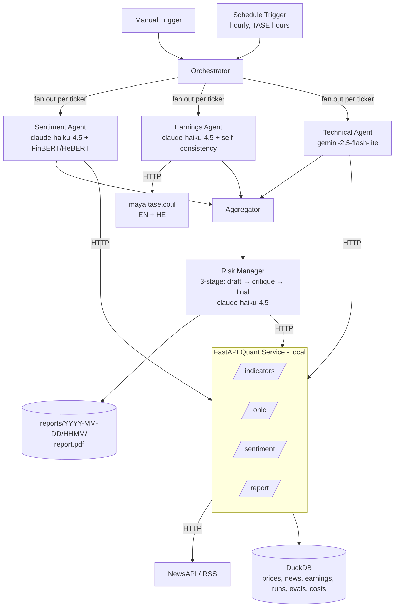

# Technical Design Plan

## n8n-Based Multi-Agent System for Investment Decisions (TA-35)

An automated workflow simulating a virtual investment team. Four specialist agents — Sentiment, Earnings, Technical, and Risk Manager — independently analyze a watchlist of TA-35 names; a coordinating workflow synthesizes their conclusions, runs a deliberate critique pass, and produces a justified buy / hold / sell recommendation as a detailed PDF report saved to disk.

Two design choices distinguish the system from a baseline LLM-only pipeline. First, sentiment is scored twice — once by a language model and once by a fine-tuned transformer (FinBERT for English, HeBERT for Hebrew) — and disagreements between the two are surfaced in the report rather than hidden. Second, the Risk Manager runs a three-stage critique loop (draft → devil's-advocate critique → final decision) so the rationale visibly stress-tests itself instead of being a single LLM emission. Number extraction from earnings disclosures uses self-consistency sampling to enforce a strict "do not invent numbers" guarantee.

The system runs on self-hosted n8n with language-model access via OpenRouter; computation that does not fit n8n is delegated to a small local Python service. The workflow runs in two modes: manually triggered for the demo, and on a schedule during TASE trading hours.

---

## 1. Scope and assumptions

- **Watchlist.** TA-35 constituents. Starter set: `TEVA.TA`, `NICE.TA`, `LUMI.TA`, `POLI.TA`, `ESLT.TA`; the full list lives in config.
- **Markets data.** Daily and intraday OHLC via Yahoo Finance (`*.TA` symbols); Alpha Vantage as a backup for indicators and intraday history.
- **News.** NewsAPI for English coverage and Israeli English-language outlets (Globes, Reuters, Bloomberg, Calcalist English) via targeted RSS. Hebrew headlines from Ynet/Calcalist RSS are used as a fallback and translated by the language model.
- **Earnings disclosures.** The English MAYA page at `maya.tase.co.il/en/reports/companies` is primary; the Hebrew page is fallback for names that report only in Hebrew. The paid TASE MAYA API is out of scope.
- **Decision scope.** An analytical recommendation report (long / short / hold / avoid with conviction and rationale) per ticker and an overall watchlist summary. No real or simulated execution.
- **Run modes.** Manual trigger for demonstrations; scheduled trigger hourly during TASE hours (Sun–Thu, ~09:30–17:30 Asia/Jerusalem).
- **Delivery.** A PDF report saved to `reports/YYYY-MM-DD/HHMM/report.pdf`. Email and Telegram delivery are out of scope but the report step is structured so either can be added with a single extra n8n node.
- **Deployment.** Local only.

---

## 2. System architecture

Two layers joined by one HTTP boundary:

1. **Orchestration (n8n + OpenRouter).** A trigger fans out the four agent sub-workflows over the watchlist, the Risk Manager consumes their outputs through a three-stage critique loop, and the report is rendered.
2. **Quant service (Python + FastAPI).** Computes technical indicators on cached OHLC, serves a sentiment endpoint backed by a fine-tuned transformer (FinBERT/HeBERT), and generates the PDF. Everything that needs a real library (`pandas-ta`, Hugging Face Transformers, WeasyPrint) lives here.



n8n's embedded Python runtime cannot import `pandas-ta`, Transformers, or PDF libraries, so all such work lives in the FastAPI service.

---

## 3. Agents

Each agent is an n8n sub-workflow. Sentiment, Earnings, and Technical run in parallel per ticker; the Risk Manager runs once afterward, consuming all three.

### 3.1 Sentiment Agent (dual-model)

- **Role.** Read news headlines and summaries from the last two hours about a given ticker; score sentiment two ways and surface disagreements.
- **Two independent scorers:**
  - **`llm_sentiment`** — Haiku 4.5 reads each article (translating Hebrew inline when needed) and returns a `-1..+1` score plus per-article reasoning. Prompt is **few-shot**, loaded from `prompts/sentiment_examples.jsonl` (labeled examples covering positive/negative/neutral and an English/Hebrew mix).
  - **`model_sentiment`** — the quant service's `/sentiment` endpoint. English text is scored by `ProsusAI/finbert`; Hebrew text by `avichr/heBERT_sentiment_analysis`. Outputs `-1..+1` per article and an aggregated score.
- **Agreement metric.** `|llm − model|` per article; aggregate disagreement is the mean. High disagreement is **not** a failure — it is a feature reported to the Risk Manager and shown in the PDF.
- **Sources.** NewsAPI (English); Globes/Reuters/Bloomberg/Calcalist-English RSS; Ynet/Calcalist Hebrew RSS as fallback. Fetching, §4.3 cleaning, and `news`-table persistence run server-side in the quant service (`/news/fetch`, `/news/store`) so n8n moves only compact, pre-cleaned items.
- **Output (JSON).**
  The aggregate `llm_sentiment` and `model_sentiment` are the **mean** of the per-article LLM and model scores; `disagreement` is the **mean of the per-article `|llm − model|`**. The per-article model scores come from `/sentiment`; the endpoint returns per-item scores only, so the aggregation and disagreement are computed in the sub-workflow.
  ```jsonc
  { "ticker":"TEVA.TA", "window":"2h",
    "llm_sentiment": -0.32, "model_sentiment": -0.18, "disagreement": 0.14,
    "n_articles": 7,
    "top_items":[{"headline":"…","source":"…","url":"…","language":"en",
                   "llm_score":-0.6, "model_score":-0.4}],
    "summary":"Negative tone driven by an FDA delay story; LLM more bearish than the fine-tuned model." }
  ```

### 3.2 Earnings Agent (self-consistent number extraction)

- **Role.** Detect recent MAYA disclosures for the ticker, classify them (earnings / guidance / material event / other), and extract headline financial numbers **only when present verbatim** in the source.
- **Self-consistency for numbers.** The language model is sampled **three times at `temperature=0.3`** for every number it extracts (revenue, EPS, guidance figures). A figure is committed only when at least two of the three samples agree (string-exact match after units normalization). Otherwise the field is marked `"ambiguous"` and shown that way in the report — never silently filled.
- **Sources.** `maya.tase.co.il/en/reports/companies` primary; the Hebrew page as fallback with LLM translation.
- **Output (JSON).**
  ```jsonc
  { "ticker":"TEVA.TA",
    "latest_disclosure":{"date":"2026-06-19","type":"earnings","language":"en",
                          "title":"Q1 2026 results","url":"https://maya.tase.co.il/…",
                          "summary":"Q1 beat on revenue; guidance reaffirmed.",
                          "extracted":{"revenue":{"value":"$4.1B","confidence":3},
                                       "eps":{"value":"$0.62","confidence":3},
                                       "guidance":{"value":"ambiguous","confidence":1}}},
    "is_earnings_window": true, "materiality":"high",
    "summary":"Q1 beat on revenue; guidance reaffirmed." }
  ```

### 3.3 Technical Agent

- **Role.** Compute and interpret RSI, MACD, Bollinger, and ATR over recent OHLC. HTTP calls are made by n8n; the language model writes a plain-English reading.
- **Sources.** Yahoo Finance via the quant service; Alpha Vantage as backup. Indicators via `pandas-ta`.
- **Output (JSON).**
  ```jsonc
  { "ticker":"TEVA.TA", "as_of":"2026-06-22",
    "indicators":{ "rsi_14":62.1,
                   "macd":{"macd":1.2,"signal":0.9,"hist":0.3},
                   "bbands":{"upper":34.1,"mid":31.0,"lower":27.9,"pct_b":0.71},
                   "atr_14":0.85 },
    "signal":"bullish_momentum",
    "summary":"Momentum building; near upper Bollinger but not yet overbought." }
  ```

### 3.4 Risk Manager — three-stage critique loop

The Risk Manager is the most consequential reasoning step in the system, so it runs as **three sequential LLM passes** with explicit role separation rather than a single emission:

1. **Draft pass.** Given the three agents' outputs, produce an initial `{recommendation, conviction, rationale}` per the agreement rubric.
2. **Devil's-advocate critique pass.** Given the draft, deliberately argue the **opposite** case: cite specific signals the draft underweighted, name plausible failure scenarios for the recommendation, and challenge the conviction. Output is structured: `{counter_recommendation, key_objections[], conviction_challenge}`.
3. **Final-decision pass.** Given the draft and the critique, produce the final `{recommendation, conviction, rationale}`. The rationale must explicitly state how each critique objection was either incorporated or dismissed.

This visibly demonstrates non-trivial prompt engineering, makes the model's reasoning auditable in the PDF (all three passes are shown), and reduces the rate of overconfident calls.

**Decision rubric (defaults in `config/rubric.yaml`):**

**Canonical enums (used by all agents, schemas, and the rubric):**

- `recommendation ∈ {long, short, hold, avoid}`
- `conviction ∈ {low, medium, high}`
- Technical `signal ∈ {bullish_momentum, bearish_momentum, overbought, oversold, neutral}`
- Earnings `kind ∈ {earnings, guidance, material_event, other}`
- Earnings `materiality ∈ {low, medium, high}`
- Agent `status ∈ {ok, degraded}` (returned by every sub-workflow)

**Directional mapping** (used by the agreement rule below):

| Agent     | Bullish                                              | Bearish                                         | Neutral              |
| --------- | ---------------------------------------------------- | ----------------------------------------------- | -------------------- |
| Sentiment | `max(llm_sentiment, model_sentiment) ≥ 0.2`       | `min(llm_sentiment, model_sentiment) ≤ -0.2` | otherwise            |
| Technical | `signal ∈ {bullish_momentum, oversold}`           | `signal ∈ {bearish_momentum, overbought}`    | `signal = neutral` |
| Earnings  | positive surprise / raised guidance (LLM-classified) | miss / cut guidance (LLM-classified)            | otherwise            |

**Strong signal flags** (used by the draft pass to pick a side at all):
`|llm_sentiment| ≥ 0.4` or `|model_sentiment| ≥ 0.4`; technical `signal ∈ {overbought, oversold}`; earnings `materiality = high` within the last `earnings_window_days`.

**Agreement rule.** Count agents whose directional mapping equals the candidate side (bullish for `long`, bearish for `short`).

| Agents agreeing | Conviction                                |
| --------------- | ----------------------------------------- |
| 3 of 3          | `high`                                  |
| 2 of 3          | `medium`                                |
| ≤ 1 of 3       | `hold` (no non-`hold` call permitted) |

`short` requires at least one **strong** bearish signal in addition to the count. `avoid` is reserved for cases where `status = "degraded"` on two or more agents (insufficient evidence) — never confused with a directional call.

**Conviction caps (applied after the count):**

- **Earnings event cap.** `materiality = high` within `earnings_window_days` caps conviction at `medium` (event risk), regardless of agreement count.
- **Dual-sentiment cap.** `disagreement > 0.3` caps conviction at `medium` and the report explicitly notes the LLM/model split.
- **Degraded-agent cap.** Any single agent returning `status = "degraded"` caps conviction at `medium`; two or more degraded agents force `avoid` per the rule above.

---

## 4. Data layer

### 4.1 Sources

| Need                    | Primary                                                                          | Notes / limits                             | Backup                                                  |
| ----------------------- | -------------------------------------------------------------------------------- | ------------------------------------------ | ------------------------------------------------------- |
| OHLC (daily + intraday) | Yahoo Finance via`yfinance`                                                    | Free; ~60d of 1–5m bars, ~730d of 1h bars | Alpha Vantage (25 req/day — cache hard)                |
| News (English)          | NewsAPI                                                                          | Free tier 100 req/day                      | Targeted RSS (Globes, Reuters, Bloomberg, Calcalist EN) |
| News (Hebrew, fallback) | Ynet / Calcalist RSS                                                             | Free RSS; LLM translates                   | —                                                      |
| Earnings disclosures    | `maya.tase.co.il/en/reports/companies` (HTML)                                  | Free, English where available              | Hebrew Maya + LLM translation                           |
| Market context          | Yahoo Finance for`^TA125.TA`, `^GSPC`, `^VIX`                              | Free                                       | —                                                      |
| Fine-tuned sentiment    | Hugging Face`ProsusAI/finbert` (EN), `avichr/heBERT_sentiment_analysis` (HE) | Local inference via`transformers`        | —                                                      |

### 4.2 Caching and persistence

DuckDB (`quant_service/store.duckdb`):

```sql
prices       (symbol TEXT, ts TIMESTAMP, open DOUBLE, high DOUBLE, low DOUBLE,
              close DOUBLE, volume BIGINT, source TEXT,
              PRIMARY KEY(symbol, ts))

news         (id TEXT PRIMARY KEY, symbol TEXT, published_at TIMESTAMP,
              headline TEXT, url TEXT, source TEXT, language TEXT,
              llm_sentiment DOUBLE, model_sentiment DOUBLE, disagreement DOUBLE,
              raw JSON)

earnings     (id TEXT PRIMARY KEY, symbol TEXT, published_at TIMESTAMP,
              language TEXT, title TEXT, url TEXT, kind TEXT,
              materiality TEXT, summary TEXT, extracted JSON)

runs         (run_id TEXT PRIMARY KEY, started_at TIMESTAMP, finished_at TIMESTAMP,
              mode TEXT, tickers JSON, status TEXT, report_path TEXT)

recommendations (run_id TEXT, ticker TEXT,
                 draft JSON, critique JSON, final JSON,
                 sentiment JSON, earnings JSON, technical JSON,
                 agent_status JSON,                              -- {sentiment:"ok|degraded", earnings:..., technical:...}
                 PRIMARY KEY(run_id, ticker))

costs        (run_id TEXT, agent TEXT, model TEXT, input_tokens INT,
              output_tokens INT, usd_cost DOUBLE, latency_ms INT,
              PRIMARY KEY(run_id, agent, model))

evals        (eval_id TEXT PRIMARY KEY, run_at TIMESTAMP, agent TEXT, dataset TEXT,
              metric TEXT, value DOUBLE, details JSON)
```

The `costs` table is written on every LLM call; the `evals` table is written by the evaluation harness (§9).

### 4.3 Cleaning and outlier handling

- OHLC: adjusted close; reindex onto the TASE calendar; one-day-gap forward-fill; flag returns beyond 8× MAD.
- News: deduplicate by `url`; drop items where the ticker only appears in tag metadata.
- Earnings: deduplicate by `(symbol, url)`; **the LLM never invents numbers** (§3.2 self-consistency enforces this).

### 4.4 Runtime universe

`config/universe.yaml`:

```yaml
watchlist: ["TEVA.TA","NICE.TA","LUMI.TA","POLI.TA","ESLT.TA"]
news_window_minutes: 120
earnings_window_days: 5
ohlc_lookback_days: 180
# Ticker -> query terms used to fetch news (§3.1). *.TA symbols are not searchable
# on NewsAPI/RSS, so each ticker maps to the company's common name(s) (EN + HE).
search_terms:
  TEVA.TA: ["Teva"]
  NICE.TA: ["NICE Ltd", "NICE Systems"]
  LUMI.TA: ["Bank Leumi", "Leumi", "לאומי"]
  POLI.TA: ["Bank Hapoalim", "Hapoalim", "הפועלים"]
  ESLT.TA: ["Elbit Systems", "Elbit", "אלביט"]
# RSS feeds fetched server-side by /news/fetch. EN feeds are primary; HE feeds are
# the §3.1 fallback (LLM translates inline). NewsAPI covers EN separately.
rss_feeds:
  en:
    - "https://www.globes.co.il/webservice/rss/rssfeeder.asmx/FeederNode?iID=1725"
    - "https://www.calcalistech.com/ctechnews/home/0,7340,L-5211,00.xml"
  he:
    - "https://www.calcalist.co.il/GeneralRSS/0,16335,L-8,00.xml"
    - "https://www.ynet.co.il/Integration/StoryRss6.xml"
# Cron is evaluated in n8n's TZ setting; set TZ=Asia/Jerusalem (§11.1) so this reads as local.
# Sun–Thu, hourly from 10:00 to 17:00 local time (covers TASE continuous trading ~09:30–17:25 IDT/IST).
# Day-of-week: 0=Sunday in n8n cron. DST is handled by the TZ setting, not the cron expression.
schedule_cron: "0 10-17 * * 0-4"
report_dir: "reports"
```

`config/rubric.yaml` holds the Risk Manager rubric thresholds.

---

## 5. Quant service (FastAPI)

Local FastAPI app (`uvicorn app:app --port 8000`). All responses small and pre-summarized.

| Endpoint             | Purpose                                                                      |
| -------------------- | ---------------------------------------------------------------------------- |
| `POST /ohlc`       | Cached daily/intraday OHLC for a symbol                                      |
| `POST /indicators` | RSI, MACD, Bollinger, ATR from cached OHLC                                   |
| `POST /sentiment`  | FinBERT/HeBERT score for a batch of texts (auto-routes by detected language) |
| `POST /news/fetch` | Fetch + clean recent news for a ticker (NewsAPI EN + RSS EN/HE) and return compact items plus the few-shot examples; keeps NewsAPI/RSS access and §4.3 cleaning server-side so n8n never fetches or parses raw feeds |
| `POST /news/store` | Upsert per-article dual-sentiment scores into the `news` table (§4.2); n8n cannot write DuckDB directly |
| `POST /report`     | Render PDF from Risk Manager output + run id                                 |
| `POST /validate`   | Validate an agent's raw LLM JSON against its Pydantic schema in `schemas/` (the §9.4 LLM-boundary guardrail; n8n's embedded Python cannot import the repo's schemas, so validation is served over HTTP) |

```jsonc
// POST /ohlc
{ "symbol":"TEVA.TA", "lookback_days":180, "interval":"1d" }
{ "symbol":"TEVA.TA","interval":"1d","as_of":"2026-06-22",
  "candles":[{"ts":"2026-06-20","o":31.1,"h":31.6,"l":30.9,"c":31.4,"v":1234567}, …],
  "summary":"180 daily bars cached." }

// POST /indicators
{ "symbol":"TEVA.TA","lookback_days":120,"indicators":["rsi","macd","bbands","atr"] }
{ "symbol":"TEVA.TA","as_of":"2026-06-22",
  "indicators":{ "rsi_14":62.1, "macd":{"macd":1.2,"signal":0.9,"hist":0.3},
                  "bbands":{"upper":34.1,"mid":31.0,"lower":27.9,"pct_b":0.71},
                  "atr_14":0.85 },
  "summary":"Momentum building; near upper Bollinger." }

// POST /sentiment
{ "items":[{"id":"a1","text":"Teva beats Q1 estimates …","language":"en"},
           {"id":"a2","text":"דיווח רבעוני: …","language":"he"}] }
{ "scores":[{"id":"a1","score":0.62,"model":"finbert"},
             {"id":"a2","score":-0.18,"model":"hebert"}],
  "summary":"2 items scored: 1 EN (finbert), 1 HE (hebert)." }

// POST /news/fetch
{ "ticker":"TEVA.TA", "window_minutes":120 }
{ "ticker":"TEVA.TA",
  "items":[{"id":"<sha1(url)>","headline":"Teva beats Q1 estimates","summary":"…",
            "source":"Globes","url":"https://…","published_at":"2026-06-22T09:14:00Z",
            "language":"en"}, …],
  "few_shot":[{"text":"…","language":"en","score":0.6,"reasoning":"…"}, …],
  "summary":"7 items after cleaning: 5 EN (NewsAPI/RSS), 2 HE (RSS)." }
// Partial-source failure degrades, never 500s: summary prefixed "degraded: <reason>".

// POST /news/store
{ "ticker":"TEVA.TA",
  "items":[{"id":"<sha1(url)>","headline":"…","url":"https://…","source":"Globes",
            "language":"en","published_at":"2026-06-22T09:14:00Z",
            "llm_score":-0.6,"model_score":-0.4,"disagreement":0.2,
            "raw":{ /* original fetched item */ }}, …] }
{ "stored":7 }

// POST /report
{ "run_id":"r_2026-06-22T13:00", "recommendations":[ /* per-ticker, see §6.3 */ ],
  "summary":"3 long, 1 hold, 1 avoid." }
{ "run_id":"r_2026-06-22T13:00", "pdf_path":"reports/2026-06-22/1300/report.pdf" }

// POST /validate
{ "agent":"technical", "payload":{"signal":"bullish_momentum","summary":"Momentum building."} }
{ "agent":"technical", "valid":true, "errors":[] }
// invalid example: {"valid":false, "errors":["signal: Input should be 'bullish_momentum', … or 'neutral'"]}
```

PDF rendering uses **WeasyPrint** over a **Jinja2** template (`templates/report.html.j2`).

---

## 6. Orchestration (n8n)

### 6.1 Triggers and high-level flow

- **Manual Trigger** for the demo.
- **Schedule Trigger** with `schedule_cron`; the workflow checks the current Asia/Jerusalem time against TASE hours and exits cleanly outside them.

Top-level flow:

1. Create a `run_id` and write a row into `runs`.
2. For each ticker (n8n loop, concurrency 3): call the three analysis sub-workflows in parallel.
3. Call the Risk Manager sub-workflow once per ticker; it runs the three-stage critique loop internally.
4. Call `POST /report` to render the PDF.
5. Update the `runs` row with `finished_at`, `status`, `report_path`.

### 6.2 Sub-workflow input / output

| Sub-workflow | Input                                                  | Calls                       | Output |
| ------------ | ------------------------------------------------------ | --------------------------- | ------ |
| Sentiment    | `{ ticker, window_minutes, run_id }`                 | `/news/fetch`, `/sentiment`, `/news/store` (NewsAPI + RSS reached server-side) | §3.1  |
| Earnings     | `{ ticker, window_days, run_id }`                    | maya.tase.co.il (EN/HE)     | §3.2  |
| Technical    | `{ ticker, lookback_days, run_id }`                  | `/ohlc`, `/indicators`  | §3.3  |
| Risk Manager | `{ ticker, sentiment, earnings, technical, run_id }` | (LLM only — three passes)  | §6.3  |

### 6.3 Per-ticker Risk Manager output (consumed by `/report`)

```jsonc
{
  "ticker":"TEVA.TA",
  "draft":   { "recommendation":"long",  "conviction":"high",
                "rationale":"…initial pass…" },
  "critique":{ "counter_recommendation":"hold",
                "key_objections":["LLM sentiment more bearish than FinBERT",
                                   "earnings window opens in 4 days"],
                "conviction_challenge":"high → medium" },
  "final":   { "recommendation":"long", "conviction":"medium",
                "rationale":"Two of three signals constructive; dual-sentiment disagreement (0.14) is below threshold but earnings window in 4 days warrants conviction cap. Critique objection on event risk incorporated." },
  "sentiment":{ "llm_sentiment":-0.12, "model_sentiment":-0.05, "disagreement":0.07,
                 "summary":"Mixed; mild negative bias." },
  "earnings":{ "is_window":false, "materiality":"low",
                "summary":"No recent disclosures." },
  "technical":{ "signal":"bullish_momentum",
                 "summary":"Momentum building; RSI 62, MACD positive." }
}
```

### 6.4 OpenRouter wiring

Each sub-workflow holds its own OpenRouter Chat Model node, so model selection is per-agent. The OpenRouter credential is created once at the n8n level. On n8n < 1.78, use the OpenAI node with base URL `https://openrouter.ai/api/v1`.

---

## 7. AI techniques and model assignments

The system intentionally combines four AI techniques beyond baseline LLM calls. Each is listed below with its location and what it contributes.

| Technique                                                               | Where                                                        | What it adds                                                                               |
| ----------------------------------------------------------------------- | ------------------------------------------------------------ | ------------------------------------------------------------------------------------------ |
| **Fine-tuned domain transformers** (FinBERT EN, HeBERT HE)        | `/sentiment` endpoint, used by the Sentiment Agent (§3.1) | Independent sentiment signal alongside the LLM; disagreement becomes a first-class feature |
| **Few-shot prompting from a labeled JSONL**                       | Sentiment + Earnings agents                                  | Visible, version-controlled, evaluable prompt engineering                                  |
| **Self-consistency sampling** (n=3, temperature=0.3)              | Earnings number extraction (§3.2)                           | Enforces "do not invent numbers" by construction, not by instruction                       |
| **Multi-pass critique loop** (draft → devil's advocate → final) | Risk Manager (§3.4)                                         | Visibly audits its own reasoning; reduces overconfident calls                              |

**Model assignments and cost:**

| Agent                     | OpenRouter model                 | Price (per 1M tokens) | Why                                                      |
| ------------------------- | -------------------------------- | --------------------- | -------------------------------------------------------- |
| Sentiment                 | `anthropic/claude-haiku-4.5`   | $1 in / $5 out        | Multi-headline reading, translation, few-shot scoring    |
| Earnings                  | `anthropic/claude-haiku-4.5`   | $1 in / $5 out        | Translation, careful extraction with self-consistency    |
| Technical                 | `google/gemini-2.5-flash-lite` | $0.10 in / $0.40 out  | Narrates a pre-computed JSON; no reasoning required      |
| Risk Manager (×3 passes) | `anthropic/claude-haiku-4.5`   | $1 in / $5 out        | Cross-agent synthesis, critique, and final justification |

Per-run cost for a five-ticker watchlist is roughly $0.04–$0.08 (the critique loop triples the Risk Manager's call count). All token usage is logged to `costs` per run/agent. Any agent's model is a one-field change to upgrade — Risk Manager promotion to `anthropic/claude-sonnet-4-6` is the natural fallback if rationale quality is insufficient.

---

## 8. PDF report

### 8.1 Structure

1. **Header.** Run id, timestamp (Asia/Jerusalem), watchlist, mode.
2. **Executive summary.** Watchlist counts (long / short / hold / avoid) and the top three highest-conviction calls with one-line rationales.
3. **Per-ticker section** (one page per ticker):
   - Recommendation badge and conviction.
   - Three agent panels:
     - **Sentiment** — both scores side-by-side, the disagreement value, top articles with citations.
     - **Earnings** — disclosure title, link to Maya, extracted figures with `confidence` markers (figures marked `ambiguous` are visually distinct).
     - **Technical** — indicator snapshot + signal.
   - **Reasoning trace** — draft, critique objections, final decision. This is the headline differentiator of the report.
   - **Price chart thumbnail** — 90-day close + 20/50-day moving averages, generated as PNG by the quant service.
4. **Methodology footer.** Decision rubric, dual-sentiment threshold, the critique-loop description, and a disclaimer that the report is educational and not investment advice.

### 8.2 Rendering

The Jinja2 template `templates/report.html.j2` receives the Risk Manager output and renders to HTML; WeasyPrint converts to PDF. The same template renders a single-ticker preview during development.

### 8.3 Delivery

Reports are written to `reports/YYYY-MM-DD/HHMM/report.pdf` and the path is stored in `runs.report_path`. Email/Telegram are not built but the seam is in place.

---

## 9. Evaluation and observability

A small evaluation harness ships with the system; results live in DuckDB (`evals` table) and are reported in the README.

### 9.1 Labeled datasets (in `eval/`)

- **`eval/sentiment_labeled.jsonl`** — 30 news items (~20 EN, ~10 HE) labeled `{positive, neutral, negative}` and a numeric score, hand-curated from real TA-35 coverage.
- **`eval/earnings_labeled.jsonl`** — 10 Maya disclosures with ground-truth `{kind, materiality, key figures}`.

### 9.2 Metrics

| Agent                      | Dataset           | Metrics                                                                           |
| -------------------------- | ----------------- | --------------------------------------------------------------------------------- |
| Sentiment (LLM)            | sentiment_labeled | Accuracy on label, MAE on numeric score                                           |
| Sentiment (FinBERT/HeBERT) | sentiment_labeled | Accuracy on label, MAE on numeric score                                           |
| Sentiment (agreement)      | sentiment_labeled | Correlation between LLM and model scores                                          |
| Earnings (classifier)      | earnings_labeled  | F1 on`kind`, accuracy on `materiality`                                        |
| Earnings (extractor)       | earnings_labeled  | Field-level precision/recall (numbers correct when present, "ambiguous" when not) |

### 9.3 Harness

`python -m eval.run` executes all of the above end-to-end against cached or fixture inputs, writes rows to `evals`, and prints a one-page summary. The README reproduces this summary so a grader sees concrete numbers, not just claims.

### 9.4 Observability

- **Cost logging.** Every LLM call writes `{run_id, agent, model, input_tokens, output_tokens, usd_cost, latency_ms}` to `costs`. A simple `python -m ops.cost_report` summarizes the last N runs.
- **Structured outputs.** Every LLM-to-agent boundary uses a **Pydantic schema**; a malformed response triggers one automatic retry with a stricter instruction before the agent returns a `degraded` result.
- **Degraded mode.** On any external-source failure or rate-limit, the agent returns its partial result with `status: "degraded"` and a reason; the Risk Manager downgrades conviction accordingly. No silent fallbacks, no fabrication.

---

## 10. Repository structure

```
n8n-investment-team/
├── n8n/
│   ├── orchestrator.workflow.json
│   ├── agents/ {sentiment,earnings,technical,risk_manager}.json
│   └── README_credentials.md
├── quant_service/
│   ├── app.py
│   ├── routers/ {ohlc,indicators,sentiment,news,report,validate}.py  # news = /news/fetch + /news/store
│   ├── data/ {yahoo.py, newsapi.py, maya.py, rss.py, news_store.py, tls.py, cache.py, ingest.py}  # ingest = OHLC pull/clean CLI (python -m data.ingest); news_store = news-table upsert; tls = OS-trust SSL context for httpx
│   ├── indicators/ {calc.py}  # pandas-ta computation behind /indicators (§3.3, §5)
│   ├── nlp/  {finbert.py, hebert.py, language_detect.py}
│   ├── pdf/  {render.py, charts.py}
│   ├── schemas/ {sentiment.py, earnings.py, technical.py, risk_manager.py}  # Pydantic
│   ├── ops/  {cost_log.py, cost_report.py}
│   ├── templates/ {report.html.j2, report.css}
│   ├── store.duckdb
│   └── requirements.txt
├── prompts/  {sentiment_examples.jsonl, earnings_examples.jsonl,
│              risk_manager_draft.md, risk_manager_critique.md, risk_manager_final.md}
├── eval/     {sentiment_labeled.jsonl, earnings_labeled.jsonl, run.py}
├── config/   {universe.yaml, rubric.yaml}
├── reports/  # generated PDFs, gitignored
├── docs/     {design.md, results.md, demo_script.md, architecture.svg}
├── README.md
├── .env.example
└── .gitignore
```

---

## 11. Configuration, secrets, operations

### 11.1 Environment variables

```
OPENROUTER_API_KEY        # all LLM access
NEWSAPI_API_KEY           # English news
ALPHAVANTAGE_API_KEY      # OHLC backup
QUANT_SERVICE_URL         # http://localhost:8000 (or host.docker.internal:8000 if n8n is in Docker)
DUCKDB_PATH               # quant_service/store.duckdb
REPORT_DIR                # reports
TZ                        # Asia/Jerusalem
HF_HOME                   # local Hugging Face cache (avoids re-downloads)
```

Only `.env.example` is committed. `reports/`, `store.duckdb`, and the HF cache are gitignored.

### 11.2 Operations notes

- Scheduled runs exit cleanly outside TASE hours (no `runs` row written).
- Each external call is cached and rate-limit-aware; on failure the workflow logs the issue, marks the agent as `degraded`, and the Risk Manager downgrades conviction.
- All times stored as UTC; rendered in Asia/Jerusalem.
- Determinism: a `run_id` plus cached inputs reproduces the same report on rerun. Note that LLM calls are non-deterministic by default; the system pins `temperature=0` for single-shot calls and `temperature=0.3` only for self-consistency sampling (which then commits a stable result via majority vote).

---

## 12. Delivery plan

**Skeleton.** n8n running, OpenRouter credential working, FastAPI service reachable, DuckDB schemas created, `config/` populated, Jinja2 template skeleton in place. Validates the integration before any logic.

**Milestone A — Data and indicators.** Yahoo Finance ingestion into `prices`; `/ohlc` and `/indicators` working; cleaning per §4.3.

**Milestone B — Three analysis agents.**

- **B1 Technical Agent** (HTTP-only).
- **B2 Sentiment Agent** with dual scoring (LLM + FinBERT/HeBERT), few-shot prompts, Pydantic validation.
- **B3 Earnings Agent** with Maya EN/HE scraping, self-consistency sampling for numbers, Pydantic validation.

**Milestone C — Risk Manager and orchestration.** The three-stage critique loop (§3.4); orchestrator fan-out across the watchlist; `recommendations` table populated with all three passes.

**Milestone D — PDF and schedule.** `/report` endpoint, full Jinja2 template with reasoning trace and dual-sentiment panel, chart thumbnails, scheduled trigger gated by TASE hours, manual trigger for the demo.

**Milestone E — Evaluation and docs.** Labeled datasets, evaluation harness, cost report; README with quick-start, screenshots, eval results, and a limitations section; `docs/results.md` with a walk-through of one or two real runs; `docs/demo_script.md` for the 5-minute defense; `docs/architecture.svg` exported from the design diagram.

---

## 13. Limitations (acknowledged up front)

The grader's rubric explicitly rewards "understanding of solution limitations." Stating them here so the implementation does not paper over them:

- **News coverage of TA-35 mid-caps is patchy** outside the largest names. Sentiment for a sparsely-covered ticker will legitimately be thin; the report shows article counts and never pads.
- **HeBERT is a general Hebrew sentiment model, not finance-specific.** Performance on financial-news Hebrew is worse than FinBERT on financial-news English; the evaluation harness measures this rather than glossing it.
- **Maya scraping is best-effort.** Layout changes can break the parser; the fallback is widening to the Hebrew page, which loses some structural fields. The earnings agent will mark fields `ambiguous` rather than guess.
- **The Risk Manager's three-pass loop reduces overconfidence but does not guarantee correctness.** It is a structured reasoning aid, not a financial-validity guarantee. The PDF disclaims this explicitly.
- **No live execution and no return measurement.** The system produces recommendations and rationales; it does not measure whether those recommendations would have made money. A backtest is a natural next step and is listed in `docs/results.md` as future work.
- **OpenRouter pricing and model availability** can change. The system is designed for one-field model swaps to absorb this.

---

## 14. Open assumptions

- **Maya scraping resilience** as above; if it becomes infeasible, the Earnings agent degrades to "no recent disclosure" rather than fabricating.
- **NewsAPI coverage** as above.
- **Schedule frequency.** Hourly during TASE hours is the default; a less-frequent schedule mostly saves NewsAPI quota without changing decisions given the two-hour news window.

