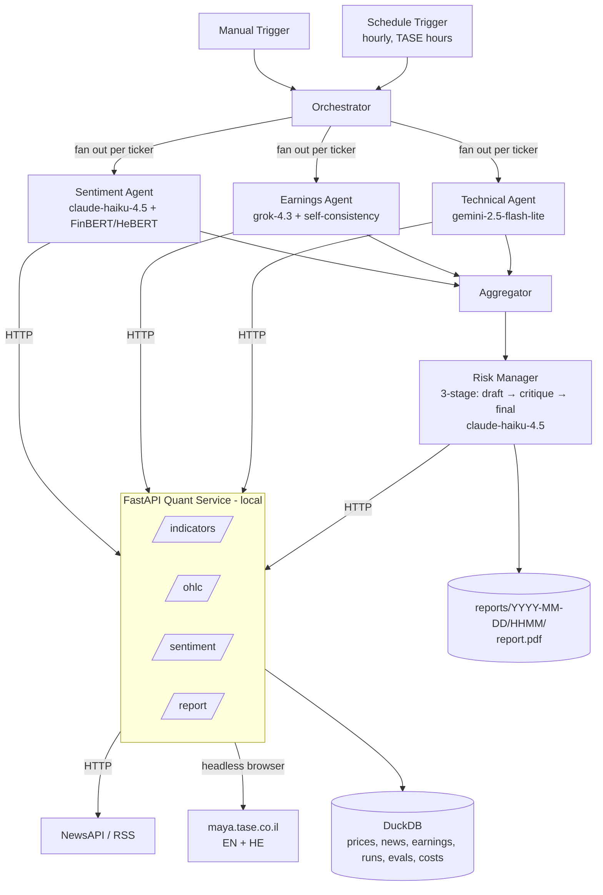

# Technical Design Plan

## n8n-Based Multi-Agent System for Investment Decisions (TA-35)

An automated workflow simulating a virtual investment team. Four specialist agents — Sentiment, Earnings, Technical, and Risk Manager — independently analyze a watchlist of TA-35 names; a coordinating workflow synthesizes their conclusions, runs a deliberate critique pass, and produces a justified buy / hold / sell recommendation as a detailed PDF report saved to disk.

Two design choices distinguish the system from a baseline LLM-only pipeline. First, sentiment is scored twice — once by a language model and once by a fine-tuned transformer (FinBERT for English, HeBERT for Hebrew) — and disagreements between the two are surfaced in the report rather than hidden. Second, the Risk Manager runs a three-stage critique loop (draft → devil's-advocate critique → final decision) so the rationale visibly stress-tests itself instead of being a single LLM emission. Number extraction from earnings disclosures uses self-consistency sampling to enforce a strict "do not invent numbers" guarantee.

The system runs on self-hosted n8n with language-model access via OpenRouter; computation that does not fit n8n is delegated to a small local Python service. The workflow runs in two modes: manually triggered for the demo, and on a schedule during TASE trading hours.

---

## 1. Scope and assumptions

- **Watchlist.** TA-35 constituents. Starter set: `TEVA.TA`, `NICE.TA`, `LUMI.TA`, `POLI.TA`, `ESLT.TA`; the full list lives in config.
- **Markets data.** Daily and intraday OHLC via Yahoo Finance (`*.TA` symbols); Alpha Vantage as a backup for indicators and intraday history.
- **News.** NewsAPI for English coverage and Israeli English-language outlets (Globes, Reuters, Bloomberg, Calcalist English) via targeted RSS. Hebrew headlines from Ynet/Calcalist RSS are used as a fallback and translated by the language model.
- **Earnings disclosures.** The English MAYA page at `maya.tase.co.il/en/reports/companies` is primary; the Hebrew page is fallback for names that report only in Hebrew. The paid TASE MAYA API is out of scope.
- **Decision scope.** An analytical recommendation report (long / short / hold / avoid with conviction and rationale) per ticker and an overall watchlist summary. No real or simulated execution.
- **Run modes.** Manual trigger for demonstrations; scheduled trigger hourly during TASE hours (Sun–Thu, ~09:30–17:30 Asia/Jerusalem); and a **chat trigger** (§6.5) that runs the same pipeline conversationally for an ad-hoc ticker.
- **Delivery.** A PDF report saved to `reports/YYYY-MM-DD/HHMM/report.pdf`. Email and Telegram delivery are out of scope but the report step is structured so either can be added with a single extra n8n node.
- **Deployment.** Local only.

---

## 2. System architecture

Two layers joined by one HTTP boundary:

1. **Orchestration (n8n + OpenRouter).** A trigger fans out the four agent sub-workflows over the watchlist, the Risk Manager consumes their outputs through a three-stage critique loop, and the report is rendered.
2. **Quant service (Python + FastAPI).** Computes technical indicators on cached OHLC, serves a sentiment endpoint backed by a fine-tuned transformer (FinBERT/HeBERT), and generates the PDF. Everything that needs a real library (`pandas-ta`, Hugging Face Transformers, WeasyPrint) lives here.



n8n's embedded Python runtime cannot import `pandas-ta`, Transformers, or PDF libraries, so all such work lives in the FastAPI service.

---

## 3. Agents

Each agent is an n8n sub-workflow. Sentiment, Earnings, and Technical run in parallel per ticker; the Risk Manager runs once afterward, consuming all three.

### 3.1 Sentiment Agent (dual-model)

- **Role.** Read news headlines and summaries from the last two hours about a given ticker; score sentiment two ways and surface disagreements.
- **Two independent scorers:**
  - **`llm_sentiment`** — Haiku 4.5 reads each article (translating Hebrew inline when needed) and returns a `-1..+1` score plus per-article reasoning. Prompt is **few-shot**, loaded from `prompts/sentiment_examples.jsonl` (labeled examples covering positive/negative/neutral and an English/Hebrew mix).
  - **`model_sentiment`** — the quant service's `/sentiment` endpoint. English text is scored by `ProsusAI/finbert`; Hebrew text by `avichr/heBERT_sentiment_analysis`. Outputs `-1..+1` per article and an aggregated score.
- **Agreement metric.** `|llm − model|` per article; aggregate disagreement is the mean. High disagreement is **not** a failure — it is a feature reported to the Risk Manager and shown in the PDF.
- **Sources.** NewsAPI (English); Globes/Reuters/Bloomberg/Calcalist-English RSS; Ynet/Calcalist Hebrew RSS as fallback. Fetching, §4.3 cleaning, and `news`-table persistence run server-side in the quant service (`/news/fetch`, `/news/store`) so n8n moves only compact, pre-cleaned items.
- **Output (JSON).**
  The aggregate `llm_sentiment` and `model_sentiment` are the **mean** of the per-article LLM and model scores; `disagreement` is the **mean of the per-article `|llm − model|`**. The per-article model scores come from `/sentiment`; the endpoint returns per-item scores only, so the aggregation and disagreement are computed in the sub-workflow.
  ```jsonc
  { "ticker":"TEVA.TA", "window":"2h",
    "llm_sentiment": -0.32, "model_sentiment": -0.18, "disagreement": 0.14,
    "n_articles": 7,
    "top_items":[{"headline":"…","source":"…","url":"…","language":"en",
                   "llm_score":-0.6, "model_score":-0.4}],
    "summary":"Negative tone driven by an FDA delay story; LLM more bearish than the fine-tuned model." }
  ```

### 3.2 Earnings Agent (self-consistent number extraction)

- **Role.** Detect recent MAYA disclosures for the ticker, classify them (earnings / guidance / material event / other), and extract headline financial numbers **only when present verbatim** in the source.
- **Which disclosure gets analyzed (top-3, most material wins).** A ticker's *newest* filing is usually administrative — a Form 4 insider statement, an "Opening of Trading" notice, a registrar update — while the disclosure that moves the thesis sits further down the list (verified: TEVA's newest is a Form 4 with its Q1 8-K 30 rows below; Elbit's newest is a *"to report Q2 results on Aug 5"* scheduling notice with the actual Q1 results 6 rows below). Analyzing the newest therefore reports "other / low" for almost every ticker, and §3.4's earnings-event conviction cap — which keys off `materiality: high` — never fires.

  So the agent **classifies the top 3 candidates and returns the most material one**:
  1. **Rank (deterministic, server-side).** `/earnings/fetch` scores in-window disclosures by title and returns them ranked, so only the top `earnings_candidates` (default 3, `config/universe.yaml`) carry an `excerpt`. Administrative filings are demoted (Forms 3/4/5, 13D/G, trading/registrar/meeting notices); results/guidance wording is promoted. This is **retrieval, not classification** — it only decides which documents are worth an LLM call.
  2. **Classify each candidate (LLM).** The §7 classify pass runs once per candidate, so `kind` and `materiality` remain the model's judgement, never the keyword score's.
  3. **Select.** Highest `materiality` wins (`high` > `medium` > `low`), tie broken by `kind` (`earnings` > `guidance` > `material_event` > `other`) and then recency. A mis-ranked candidate is therefore recoverable: the model simply classifies it `other/low` and a better-classified sibling is selected.
  4. **Extract from the winner only.** Self-consistency (n=3) runs on the selected disclosure alone, so the cost is 3 classify + 3 extract calls per ticker rather than 3 × the whole chain.
- **Self-consistency for numbers.** The language model is sampled **three times at `temperature=0.3`** for every number it extracts (revenue, EPS, guidance figures). A figure is committed only when at least two of the three samples agree (string-exact match after units normalization). Otherwise the field is marked `"ambiguous"` and shown that way in the report — never silently filled.
- **Sources.** `maya.tase.co.il/en/reports/companies` primary; the Hebrew page as fallback with LLM translation. The Maya site is a JavaScript SPA behind bot protection, so scraping happens **server-side in the quant service** (`/earnings/fetch`, Playwright headless Chromium) — n8n moves only compact disclosure items, mirroring the news pattern (§3.1).
- **Where the figures actually live (verified against the live site).** A disclosure is published across three layers, and only the third contains financial figures:
  1. `maya.tase.co.il/en/reports/details/<id>` — the SPA shell. Its `document.body.innerText` is navigation, the report-list sidebar, and a live stock quote. **No disclosure text, but it does contain decoy numbers** (`Last Rate 9,736`, `Change -0.4%`, the security id).
  2. `mayafiles.tase.co.il/rhtm/<bucket>/H<id>.htm` — an iframe holding the MAGNA cover sheet (~1.2 KB): issuer, regulation cited, and the attachment's filename. Still no figures.
  3. `mayafiles.tase.co.il/rpdf/<bucket>/P<id>-00.pdf` — **the attached press release / financial statement: the verbatim source of revenue, EPS and guidance.** Text-based (not scanned), so it extracts without OCR.

  The excerpt returned by `/earnings/fetch` is therefore taken from **layer 3**: resolve the report id's PDF attachment, extract its text, and bound it to `_EXCERPT_MAX`. Reading only layer 1 (the naive `body.innerText`) yields an excerpt in which no figure is ever present, so every field votes `"ambiguous"` and §3.2's self-consistency never commits — the mechanism is intact but never exercised. `<bucket>` is the report id rounded to its enclosing 1000 (id `1737984` → `1737001-1738000`). When the PDF is unreachable or carries no extractable text, the agent falls back to the layer-2 cover sheet and then the title alone; figures then come out `"ambiguous"`, never invented (§9.4).
- **Output (JSON).**
  `selected_disclosure` is the disclosure the agent classified *and* extracted from — the most material of the ranked candidates, not necessarily the newest. `considered` lists the other classified candidates so a reviewer can see what was rejected and why the winner won; it is the audit trail for the selection and carries no figures (only the winner is extracted from).
  ```jsonc
  { "ticker":"TEVA.TA",
    "selected_disclosure":{"date":"2026-06-19","type":"earnings","language":"en",
                          "title":"Q1 2026 results","url":"https://maya.tase.co.il/…",
                          "title_en":null,  // English translation of a Hebrew title; null for EN disclosures (§8.1 translation flag)
                          "summary":"Q1 beat on revenue; guidance reaffirmed.",
                          "extracted":{"revenue":{"value":"$4.1B","confidence":3},
                                       "eps":{"value":"$0.62","confidence":3},
                                       "guidance":{"value":"ambiguous","confidence":1}}},
    "considered":[{"date":"2026-06-22","title":"FORM 4 — Shields Matthew","url":"https://maya.tase.co.il/…",
                    "kind":"other","materiality":"low"}],  // classified but not selected
    "is_earnings_window": true, "materiality":"high",
    "summary":"Q1 beat on revenue; guidance reaffirmed." }
  ```
  `selected_disclosure` is `null` (and `considered` empty) when the scrape is healthy but nothing matched the window — a valid "no recent disclosure", never padded (§13, §14).

### 3.3 Technical Agent

- **Role.** Compute and interpret RSI, MACD, Bollinger, and ATR over recent OHLC. HTTP calls are made by n8n; the language model writes a plain-English reading.
- **Sources.** Yahoo Finance via the quant service; Alpha Vantage as backup. Indicators via `pandas-ta`.
- **Output (JSON).**
  ```jsonc
  { "ticker":"TEVA.TA", "as_of":"2026-06-22",
    "indicators":{ "rsi_14":62.1,
                   "macd":{"macd":1.2,"signal":0.9,"hist":0.3},
                   "bbands":{"upper":34.1,"mid":31.0,"lower":27.9,"pct_b":0.71},
                   "atr_14":0.85 },
    "signal":"bullish_momentum",
    "summary":"Momentum building; near upper Bollinger but not yet overbought." }
  ```

### 3.4 Risk Manager — three-stage critique loop

The Risk Manager is the most consequential reasoning step in the system, so it runs as **three sequential LLM passes** with explicit role separation rather than a single emission:

1. **Draft pass.** Given the three agents' outputs, produce an initial `{recommendation, conviction, rationale, earnings_direction}` per the agreement rubric. Sentiment and technical directions are computed deterministically server-side (`/riskmanager/context`); `earnings_direction ∈ {bullish, bearish, neutral}` is the one directional mapping §3.4 leaves to the model ("LLM-classified"), so it is emitted here to keep it auditable and to let the sub-workflow recompute the agreement count mechanically for the final clamp.
2. **Devil's-advocate critique pass.** Given the draft, deliberately argue the **opposite** case: cite specific signals the draft underweighted, name plausible failure scenarios for the recommendation, and challenge the conviction. Output is structured: `{counter_recommendation, key_objections[], conviction_challenge}`.
3. **Final-decision pass.** Given the draft and the critique, produce the final `{recommendation, conviction, rationale}`. The rationale must explicitly state how each critique objection was either incorporated or dismissed.

This visibly demonstrates non-trivial prompt engineering, makes the model's reasoning auditable in the PDF (all three passes are shown), and reduces the rate of overconfident calls.

**Decision rubric (defaults in `config/rubric.yaml`):**

**Canonical enums (used by all agents, schemas, and the rubric):**

- `recommendation ∈ {long, short, hold, avoid}`
- `conviction ∈ {low, medium, high}`
- Technical `signal ∈ {bullish_momentum, bearish_momentum, overbought, oversold, neutral}`
- Earnings `kind ∈ {earnings, guidance, material_event, other}`
- Earnings `materiality ∈ {low, medium, high}`
- Agent `status ∈ {ok, degraded}` (returned by every sub-workflow)

**Directional mapping** (used by the agreement rule below):

| Agent     | Bullish                                              | Bearish                                         | Neutral              |
| --------- | ---------------------------------------------------- | ----------------------------------------------- | -------------------- |
| Sentiment | `max(llm_sentiment, model_sentiment) ≥ 0.2`       | `min(llm_sentiment, model_sentiment) ≤ -0.2` | otherwise            |
| Technical | `signal ∈ {bullish_momentum, oversold}`           | `signal ∈ {bearish_momentum, overbought}`    | `signal = neutral` |
| Earnings  | positive surprise / raised guidance (LLM-classified) | miss / cut guidance (LLM-classified)            | otherwise            |

**Strong signal flags** (used by the draft pass to pick a side at all):
`|llm_sentiment| ≥ 0.4` or `|model_sentiment| ≥ 0.4`; technical `signal ∈ {overbought, oversold}`; earnings `materiality = high` within the last `earnings_window_days`.

**Agreement rule.** Count agents whose directional mapping equals the candidate side (bullish for `long`, bearish for `short`).

| Agents agreeing | Conviction                                |
| --------------- | ----------------------------------------- |
| 3 of 3          | `high`                                  |
| 2 of 3          | `medium`                                |
| ≤ 1 of 3       | `hold` (no non-`hold` call permitted) |

`short` requires at least one **strong** bearish signal in addition to the count. `avoid` is reserved for cases where `status = "degraded"` on two or more agents (insufficient evidence) — never confused with a directional call.

**Conviction caps (applied after the count):**

- **Earnings event cap.** `materiality = high` within `earnings_window_days` caps conviction at `medium` (event risk), regardless of agreement count.
- **Dual-sentiment cap.** `disagreement > 0.3` caps conviction at `medium` and the report explicitly notes the LLM/model split.
- **Degraded-agent cap.** Any single agent returning `status = "degraded"` caps conviction at `medium`; two or more degraded agents force `avoid` per the rule above.

---

## 4. Data layer

### 4.1 Sources

| Need                    | Primary                                                                          | Notes / limits                             | Backup                                                  |
| ----------------------- | -------------------------------------------------------------------------------- | ------------------------------------------ | ------------------------------------------------------- |
| OHLC (daily + intraday) | Yahoo Finance via`yfinance`                                                    | Free; ~60d of 1–5m bars, ~730d of 1h bars | Alpha Vantage (25 req/day — cache hard)                |
| News (English)          | NewsAPI                                                                          | Free tier 100 req/day                      | Targeted RSS (Globes, Reuters, Bloomberg, Calcalist EN) |
| News (Hebrew, fallback) | Ynet / Calcalist RSS                                                             | Free RSS; LLM translates                   | —                                                      |
| Earnings disclosures    | `maya.tase.co.il/en/reports/companies` (JS SPA, rendered via Playwright headless Chromium server-side); figures come from the disclosure's **PDF attachment** on `mayafiles.tase.co.il` (§3.2), text-extracted with `pypdf` | Free, English where available; best-effort (§13) | Hebrew Maya + LLM translation                           |
| Market context          | Yahoo Finance for`^TA125.TA`, `^GSPC`, `^VIX`                              | Free                                       | —                                                      |
| Fine-tuned sentiment    | Hugging Face`ProsusAI/finbert` (EN), `avichr/heBERT_sentiment_analysis` (HE) | Local inference via`transformers`        | —                                                      |

### 4.2 Caching and persistence

DuckDB (`quant_service/store.duckdb`):

```sql
prices       (symbol TEXT, ts TIMESTAMP, open DOUBLE, high DOUBLE, low DOUBLE,
              close DOUBLE, volume BIGINT, source TEXT,
              PRIMARY KEY(symbol, ts))

news         (id TEXT PRIMARY KEY, symbol TEXT, published_at TIMESTAMP,
              headline TEXT, url TEXT, source TEXT, language TEXT,
              llm_sentiment DOUBLE, model_sentiment DOUBLE, disagreement DOUBLE,
              raw JSON)

earnings     (id TEXT PRIMARY KEY, symbol TEXT, published_at TIMESTAMP,
              language TEXT, title TEXT, url TEXT, kind TEXT,
              materiality TEXT, summary TEXT, extracted JSON)

runs         (run_id TEXT PRIMARY KEY, started_at TIMESTAMP, finished_at TIMESTAMP,
              mode TEXT, tickers JSON, status TEXT, report_path TEXT)

recommendations (run_id TEXT, ticker TEXT,
                 draft JSON, critique JSON, final JSON,
                 sentiment JSON, earnings JSON, technical JSON,
                 agent_status JSON,                              -- {sentiment:"ok|degraded", earnings:..., technical:...}
                 PRIMARY KEY(run_id, ticker))

costs        (run_id TEXT, agent TEXT, model TEXT, input_tokens INT,
              output_tokens INT, usd_cost DOUBLE, latency_ms INT,
              PRIMARY KEY(run_id, agent, model))

evals        (eval_id TEXT PRIMARY KEY, run_at TIMESTAMP, agent TEXT, dataset TEXT,
              metric TEXT, value DOUBLE, details JSON)
```

The `costs` table is written on every LLM call; the `evals` table is written by the evaluation harness (§9).

### 4.3 Cleaning and outlier handling

- OHLC: adjusted close; reindex onto the TASE calendar; one-day-gap forward-fill; flag returns beyond 8× MAD.
- News: deduplicate by `url`; drop items where the ticker only appears in tag metadata.
- Earnings: deduplicate by `(symbol, url)`; **the LLM never invents numbers** (§3.2 self-consistency enforces this).

### 4.4 Runtime universe

`config/universe.yaml`:

```yaml
watchlist: ["TEVA.TA","NICE.TA","LUMI.TA","POLI.TA","ESLT.TA"]
news_window_minutes: 120
earnings_window_days: 5
earnings_candidates: 3   # disclosures classified per ticker; most material wins (§3.2)
ohlc_lookback_days: 180
# Ticker -> query terms used to fetch news (§3.1). *.TA symbols are not searchable
# on NewsAPI/RSS, so each ticker maps to the company's common name(s) (EN + HE).
search_terms:
  TEVA.TA: ["Teva"]
  NICE.TA: ["NICE Ltd", "NICE Systems"]
  LUMI.TA: ["Bank Leumi", "Leumi", "לאומי"]
  POLI.TA: ["Bank Hapoalim", "Hapoalim", "הפועלים"]
  ESLT.TA: ["Elbit Systems", "Elbit", "אלביט"]
# RSS feeds fetched server-side by /news/fetch. EN feeds are primary; HE feeds are
# the §3.1 fallback (LLM translates inline). NewsAPI covers EN separately.
rss_feeds:
  en:
    - "https://www.globes.co.il/webservice/rss/rssfeeder.asmx/FeederNode?iID=1725"
    - "https://www.calcalistech.com/ctechnews/home/0,7340,L-5211,00.xml"
  he:
    - "https://www.calcalist.co.il/GeneralRSS/0,16335,L-8,00.xml"
    - "https://www.ynet.co.il/Integration/StoryRss6.xml"
# Cron is evaluated in n8n's TZ setting; set TZ=Asia/Jerusalem (§11.1) so this reads as local.
# Sun–Thu, hourly from 10:00 to 17:00 local time (covers TASE continuous trading ~09:30–17:25 IDT/IST).
# Day-of-week: 0=Sunday in n8n cron. DST is handled by the TZ setting, not the cron expression.
schedule_cron: "0 10-17 * * 0-4"
report_dir: "reports"
# n8n sub-workflow ids (§6.2). Used by /costs/harvest to attribute each agent
# sub-execution's LLM calls to an agent name in `costs` (§9.4). Filled in after the
# agent workflows are imported into n8n.
n8n_workflow_ids:
  technical: "81TNoBqkAasjafvT"
  sentiment: "KnV1HngeDrOcVcqH"
  earnings: "7SU3ioCng1HsFMkl"
  risk_manager: "NgajAcDX26YE3i98"
  # chat: "<id>"   # §6.5 chat assistant — added in Step 13 so its tokens reach `costs`
```

`config/rubric.yaml` holds the Risk Manager rubric thresholds.

---

## 5. Quant service (FastAPI)

Local FastAPI app (`uvicorn app:app --port 8000`). All responses small and pre-summarized.

| Endpoint             | Purpose                                                                      |
| -------------------- | ---------------------------------------------------------------------------- |
| `POST /ohlc`       | Cached daily/intraday OHLC for a symbol                                      |
| `POST /indicators` | RSI, MACD, Bollinger, ATR from cached OHLC                                   |
| `POST /sentiment`  | FinBERT/HeBERT score for a batch of texts (auto-routes by detected language) |
| `POST /news/fetch` | Fetch + clean recent news for a ticker (NewsAPI EN + RSS EN/HE) and return compact items plus the few-shot examples; keeps NewsAPI/RSS access and §4.3 cleaning server-side so n8n never fetches or parses raw feeds |
| `POST /news/store` | Upsert per-article dual-sentiment scores into the `news` table (§4.2); n8n cannot write DuckDB directly |
| `POST /earnings/fetch` | Scrape + clean recent Maya disclosures for a ticker (EN primary, HE fallback; Playwright headless Chromium) and return compact items **ranked by relevance (§3.2), the top `earnings_candidates` each with a bounded text excerpt extracted from that disclosure's PDF attachment — the only layer carrying financial figures** — plus the few-shot examples; keeps SPA rendering, bot-protection handling, PDF text extraction, ranking, and §4.3 cleaning server-side so n8n never touches raw pages or PDFs |
| `POST /earnings/store` | Upsert the classified disclosure + self-consistency extraction into the `earnings` table (§4.2); n8n cannot write DuckDB directly |
| `POST /report`     | Render PDF from Risk Manager output + run id                                 |
| `POST /validate`   | Validate an agent's raw LLM JSON against its Pydantic schema in `schemas/` (the §9.4 LLM-boundary guardrail; n8n's embedded Python cannot import the repo's schemas, so validation is served over HTTP) |
| `POST /runs/start`   | Open a run: mint the `run_id`, write the `runs` row (§4.2), and return the run's config (watchlist + windows from `config/universe.yaml`) so the orchestrator never hardcodes them (§4.4). n8n cannot write DuckDB directly, so every orchestration write is served over HTTP — same precedent as `/news/store` and `/earnings/store` |
| `POST /runs/finish`  | Close a run: set `finished_at`, `status`, `report_path` on the `runs` row |
| `POST /recommendations/store` | Upsert one per-ticker `recommendations` row (draft/critique/final + the three agent outputs + `agent_status`), keyed `(run_id, ticker)` (§4.2) |
| `POST /costs/harvest` | Log the run's LLM costs into `costs` (§4.2, §9.4). Token usage is **not reachable inside an n8n workflow** — the LLM chain node emits only its text and a Code node cannot read the Chat Model sub-node's run data — so the quant service reads the agents' sub-executions from n8n's REST API (`N8N_API_URL`/`N8N_API_KEY`, §11.1) and pulls the real `tokenUsage` (prompt/completion), the model, and each call's `executionTime` (→ `latency_ms`) per LLM call. `usd_cost` is computed server-side from the §7 price table. The orchestrator calls this once after the fan-out, when every sub-execution has finished and been persisted. Idempotent: re-harvesting a `run_id` rewrites the same totals. Degrades (never 500s) if the n8n API is unreachable |
| `POST /riskmanager/context` | Serve the Risk Manager sub-workflow its three pass prompts (from `prompts/risk_manager_*.md`), the rubric thresholds (from `config/rubric.yaml`), and the **deterministic** §3.4 rubric facts (directional mapping, strong-signal flags, agreement counts, applicable conviction caps) computed from the agent outputs. Keeps prompts and rubric server-side (never hardcoded in the workflow) and makes the rubric a mechanism, not just an instruction — mirrors the server-side few-shot loading in `/news/fetch` and `/earnings/fetch`. Read-only; degrades (never 500s) on partial agent input |

```jsonc
// POST /ohlc
{ "symbol":"TEVA.TA", "lookback_days":180, "interval":"1d" }
{ "symbol":"TEVA.TA","interval":"1d","as_of":"2026-06-22",
  "candles":[{"ts":"2026-06-20","o":31.1,"h":31.6,"l":30.9,"c":31.4,"v":1234567}, …],
  "summary":"180 daily bars cached." }

// POST /indicators
{ "symbol":"TEVA.TA","lookback_days":120,"indicators":["rsi","macd","bbands","atr"] }
{ "symbol":"TEVA.TA","as_of":"2026-06-22",
  "indicators":{ "rsi_14":62.1, "macd":{"macd":1.2,"signal":0.9,"hist":0.3},
                  "bbands":{"upper":34.1,"mid":31.0,"lower":27.9,"pct_b":0.71},
                  "atr_14":0.85 },
  "summary":"Momentum building; near upper Bollinger." }

// POST /sentiment
{ "items":[{"id":"a1","text":"Teva beats Q1 estimates …","language":"en"},
           {"id":"a2","text":"דיווח רבעוני: …","language":"he"}] }
{ "scores":[{"id":"a1","score":0.62,"model":"finbert"},
             {"id":"a2","score":-0.18,"model":"hebert"}],
  "summary":"2 items scored: 1 EN (finbert), 1 HE (hebert)." }

// POST /news/fetch
{ "ticker":"TEVA.TA", "window_minutes":120 }
{ "ticker":"TEVA.TA",
  "items":[{"id":"<sha1(url)>","headline":"Teva beats Q1 estimates","summary":"…",
            "source":"Globes","url":"https://…","published_at":"2026-06-22T09:14:00Z",
            "language":"en"}, …],
  "few_shot":[{"text":"…","language":"en","score":0.6,"reasoning":"…"}, …],
  "summary":"7 items after cleaning: 5 EN (NewsAPI/RSS), 2 HE (RSS)." }
// Partial-source failure degrades, never 500s: summary prefixed "degraded: <reason>".

// POST /news/store
{ "ticker":"TEVA.TA",
  "items":[{"id":"<sha1(url)>","headline":"…","url":"https://…","source":"Globes",
            "language":"en","published_at":"2026-06-22T09:14:00Z",
            "llm_score":-0.6,"model_score":-0.4,"disagreement":0.2,
            "raw":{ /* original fetched item */ }}, …] }
{ "stored":7 }

// POST /earnings/fetch
{ "ticker":"TEVA.TA", "window_days":5 }
{ "ticker":"TEVA.TA",
  "items":[{"id":"<sha1(symbol|url)>","symbol":"TEVA.TA",
            "published_at":"2026-06-19T06:05:00+00:00",
            "title":"Q1 2026 results","url":"https://maya.tase.co.il/…",
            "language":"en", "rank_score":6,
            "excerpt":"Teva … revenues were $4.1 billion …"}, …],
  "few_shot":[{"title":"…","excerpt":"…","language":"en","kind":"earnings",
               "materiality":"high","reasoning":"…"}, …],
  "summary":"2 disclosure(s) in window: 2 EN, 0 HE (window 5d)." }
// Items are ordered by `rank_score` desc, then recency (§3.2 ranking). Only the
// top `earnings_candidates` carry an `excerpt` — the verbatim source the §3.2
// classify + self-consistency passes read; the rest are context only.
// `language` on an excerpted item is re-derived from the PDF text, since Maya's
// English site serves AI-translated titles for Hebrew filings (§3.2).
// Scrape failure degrades, never 500s: summary prefixed "degraded: <reason>".

// POST /earnings/store
{ "ticker":"TEVA.TA",
  "items":[{"id":"<sha1(symbol|url)>","published_at":"2026-06-19T06:05:00+00:00",
            "language":"en","title":"Q1 2026 results","url":"https://…",
            "kind":"earnings","materiality":"high",
            "summary":"Q1 beat on revenue; guidance reaffirmed.",
            "extracted":{"revenue":{"value":"$4.1B","confidence":3},
                         "eps":{"value":"$0.62","confidence":3},
                         "guidance":{"value":"ambiguous","confidence":1}}}] }
{ "stored":1 }

// POST /runs/start
{ "mode":"manual" }                       // mode ∈ {manual, scheduled, chat}  (chat = §6.5)
{ "run_id":"r_2026-06-22T13:00", "started_at":"2026-06-22T10:00:00+00:00",
  "mode":"manual",
  "watchlist":["TEVA.TA","NICE.TA", …],   // config/universe.yaml (§4.4)
  "window_minutes":120, "window_days":5, "lookback_days":180,
  "summary":"run r_2026-06-22T13:00 started (manual): 5 ticker(s)." }

// POST /runs/finish
{ "run_id":"r_2026-06-22T13:00", "status":"ok",      // status ∈ {ok, degraded, error}
  "report_path":"reports/2026-06-22/1300/report.pdf" }
{ "run_id":"r_2026-06-22T13:00", "finished_at":"2026-06-22T10:04:12+00:00",
  "status":"ok", "summary":"run r_2026-06-22T13:00 finished (ok)." }

// POST /recommendations/store
{ "run_id":"r_2026-06-22T13:00", "ticker":"TEVA.TA",
  "draft":{ /* §6.3 */ }, "critique":{ /* §6.3 */ }, "final":{ /* §6.3 */ },
  "sentiment":{ /* §3.1 */ }, "earnings":{ /* §3.2 */ }, "technical":{ /* §3.3 */ },
  "agent_status":{"sentiment":"ok","earnings":"degraded","technical":"ok"} }
{ "stored":1 }

// POST /costs/harvest
{ "run_id":"r_2026-06-22T13:00" }
{ "run_id":"r_2026-06-22T13:00", "rows":4, "calls":9, "usd_cost":0.0421,
  "by_agent":[{"agent":"technical","model":"google/gemini-2.5-flash-lite",
               "input_tokens":812,"output_tokens":96,"usd_cost":0.0001,
               "latency_ms":1814,"calls":1}, …],
  "summary":"harvested 9 LLM call(s) across 4 agent(s): $0.0421." }
// Unreachable n8n API degrades, never 500s: summary prefixed "degraded: <reason>".

// POST /report
{ "run_id":"r_2026-06-22T13:00", "recommendations":[ /* per-ticker, see §6.3 */ ],
  "summary":"3 long, 1 hold, 1 avoid." }
{ "run_id":"r_2026-06-22T13:00", "pdf_path":"reports/2026-06-22/1300/report.pdf" }
// The §8.1 rich blocks (news citations, Maya disclosure + figures, indicator
// snapshot, price chart) are enriched server-side from the `news`/`earnings`
// tables and the `prices` cache — the §6.3 payload carries only the condensed
// panels (§2 heavy-data-stays-server-side). Rendering degrades, never 500s:
// { "run_id":…, "pdf_path": null, "summary":"degraded: <reason>" } (the
// orchestrator maps a null pdf_path to run status "error"). Needs the GTK
// runtime for WeasyPrint (§11.1).

// POST /validate
{ "agent":"technical", "payload":{"signal":"bullish_momentum","summary":"Momentum building."} }
{ "agent":"technical", "valid":true, "errors":[] }
// invalid example: {"valid":false, "errors":["signal: Input should be 'bullish_momentum', … or 'neutral'"]}
// agents: technical, sentiment, earnings, earnings_extraction, risk_draft, risk_critique, risk_final

// POST /riskmanager/context
{ "ticker":"TEVA.TA", "sentiment":{ /* §3.1 */ }, "earnings":{ /* §3.2 */ }, "technical":{ /* §3.3 */ } }
{ "ticker":"TEVA.TA",
  "prompts":{ "draft":"…", "critique":"…", "final":"…" },          // prompts/risk_manager_*.md
  "rubric":{ /* config/rubric.yaml */ },
  "facts":{ "sentiment_direction":"bullish", "technical_direction":"bearish",
            "strong_signals":{"sentiment":true,"technical":false,"earnings":false,"any":true},
            "has_strong_bearish":false, "short_requires_strong_bearish":true,
            "agreement_counts":{"fixed_bullish":1,"fixed_bearish":1,
              "by_earnings_direction":{"bullish":{"bullish":2,"bearish":1},
                "bearish":{"bullish":1,"bearish":2},"neutral":{"bullish":1,"bearish":1}}},
            "caps":{"earnings_event":false,"dual_sentiment":false,"degraded_agents":[],
              "degraded_count":0,"force_avoid":false,"any_cap_medium":false} },
  "summary":"context ready for TEVA.TA." }
// Read-only; partial/degraded agent input degrades the summary ("degraded: …"), never 500s.
```

PDF rendering uses **WeasyPrint** over a **Jinja2** template (`templates/report.html.j2`).

---

## 6. Orchestration (n8n)

### 6.1 Triggers and high-level flow

- **Manual Trigger** for the demo.
- **Schedule Trigger** with `schedule_cron`; the workflow checks the current Asia/Jerusalem time against TASE hours and exits cleanly outside them.

Top-level flow:

1. Call `POST /runs/start` — the service mints the `run_id`, writes the `runs` row, and returns the watchlist and window parameters from `config/universe.yaml`.
2. For each ticker (n8n loop, concurrency 3): call the three analysis sub-workflows in parallel.
3. Call the Risk Manager sub-workflow once per ticker; it runs the three-stage critique loop internally. Persist each result with `POST /recommendations/store`.
4. Call `POST /costs/harvest` to log every LLM call of the run into `costs` (§9.4 — token usage is only available from n8n's execution API, so it is harvested once the sub-executions have finished).
5. Call `POST /report` to render the PDF.
6. Call `POST /runs/finish` to set `finished_at`, `status`, `report_path` on the `runs` row.

### 6.2 Sub-workflow input / output

| Sub-workflow | Input                                                  | Calls                       | Output |
| ------------ | ------------------------------------------------------ | --------------------------- | ------ |
| Sentiment    | `{ ticker, window_minutes, run_id }`                 | `/news/fetch`, `/sentiment`, `/news/store` (NewsAPI + RSS reached server-side) | §3.1  |
| Earnings     | `{ ticker, window_days, run_id }`                    | `/earnings/fetch`, `/validate`, `/earnings/store` (Maya EN/HE reached server-side via headless browser) | §3.2  |
| Technical    | `{ ticker, lookback_days, run_id }`                  | `/ohlc`, `/indicators`  | §3.3  |
| Risk Manager | `{ ticker, sentiment, earnings, technical, run_id }` | `/riskmanager/context` (prompts + rubric + deterministic facts), `/validate` (×3 passes); three LLM passes otherwise | §6.3  |

### 6.3 Per-ticker Risk Manager output (consumed by `/report`)

```jsonc
{
  "ticker":"TEVA.TA",
  "draft":   { "recommendation":"long",  "conviction":"high",
                "rationale":"…initial pass…" },
  "critique":{ "counter_recommendation":"hold",
                "key_objections":["LLM sentiment more bearish than FinBERT",
                                   "earnings window opens in 4 days"],
                "conviction_challenge":"high → medium" },
  "final":   { "recommendation":"long", "conviction":"medium",
                "rationale":"Two of three signals constructive; dual-sentiment disagreement (0.14) is below threshold but earnings window in 4 days warrants conviction cap. Critique objection on event risk incorporated." },
  "sentiment":{ "llm_sentiment":-0.12, "model_sentiment":-0.05, "disagreement":0.07,
                 "summary":"Mixed; mild negative bias." },
  "earnings":{ "is_window":false, "materiality":"low",
                "summary":"No recent disclosures." },
  "technical":{ "signal":"bullish_momentum",
                 "summary":"Momentum building; RSI 62, MACD positive." }
}
```

### 6.4 OpenRouter wiring

Each sub-workflow holds its own OpenRouter Chat Model node, so model selection is per-agent. The OpenRouter credential is created once at the n8n level. On n8n < 1.78, use the OpenAI node with base URL `https://openrouter.ai/api/v1`.

### 6.5 Chat assistant front end (`mode: "chat"`)

A third entry point alongside the manual and scheduled triggers: an n8n **Chat Trigger** → **AI Agent** (`n8n/chat_assistant.workflow.json`) that turns the pipeline into a conversational "investment team" — *"what do you think about Teva?"* runs the real fan-out for that ticker and answers with the Risk Manager's call.

- **The chat agent is a router, not an analyst.** This is the load-bearing constraint. It holds **no analytical authority**: it may only invoke tools and relay what they return. It must never emit a recommendation, conviction, sentiment score, indicator, or financial figure of its own — those come from the Risk Manager and the quant service, or they do not appear. Letting the chat model *discuss* the stocks would bypass both the §3.4 critique loop and the §3.2 "never invent numbers" guarantee, which are the system's differentiators. Its system prompt states this explicitly, and the §9.1 eval set gains a small "refusal" case: asked for a figure the tools did not return, it declines instead of inventing one.
- **Tool.** One **Call n8n Workflow Tool** bound to the orchestrator. The orchestrator therefore gains an **Execute Workflow Trigger** with an optional `tickers` input (comma-separated); when supplied it overrides the `config/universe.yaml` watchlist for that run, so an ad-hoc single-ticker request reuses the identical fan-out → Risk Manager → persistence path rather than duplicating it. Omitted ⇒ the full watchlist, exactly as the manual/scheduled runs behave.
- **Memory.** A buffer-window memory holds the conversation so follow-ups ("and NICE?") resolve to a ticker.
- **Model.** `anthropic/claude-haiku-4.5` at `temperature=0` (routing, not reasoning).
- **Persistence and cost.** A chat-initiated run is a first-class run: it calls `/runs/start` with `mode: "chat"` and writes `runs`, `recommendations`, and `costs` like any other. The chat workflow's own id is added to `n8n_workflow_ids` as the `chat` agent so `/costs/harvest` attributes its tokens too (§9.4).
- **Latency and expectation-setting.** A single ticker takes ~40–80 s (Maya's headless scrape plus the three Risk Manager passes), so the assistant announces the wait before calling the tool. Reports still land on disk per §8.3; the chat reply is a summary, not a replacement for the PDF.

Canonical enum update: run `mode ∈ {manual, scheduled, chat}` (§5 `/runs/start`).

---

## 7. AI techniques and model assignments

The system intentionally combines four AI techniques beyond baseline LLM calls. Each is listed below with its location and what it contributes.

| Technique                                                               | Where                                                        | What it adds                                                                               |
| ----------------------------------------------------------------------- | ------------------------------------------------------------ | ------------------------------------------------------------------------------------------ |
| **Fine-tuned domain transformers** (FinBERT EN, HeBERT HE)        | `/sentiment` endpoint, used by the Sentiment Agent (§3.1) | Independent sentiment signal alongside the LLM; disagreement becomes a first-class feature |
| **Few-shot prompting from a labeled JSONL**                       | Sentiment + Earnings agents                                  | Visible, version-controlled, evaluable prompt engineering                                  |
| **Self-consistency sampling** (n=3, temperature=0.3)              | Earnings number extraction (§3.2)                           | Enforces "do not invent numbers" by construction, not by instruction                       |
| **Multi-pass critique loop** (draft → devil's advocate → final) | Risk Manager (§3.4)                                         | Visibly audits its own reasoning; reduces overconfident calls                              |

**Model assignments and cost:**

| Agent                     | OpenRouter model                 | Price (per 1M tokens) | Why                                                      |
| ------------------------- | -------------------------------- | --------------------- | -------------------------------------------------------- |
| Sentiment                 | `anthropic/claude-haiku-4.5`   | $1 in / $5 out        | Multi-headline reading, translation, few-shot scoring    |
| Earnings                  | `x-ai/grok-4.3`                | $1.25 in / $2.50 out  | Translation, careful extraction with self-consistency    |
| Technical                 | `google/gemini-2.5-flash-lite` | $0.10 in / $0.40 out  | Narrates a pre-computed JSON; no reasoning required      |
| Risk Manager (×3 passes) | `anthropic/claude-haiku-4.5`   | $1 in / $5 out        | Cross-agent synthesis, critique, and final justification |

Per-run cost for a five-ticker watchlist is roughly $0.04–$0.08 (the critique loop triples the Risk Manager's call count). All token usage is logged to `costs` per run/agent. Any agent's model is a one-field change to upgrade — Risk Manager promotion to `anthropic/claude-sonnet-4-6` is the natural fallback if rationale quality is insufficient.

The Earnings agent runs `x-ai/grok-4.3` rather than Haiku 4.5. Note that this is **not** a saving for this agent. Grok's output is half Haiku's price but its input is 25% dearer, so it only wins when a call's input is under ~10× its output. The Earnings agent sits on the wrong side of that line: each of the three ranked candidates carries a PDF excerpt of up to 6,000 characters (and the winning excerpt is re-sent once per self-consistency sample), while every response is short JSON. A representative 10k-in/500-out classify call costs $0.01375 on Grok against $0.01250 on Haiku — about 10% more. The swap is therefore justified on extraction quality, not price; `costs` per run/agent is the arbiter.

---

## 8. PDF report

### 8.1 Structure

1. **Header.** Run id, timestamp (Asia/Jerusalem), watchlist, mode.
2. **Executive summary.** Watchlist counts (long / short / hold / avoid) and the top three highest-conviction calls with one-line rationales.
3. **Per-ticker section** (one page per ticker):
   - Recommendation badge and conviction.
   - Three agent panels:
     - **Sentiment** — both scores side-by-side, the disagreement value, top articles with citations.
     - **Earnings** — disclosure title, link to Maya, extracted figures with `confidence` markers (figures marked `ambiguous` are visually distinct).
     - **Technical** — indicator snapshot + signal.
   - **Reasoning trace** — draft, critique objections, final decision. This is the headline differentiator of the report.
   - **Price chart thumbnail** — 90-day close + 20/50-day moving averages, generated as PNG by the quant service.
4. **Methodology footer.** Decision rubric, dual-sentiment threshold, the critique-loop description, and a disclaimer that the report is educational and not investment advice.

### 8.2 Rendering

The Jinja2 template `templates/report.html.j2` receives the Risk Manager output and renders to HTML; WeasyPrint converts to PDF. The same template renders a single-ticker preview during development.

### 8.3 Delivery

Reports are written to `reports/YYYY-MM-DD/HHMM/report.pdf` and the path is stored in `runs.report_path`. Email/Telegram are not built but the seam is in place.

---

## 9. Evaluation and observability

A small evaluation harness ships with the system; results live in DuckDB (`evals` table) and are reported in the README.

### 9.1 Labeled datasets (in `eval/`)

- **`eval/sentiment_labeled.jsonl`** — 30 news items (~20 EN, ~10 HE) labeled `{positive, neutral, negative}` and a numeric score, hand-curated from real TA-35 coverage.
- **`eval/earnings_labeled.jsonl`** — 10 Maya disclosures with ground-truth `{kind, materiality, key figures}`.

### 9.2 Metrics

| Agent                      | Dataset           | Metrics                                                                           |
| -------------------------- | ----------------- | --------------------------------------------------------------------------------- |
| Sentiment (LLM)            | sentiment_labeled | Accuracy on label, MAE on numeric score                                           |
| Sentiment (FinBERT/HeBERT) | sentiment_labeled | Accuracy on label, MAE on numeric score                                           |
| Sentiment (agreement)      | sentiment_labeled | Correlation between LLM and model scores                                          |
| Earnings (classifier)      | earnings_labeled  | F1 on`kind`, accuracy on `materiality`                                        |
| Earnings (extractor)       | earnings_labeled  | Field-level precision/recall (numbers correct when present, "ambiguous" when not) |

### 9.3 Harness

`python -m eval.run` executes all of the above end-to-end against cached or fixture inputs, writes rows to `evals`, and prints a one-page summary. The README reproduces this summary so a grader sees concrete numbers, not just claims.

### 9.4 Observability

- **Cost logging.** Every LLM call is logged as `{run_id, agent, model, input_tokens, output_tokens, usd_cost, latency_ms}` in `costs`, aggregated per `(run_id, agent, model)` as the §4.2 primary key requires. n8n exposes token usage only through its execution API (not to the workflow itself), so the orchestrator calls `POST /costs/harvest` after the fan-out and the quant service reads each agent sub-execution's real `tokenUsage` and `executionTime`. A simple `python -m ops.cost_report` summarizes the last N runs.
- **Structured outputs.** Every LLM-to-agent boundary uses a **Pydantic schema**; a malformed response triggers one automatic retry with a stricter instruction before the agent returns a `degraded` result.
- **Degraded mode.** On any external-source failure or rate-limit, the agent returns its partial result with `status: "degraded"` and a reason; the Risk Manager downgrades conviction accordingly. No silent fallbacks, no fabrication.

---

## 10. Repository structure

```
n8n-investment-team/
├── n8n/
│   ├── orchestrator.workflow.json
│   ├── chat_assistant.workflow.json   # §6.5 Chat Trigger -> AI Agent (router only); Step 13
│   ├── agents/ {sentiment,earnings,technical,risk_manager}.json
│   └── README_credentials.md
├── quant_service/
│   ├── app.py
│   ├── routers/ {ohlc,indicators,sentiment,news,earnings,report,validate,riskmanager,runs,costs}.py  # news = /news/fetch + /news/store; earnings = /earnings/fetch + /earnings/store; riskmanager = /riskmanager/context (§3.4 prompts + rubric + deterministic facts); runs = /runs/start + /runs/finish + /recommendations/store (§6.1 orchestration writes); costs = /costs/harvest (§9.4)
│   ├── data/ {yahoo.py, newsapi.py, maya.py, rss.py, news_store.py, earnings_store.py, run_store.py, textclean.py, tls.py, cache.py, ingest.py}  # ingest = OHLC pull/clean CLI (python -m data.ingest); news_store/earnings_store/run_store = table upserts (run_store = runs + recommendations); textclean = shared §4.3 text cleaning + term matching; maya = Playwright scraper + PDF-attachment text extraction (§3.2, pypdf); tls = OS-trust SSL context for httpx
│   ├── indicators/ {calc.py}  # pandas-ta computation behind /indicators (§3.3, §5)
│   ├── nlp/  {finbert.py, hebert.py, language_detect.py}
│   ├── pdf/  {render.py, charts.py}
│   ├── schemas/ {sentiment.py, earnings.py, technical.py, risk_manager.py}  # Pydantic
│   ├── ops/  {cost_log.py, cost_report.py, n8n_api.py}  # cost_log = §7 pricing + costs upsert; n8n_api = read-only client for n8n's execution API (token usage, §9.4)
│   ├── templates/ {report.html.j2, report.css}
│   ├── store.duckdb
│   └── requirements.txt
├── prompts/  {sentiment_examples.jsonl, earnings_examples.jsonl,
│              risk_manager_draft.md, risk_manager_critique.md, risk_manager_final.md}
├── eval/     {sentiment_labeled.jsonl, earnings_labeled.jsonl, run.py}
├── config/   {universe.yaml, rubric.yaml}
├── reports/  # generated PDFs, gitignored
├── docs/     {design.md, results.md, demo_script.md, architecture.svg}
├── README.md
├── .env.example
└── .gitignore
```

---

## 11. Configuration, secrets, operations

### 11.1 Environment variables

```
OPENROUTER_API_KEY        # all LLM access
NEWSAPI_API_KEY           # English news
ALPHAVANTAGE_API_KEY      # OHLC backup
QUANT_SERVICE_URL         # http://localhost:8000 (or host.docker.internal:8000 if n8n is in Docker)
N8N_API_URL               # http://localhost:5678 — n8n REST API, read by /costs/harvest (§9.4)
N8N_API_KEY               # n8n API key (Settings → n8n API); token usage is only exposed there
DUCKDB_PATH               # quant_service/store.duckdb
REPORT_DIR                # reports
TZ                        # Asia/Jerusalem
HF_HOME                   # local Hugging Face cache (avoids re-downloads)
```

Only `.env.example` is committed. `reports/`, `store.duckdb`, and the HF cache are gitignored.

n8n itself must be started with `QUANT_SERVICE_URL` in its environment **and** `N8N_BLOCK_ENV_ACCESS_IN_NODE=false`, otherwise the `{{ $env.QUANT_SERVICE_URL }}` expressions in the workflows resolve to `access to env vars denied` (n8n blocks `$env` by default).

### 11.2 Operations notes

- Scheduled runs exit cleanly outside TASE hours (no `runs` row written).
- Each external call is cached and rate-limit-aware; on failure the workflow logs the issue, marks the agent as `degraded`, and the Risk Manager downgrades conviction.
- All times stored as UTC; rendered in Asia/Jerusalem.
- Determinism: a `run_id` plus cached inputs reproduces the same report on rerun. Note that LLM calls are non-deterministic by default; the system pins `temperature=0` for single-shot calls and `temperature=0.3` only for self-consistency sampling (which then commits a stable result via majority vote).

---

## 12. Delivery plan

**Skeleton.** n8n running, OpenRouter credential working, FastAPI service reachable, DuckDB schemas created, `config/` populated, Jinja2 template skeleton in place. Validates the integration before any logic.

**Milestone A — Data and indicators.** Yahoo Finance ingestion into `prices`; `/ohlc` and `/indicators` working; cleaning per §4.3.

**Milestone B — Three analysis agents.**

- **B1 Technical Agent** (HTTP-only).
- **B2 Sentiment Agent** with dual scoring (LLM + FinBERT/HeBERT), few-shot prompts, Pydantic validation.
- **B3 Earnings Agent** with Maya EN/HE scraping, self-consistency sampling for numbers, Pydantic validation.

**Milestone C — Risk Manager and orchestration.** The three-stage critique loop (§3.4); orchestrator fan-out across the watchlist; `recommendations` table populated with all three passes.

**Milestone D — PDF and schedule.** `/report` endpoint, full Jinja2 template with reasoning trace and dual-sentiment panel, chart thumbnails, scheduled trigger gated by TASE hours, manual trigger for the demo.

**Milestone E — Evaluation and docs.** Labeled datasets, evaluation harness, cost report; README with quick-start, screenshots, eval results, and a limitations section; `docs/results.md` with a walk-through of one or two real runs; `docs/demo_script.md` for the 5-minute defense; `docs/architecture.svg` exported from the design diagram.

---

## 13. Limitations (acknowledged up front)

The grader's rubric explicitly rewards "understanding of solution limitations." Stating them here so the implementation does not paper over them:

- **News coverage of TA-35 mid-caps is patchy** outside the largest names. Sentiment for a sparsely-covered ticker will legitimately be thin; the report shows article counts and never pads.
- **HeBERT is a general Hebrew sentiment model, not finance-specific.** Performance on financial-news Hebrew is worse than FinBERT on financial-news English; the evaluation harness measures this rather than glossing it.
- **Maya scraping is best-effort.** The site is a JavaScript SPA behind bot protection, so it is rendered server-side in a headless browser (Playwright Chromium); layout changes or a bot-block can still break the harvest. The fallback is widening to the Hebrew page, which loses some structural fields. The earnings agent will mark fields `ambiguous` — or degrade to "no recent disclosure" — rather than guess.
- **Financial figures depend on a PDF attachment, two layers below the report page** (§3.2). The disclosure page itself carries no figures, so the excerpt is extracted from the attached PDF. That adds two failure modes the report surfaces honestly rather than hiding: a PDF that is a scan (no text layer) or an unreachable attachment yields `ambiguous` figures despite a successfully classified disclosure, and `mayafiles` URL-pattern changes would break extraction while leaving classification intact.
- **The Risk Manager's three-pass loop reduces overconfidence but does not guarantee correctness.** It is a structured reasoning aid, not a financial-validity guarantee. The PDF disclaims this explicitly.
- **No live execution and no return measurement.** The system produces recommendations and rationales; it does not measure whether those recommendations would have made money. A backtest is a natural next step and is listed in `docs/results.md` as future work.
- **OpenRouter pricing and model availability** can change. The system is designed for one-field model swaps to absorb this.

---

## 14. Open assumptions

- **Maya scraping resilience** as above; if it becomes infeasible, the Earnings agent degrades to "no recent disclosure" rather than fabricating.
- **NewsAPI coverage** as above.
- **Schedule frequency.** Hourly during TASE hours is the default; a less-frequent schedule mostly saves NewsAPI quota without changing decisions given the two-hour news window.

