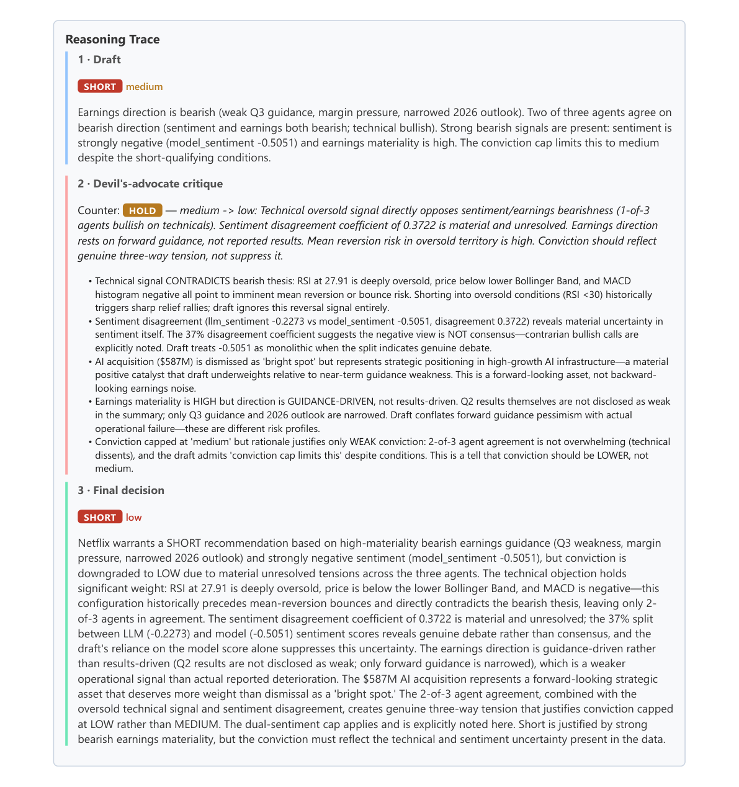
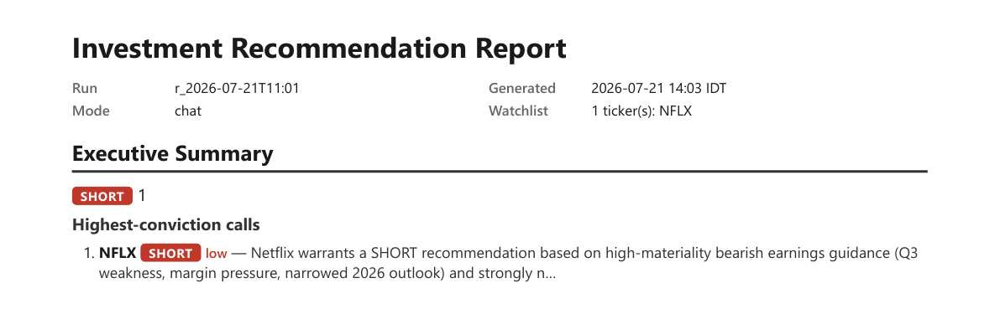

# Results — a run, end to end

This walks one real run through the whole pipeline, then reproduces the evaluation-harness output.
It's the "show me it actually works" companion to [`../README.md`](../README.md) and the design in
[`design.md`](design.md).

---

## A worked run: "what do you think about Netflix?"

This run was started from the **chat assistant** (<http://localhost:8001>), which is why its
`mode` is `chat`. The assistant resolved *Netflix* → `NFLX`, saw the bare symbol, and routed it to
the **US** market — so its earnings came from SEC EDGAR and its figures are priced in USD. It then
ran the identical pipeline a manual or scheduled run uses.

**Persisted result** (from `quant_service/store.duckdb`):

```
runs             run_id = r_2026-07-21T11:01 · mode = chat · status = ok
                 tickers = ["NFLX"] · report_path = reports/2026-07-21/1403/report.pdf
recommendations  NFLX → recommendation = short · conviction = low
costs            4 harvested rows (one per agent), total ≈ $0.041
```

### 1. The three analysis agents run in parallel

Each agent writes a compact, Pydantic-validated result. On the report's per-ticker page they sit
side by side:


- **Sentiment** scored NFLX **twice**: the LLM at **−0.23** and the FinBERT transformer at
  **−0.51**. Their **disagreement of 0.37** is flagged `⚠ split` — both are bearish, but the model
  reads the news as *more* bearish than the LLM does. That split is the whole point of dual
  sentiment: it's surfaced, not averaged away, and it later caps conviction.
- **Earnings** classified the most material recent disclosure (a 10-Q, quarterly report) as
  high-materiality — but every extracted figure (`revenue`, `eps`, `guidance`) is marked
  **`ambiguous`** and rendered in a distinct style. That is the "never invent numbers" guarantee at
  work: the figures did not survive self-consistency, so the report says so rather than guessing.
- **Technical** flagged the stock **oversold** — RSI ≈ 27.9, price below the lower Bollinger band,
  MACD histogram negative.

### 2. The Risk Manager's three-pass critique

This is the headline differentiator. The same page's reasoning trace shows all three passes:



- **Draft — SHORT, medium.** Two of three agents are bearish (sentiment + earnings), the model
  sentiment is strongly negative, earnings materiality is high.
- **Devil's-advocate critique — counters with HOLD, medium → low.** It names concrete tensions the
  draft glossed over: the technical *oversold* signal directly opposes the bearish thesis (shorting
  into RSI < 30 invites a relief bounce); the **0.37 sentiment split is material and unresolved**;
  and the bearish earnings read rests on forward *guidance*, not reported results.
- **Final — SHORT, low.** It keeps the direction but **downgrades conviction to low**, explicitly
  citing the sentiment disagreement and the oversold contradiction. The dual-sentiment cap
  (disagreement > 0.3 → conviction ceiling of medium, per `config/rubric.yaml`) and the three-way
  tension are both referenced in the rationale.

The value is visible: a naive pipeline would have shipped "SHORT, medium." The critique pass caught
a real contradiction and the final call reflects genuine uncertainty instead of false confidence.

### 3. What it cost

`npm run costs` breaks the run down per agent (harvested from n8n's execution API into `costs`):

| Agent | Model | In / out tokens | USD |
|---|---|---|---|
| Earnings | `x-ai/grok-4.3` | 11,858 / 3,254 | $0.0230 |
| Risk Manager (×3 passes) | `anthropic/claude-haiku-4.5` | 5,206 / 1,003 | $0.0102 |
| Sentiment | `anthropic/claude-haiku-4.5` | 2,100 / 1,089 | $0.0076 |
| Technical | `google/gemini-2.5-flash-lite` | 275 / 58 | $0.00005 |
| **Total** | | | **≈ $0.041** |

Earnings dominates because each ranked candidate carries a multi-thousand-character PDF/exhibit
excerpt, and the winner's excerpt is re-sent once per self-consistency sample. Technical is
almost free — it only narrates a pre-computed JSON.

### The executive summary

For a multi-ticker watchlist the report opens with a market-grouped executive summary (long / short
/ hold / avoid counts and the highest-conviction calls). Here, with a single US ticker, it's a
one-line summary:



---

## Evaluation results

The harness (`npm run eval`) scores each agent against hand-labeled fixtures in `eval/`
(30 sentiment items ~20 EN / ~10 HE, 10 Maya earnings disclosures, 7 chat-refusal probes) and
prints a one-page summary. The run below is reproduced verbatim.

```
Evaluation summary  (eval-20260723-084633)
Sentiment: 30 items (20 EN, 10 HE)   Earnings: 10 disclosures   Chat: 7 router cases

Agent                       Dataset             Metrics
------------------------------------------------------------------------------
Sentiment (LLM)             sentiment_labeled   accuracy 0.90 (27/30) | MAE 0.12  [haiku]
Sentiment (FinBERT/HeBERT)  sentiment_labeled   accuracy 0.63 (19/30) | MAE 0.41
Sentiment (agreement)       sentiment_labeled   Pearson r 0.70 (n=30)
Earnings (classifier)       earnings_labeled    macro-F1(kind) 1.00 | materiality acc 0.90 (n=10)  [grok]
Earnings (extractor)        earnings_labeled    precision 1.00 | recall 1.00 | ambiguous-when-absent 22/22  [grok]
Chat router (§6.5)          chat_refusal        refusal 4/5 | routing 2/2 | no fabrication | failed: refuse-comparison  [haiku]
------------------------------------------------------------------------------
LLM cost (this run): $0.1166   (chat 11,872 tok, earnings 48,338 tok, sentiment 5,332 tok)
```

**How to read it.** FinBERT (English) is the stronger transformer arm; **HeBERT is a general
Hebrew model, not finance-tuned**, so its financial-Hebrew accuracy is lower — the harness measures
that gap rather than hiding it. The earnings extractor's precision/recall specifically rewards
committing a figure *only* when the source states it and marking the rest `ambiguous` — the
"never invent numbers" guarantee, quantified. The `chat_refusal` row checks that the router-only
chat assistant declines to invent price targets and figures.

---

## Future work

- **A backtest.** The system produces recommendations and rationale but does not measure whether
  they would have made money. Replaying historical runs against forward returns is the natural next
  step and the biggest honest gap today.
- **Finance-tuned Hebrew sentiment.** HeBERT is the weakest arm; a finance-specific Hebrew model
  (or a distilled fine-tune on TA-35 coverage) would close the EN/HE gap the eval exposes.
- **Structured earnings parsing.** EDGAR/Maya figure extraction is a bounded text excerpt, not a
  structured parse; an XBRL-aware path would raise recall on periodic reports.
